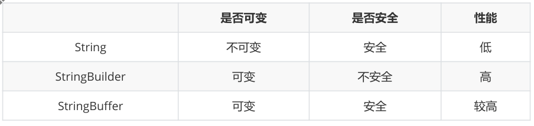

# Java核心知识

## JVM、JRE及JDK的关系

JVM（Java Virtual Machine）是Java虚拟机的缩写，它是Java程序运行的环境，负责将Java字节码翻译成特定平台的机器语言执行。

JRE（Java Runtime Environment）是Java运行时环境的缩写，它包含了JVM以及运行Java程序所需的核心类库等。

JDK（Java Development Kit）是Java开发工具包的缩写，它包含了JRE以及用于开发Java程序的编译器、调试器等开发工具。

简而言之，JDK包含了JRE，而JRE包含了JVM。

## Java语言特点

+ Java是一门面向对象的编程语言，支持封装、继承和多态等面向对象的特性。
+ Java 是跨平台的，可以在不同的平台上运行，只要安装对应平台的 JVM 即可
+ JAVA 支持多线程以及网络编程等等，具有较高的安全性以及可靠性
+ Java 具有大型的生态系统，拥有庞大开源库以及框架，可以加速开发过程

## Java和C++的区别

+ Java 可以通过 JVM 实现跨平台特性，而C++需要在特定平台上编译为可执行文件，依赖于平台，不具有跨平台性
+ Java 具有自动内存管理，通过垃圾回收机制管理内存，而C++需要手动管理内存
+ Java 没有指针，只有引用；C++支持指针与引用，允许直接操作内存
+ Java只支持单继承，一个类只能继承一个父类；C++支持多继承，一个类可以同时继承多个父类。

这些够了，也可以再记忆一点

+ Java不支持运算符重载，不能定义新的操作符。C++支持运算符重载，可以定义新的操作符以及对已有操作符进行重载。
+ Java内置了多线程支持，提供了高级的线程管理机制，使得多线程编程更为方便。C++也支持多线程，但需要使用平台特定的线程库，如POSIX线程库或Windows线程库。

## 8大基本数据类型

有8大基本数据类型

+ 整型4个，byte（1字节）、short （2字节）、int （4字节）、long（8字节）
+ 浮点型2个，float（4字节）、double（8字节）
+ 布尔型1个，boolean
+ 字符型1个，char，2字节，Unicode字符，范围为0到65535。

> 在Java中，boolean类型并没有明确定义占用的字节数。它是一种逻辑数据类型，只有两个可能的取值：true 和 false。然而，在内部实现上，Java虚拟机可能会将boolean类型表示为1个字节，但这不是Java语言规范要求的一部分。
>
> 尽管在内部实现上可能会占用1个字节，但它并不是Java语言规范中明确规定的。如果在编写Java程序时需要知道一个boolean值占用多少字节，最好参考具体的Java虚拟机实现或相关的性能测试数据。

## 类型转换

隐式（自动）类型转换和显示（强制）类型转换

+ 隐式转换：从存储范围小的类型到存储范围大的类型
+ 显示转换：从存储范围大的类型到存储范围小的类型，可能会存在精度损失

## 自动装箱与拆箱

装箱：将基本类型用包装器类型包装起来

拆箱：将包装器类型转换为基本类型

**注意**（比较==和equals）

+ `==`
  + 两边都是包装类型则==比较引用==
  + 一边是值，一边是引用，则==比较数值==，引用会发生拆箱
+ `equals`
  + 数值会先拆箱，然后再装箱

`Integer a = 1;` 自动装箱会使用缓存

`new Integer(1);` 手动装箱不使用缓存

## String

### String 的不变性

在 Java 8 中， String 内部使用 char 数组存储数据。并且被声明为 final ，因此它不可被继承

```java
public final class String implements java.io.Serializable, Comparable<String>,
CharSequence {
	private final char value[];
}
```

*为什么要要设计成不变的？*

+ 是线程安全的，可以在多个线程中使用
+ 因为不变，所以hash值计算一次就可以缓存起来，提高了字符串hash效率
+ 可以方便的创建常量池，如果创建一样的对象，可以直接从缓存池中引用，减少了内存开销

### String和StringBuffer、StringBuilder的区别是什么



从可变性、线程安全性、性能方面解释

## switch注意项

问：switch 是否能作用在 byte 上，是否能作用在 long 上，是否能作用在 String 上

答：只有 32 位整型可以作为 switch 的条件，但是后来

java1.5 开始允许枚举类型

java1.7 开始允许 String 类型

java1.7 开始允许 `byte`、`short`、`char` 类型，它们能隐式转换到 `int` 上，

## 运算符

+ &&和&
  + 不同点是 && 只要是第一个条件不成立为 false ，就不会再去判断第二个条件，最终结果直接为 false ，而 & 判断的是所有的条件
+ ||和|
  + || 只要满足第一个条件，后面的条件就不再判断，而 | 要对所有的条件进行判断


## 关键字

### static

主要用途：在不创建对象的情况下调用方法与属性，同时可以优化性能（比如读取文件）

初始化顺序：父类中的静态变量和静态代码块 -> 子类中的静态变量和静态代码块 -> 父类的实例变量和普通代码块 -> 父类的构造函数 -> 子类的实例变量和普通代码块 -> 子类的构造函数

### final

用于修饰类、变量、方法

+ 修饰类，类不可被继承
+ 修饰变量，变量不可被修改
+ 修饰方法，方法不可被重写

### final finally finalize 区别

+ final，用来修饰类、方法、变量
+ finally，用在 try 代码块中，如果使用 finally ，无论是否执行成功，此代码块都会被执行
+ finalize，object 的一个方法，一般由垃圾回收器调用，当我们调用 `System.gc()` 时，会由垃圾回收器调用这个方法，但是java规范不保证它们会被执行

### this

+ 可以引用成员变量，当形参与成员变量重名时，可以用this来区分
+ 可以调用成员函数
+ 可以调用当前类的构造函数，调用构成函数必须放在第一行，否则编译会报错
+ 可以作为参数表示当前类对象

### super

+ 引用父类成员变量
+ 调用父类成员函数
+ 调用父类构造方法

### this super 的区别

相同点：

+ 都只能用在构成函数的第一行，否则编译会报错
+ 只能在实例环境中使用，不能在静态环境中使用

不同点：

+ super 调用的使用父类的构造函数、this 调用的是当前类的重载构造函数

### break continue return 区别

+ break 结束当前循环
+ continue 跳过当前循环，进入下一个循环
+ return 结束当前方法

## 面向过程和面向对象的区别

+ 面向过程
  + 优点：性能比面向对象高，不需要对类进行实例化
  + 缺点：没有面向对象易维护、难以复用、难以拓展
+ 面相对象
  + 可以通过封装、继承、多态这三大特征，设计出低耦合的系统，维护起来更方便更灵活
  + 性能相对于面向过程较低

## 面向对象三大特性

+ 封装：隐藏内部的实现细节，通过公开公共接口或方法来操作对象
+ 继承：一个类可以继承父类的属性与方法，使子类和父类具有相同的行为
+ 多态：一个行为可以表现为不同形态的能力
  + 实现多态的条件：继承、重写、向上转型（子类的引用赋给父类对象）

## 面向对象五大基本原则

+ 单一职责原则：一个类，最好只做一件事，只有一个引起变化的原因
+ 开发封闭原则：对扩展开放，对修改封闭的
+ 里氏替换原则：派生类（子类）对象可以在程式中代替其基类（超类）对象。

+ 依赖倒置原则：依赖于抽象
  + 高层模型不应该依赖于具体实现，两者都应该依赖于抽象。
  + 抽象不应该依赖于具体实现，具体实现应该依赖于抽象。
  + 这意味着通过接口和抽象类来进行依赖注入，从而减少模块间的耦合度。
+ 接口隔离原则：使用多个小的专门的接口，而不要使用一个大的全面的总接口（不要实现不需要的接口）

> *里氏替换原则示例1*：
>
> 下面是一个示例，演示了违反里氏替换原则的情况：
>
> ```java
> class Rectangle {
>     protected int width;
>     protected int height;
> 
>     public void setWidth(int width) {
>         this.width = width;
>     }
> 
>     public void setHeight(int height) {
>         this.height = height;
>     }
> 
>     public int area() {
>         return width * height;
>     }
> }
> 
> class Square extends Rectangle {
>     @Override
>     public void setWidth(int width) {
>         this.width = width;
>         this.height = width;
>     }
> 
>     @Override
>     public void setHeight(int height) {
>         this.height = height;
>         this.width = height;
>     }
> }
> ```
>
> 在上述代码中，`Rectangle` 类代表一个矩形，它有宽度 `width` 和高度 `height`，可以计算矩形的面积。
>
> `Square` 类继承自 `Rectangle` 类，但重写了 `setWidth` 和 `setHeight` 方法，使得正方形的宽度和高度始终相等，从而满足正方形的定义。
>
> 然而，这段代码违反了里氏替换原则，因为在使用基类 `Rectangle` 的代码中，我们可能会假设可以设置宽度和高度的不同值，但当使用 `Square` 类时，这种假设不再成立，因为它会导致不符合正方形定义的结果。
>
> 解决这个问题的一种方法是将 `Square` 类和 `Rectangle` 类分开，或者重新设计类的继承关系，使得 `Square` 类不再继承自 `Rectangle` 类。这样可以避免违反里氏替换原则，确保子类可以完全替代父类。
>
> *里氏替换原则示例2*：
>
> 下面是一个示例，演示了符合里氏替换原则的情况，使用动物类和鸟类来说明里氏替换原则：
>
> ```java
> class Animal {
>     public void makeSound() {
>         System.out.println("Some generic sound");
>     }
> }
> 
> class Bird extends Animal {
>     @Override
>     public void makeSound() {
>         System.out.println("Chirp chirp!");
>     }
> 
>     public void fly() {
>         System.out.println("I can fly");
>     }
> }
> ```
>
> 在上述代码中，我们有一个 `Animal` 类和一个继承自 `Animal` 的 `Bird` 类。
>
> 根据里氏替换原则，我们可以用子类对象替代父类对象，而程序的行为应该保持一致。这意味着，如果我们有一个期待接受 `Animal` 对象的方法，我们也可以传递一个 `Bird` 对象，而这个方法应该能够正常工作。
>
> ```java
> public class Main {
>     public static void main(String[] args) {
>         Animal animal = new Bird();
>         animal.makeSound(); // 输出 "Chirp chirp!"
>         
>         // 这里没有问题，因为 Bird 类是 Animal 类的子类
>     }
> }
> ```
>
> 在这个例子中，我们实际上将一个 `Bird` 对象赋值给了一个 `Animal` 类型的变量，然后调用了 `makeSound()` 方法。这符合里氏替换原则，因为子类 `Bird` 替代了父类 `Animal`，并且程序的行为保持了一致性。
>
> 然而，请注意，由于 `animal` 变量的类型是 `Animal`，所以不能直接调用 `fly()` 方法，因为 `fly()` 方法是在 `Bird` 类中定义的，而 `animal` 对象的静态类型是 `Animal`，它不具备 `fly()` 方法。

## 抽象类和接口的对比

+ 抽象类：用来捕捉子类的通用特性
+ 接口：抽象方法的集合


相同点：

+ 都不能实例化

+ 子类都必须覆写这些抽象方法

不同点：

+ 定义：abstract class 和 interface
+ 实现：extends 和 implements
+ 修饰符：public protected default  和 只能用public
+ 构造方法：抽象方法可以有构造方法、接口不能有
+ 字段声明：抽象类是任意的、接口默认为 static final

## 构造方法

### 构造方法的作用

完成对类对象的初始化工作

### 无参构造的作用

如果一个子类的构造方法没有显示的调用父类的构造方法，那么它默认会调用父类的无参构造方法。这时如果父类中只存在有参数的构造方法，那么就会报错。

### 调用无参构造的目的

调用子类构造方法之前，调用父类的无参构造方法的目的是：帮助子类做初始化工作

### 没有构造方法可以吗

可以，如果一个类没有任何构造方法，它默认会有一个无参构造方法

### 构造方法的特性

+ 和类名同名
+ 没有返回值类型
+ 不可以写 return 语句
+ 可以被重载

## 变量

+ 类变量：独立于方法之外的变量，用 static 修饰
+ 实例变量：独立于方法之外的变量，没有用 static 修饰
+ 局部变量：方法内的变量
+ 成员变量：又称全局变量。可以分为类变量和实例变量

## 内部类

（1）*成员内部类*

+ 位于一个类的的内部，可以方法外部类的所有方法和属性
+ 如果内部类和外部类存在同名的属性和方法，需要 `外部类名.this.` 作为前缀来引用外部类的成员
+ 外部类想要使用内部类，需要先声明一个内部类对象，然后通过内部类对象来访问它的成员
+ 内部类依赖于外部类，想要使用内部类对象，必须存在一个外部类对象

（2）*局部内部类*

定义在一个方法或一个作用域的类，只能在本方法或本作用域内使用。

如果是定义在实例方法中，则可以方法所有外部类的变量与方法

如果是定义在静态方法中，则只能访问外部类的静态变量与方法

（3）*匿名内部类*

没有名字的类

（4）*静态内部类*

+ 位于一个类的内部，通过 static 关键字修饰，只能访问外部类的静态方法与变量
+ 不依赖与外部类对象，在没有外部类对象的情况下也能创建静态内部类对象


问题1：内部类的优点：

1. 内部类不被同一包下的其他类所见，有很好的封装性
2. 匿名内部类可以很方面的定义回调
3. 实现多继承，java不支持多继承，但是可以通过内部类来模拟效果。一个类可以含有多个内部类，每个内部来实现一个接口或者一个类，从而达到多继承的特性


问题2：局部内部类和匿名内部类方法局部变量时，为什么变量要加上 `final`？

可以从生命周期的角度理解，

+ 对于方法中的局部变量，因为没有加 `final` 的局部变量，在方法执行完毕后就会被销毁，如果方法中通过内部类开启了一个线程，内部类的线程方法使用了局部变量，方法结束还会存在对局部变量的引用，如果不加 final 就会造成生命周期的不一致问题
+ 对于形参的变量，（和拷贝有关，具体没看明白）

> 从 Java 8 开始，对局部变量的访问放宽了限制，可以不显式声明为 `final`，但该变量在使用时必须保证不会被修改，也就是所谓的“事实上的 final”（Effectively Final）。这意味着变量只能赋值一次，一旦赋值就不能再修改。

## 重载和覆写

### 区别

+ 重载：发生在同一个类中，方法名相同，参数列表不同，与返回值和访问修饰符无关
+ 覆写：发生在子类中，方法名和参数列表必须相同，返回值和抛出的异常类型必须和父类一致，或者是其子类，访问修饰符要大于等于父类的修饰符。但是如果父类的方法修饰符为 private 就不是覆写

### 构造器是否可以重写？

构造器只能重载，不能重写

### 重载方法能否根据返回类型区分？

不能，只能通过参数列表区分

## == 和 equals 的区别

+ ==：对于基本数据类型， == 比较的是值；对于引用数据类型， == 比较的是内存地址。
+ eauals：对于没有重写 equals 方法的类， equals 方法和 == 作用类似；对于重写过 equals 方法的类，equals 比较的是值。

## 为什么重写equals方法后，hashCode方法也必须重写

`equals`：equals 会依次比较内存地址、对象类型、以及值

`hashCode`：满足以下条件

+ 两个对象相等，则 hashCode 一定相等
+ hashCode 相等，对象不一定相等
+ hashCode 默认是堆上对象产生的特殊值，不同对象的默认 hashCode 一定不同

hashCode 对具有哈希结构的集合起着至关重要的作用

## Java 是值传递还是引用传递，或两者共存

只有值传递

+ 值传递：指在调用函数是将实际参数复制一份传递到函数中，函数内修改参数不会影响到实际参数
+ 引用传递：指调用函数时将实际参数的地址传递到函数中，那么函数内修改参数将会影响到实际参数

## IO流

Java 的 IO 流可以分为输入流和输出流

+ 按操作单元划分：字节流和字符流
+ 按角色划分为：节点流和处理流（暂时不记忆）

Java IO 流的 40 多个类都是从4个抽象类基类中派生出来的。

+ InputStream：字节输入流
+ Reader：字符输入流
+ OutputStream：字节输出流
+ Writer：字符输出流

## BIO,NIO,AIO

+ BIO（Blocking I/O）
  + **同步阻塞**：所有 i/o 操作 都是同步阻塞的，当执行 io 操作时，它会被阻塞，直到操作完成
  + **多线程模型**：每个连接都会使用一个新的线程来处理
  + **适用场景**：适用于连接数少，连接时间长的场景，比如 socket 编程
+ NIO（Non-blocking I/O）
  + **同步非阻塞**：允许一个线程同时处理多个连接
  + **多路复用器**：使用多路复用器来管理多个连接，提高了资源利用率
  + **适用场景**：适用于连接数多，连接时间短的场景
+ AIO（Asychronous I/O）
  + **异步非阻塞**：当操作完成时，会通知应用程序，不需要等待
  + **异步回调**：通过异步回调的方式来处理 I/O 事件
  + **适用场景**：适用于连接数多，且连接时间短的场景

## 反射

指在运行期间，1）可以动态获取一个类的属性和方法，2）可以动态调用一个对象的方法，访问对象的属性，的这个功能叫做反射


*获取Class对象的三种方法*

1. Class.forName()
2. 类名.class
3. 对象.getClass()

一个类在 JVM 中只会有一个 Class 实例，所以对 c1 、 c2 、 c3 进行 equals 比较时返回的都是 true 


*优缺点*

+ 优点：运行时获取类的信息，调用类的方法，大大提高代码灵活性
+ 缺点：性能相比直接调用低，反射可以绕过Java的访问控制机制可能会产生一些安全问题

## Java异常

*异常类层次结构*

在Java中，所有的异常都是 `Throwable` 类的子类，它们分为两大类：

- `Error`：代表严重的错误，通常表示虚拟机出现了一些无法恢复的错误，程序不应该捕获它们。
- `Exception`：通常代表程序可以处理的异常情况，是程序在正常运行过程中可能会遇到的情况。


*异常分类*

异常可以分为以下两类：

- **受检异常（Checked Exception）**：是指在编译时必须要处理的异常，即必须使用`try-catch`或者在方法签名中使用`throws`来处理它们，否则程序将无法通过编译。
- **非受检异常（Unchecked Exception）**：也叫运行时异常（Runtime Exception），通常是由程序逻辑错误引起的，例如空指针异常、数组越界异常等。对于这类异常，编译器不会强制要求进行处理。（Error 以及 RuntimeException及其子类）


## 注解

+ `@Target`：用在那个上面
+ `@Retention`：注解的生命周期
+ `@Inherited`：是否被子类继承
+ `@Document`：用了注解的的类，在生成api文档时都会包含该注解的说明

## 泛型

泛型提供了编译时类型安全监测机制，允许程序员在编译时检测非法的类型

### 泛型擦除

泛型基本上是在编译器层次上实现的。在使用泛型时加上类型参数，编译器编译的时候去掉，生成的字节码不会包含泛型中的类型信息。


*既然存在泛型擦除，为什么添加不同类型的数据到泛型中会报错？*

编译器先检查代码中的泛型类型，然后在进行编译擦除泛型类型

## 序列化

+ 序列化：将对象写入到 IO 流中
+ 反序列化：从 IO 流中恢复对象
+ 意义：便于网络传输，或者存储在磁盘上
+ 实现：
  + 使用 `Serializable`
  + 使用 `Externalizable`
+ 注意事项：
  + 对象的类名、实例变量会被序列化
  + 方法、类变量、 transient 实例变量都不会被序列化。
  + 某个变量不被序列化，可以使用 transient 修饰。
  + 序列化对象的引用类型成员变量，也必须是可序列化的，否则，会报错。
  + 反序列化时必须有序列化对象的 class 文件。

## 深拷贝与浅拷贝

+ 深拷贝：基于基本数据类进行值传递，对于引用类型，会新创建一个对象，并将值复制过去，所拷贝的引用类型指向两个不同的对象
+ 浅拷贝：基本数据类型使用值传递，对应引用类型，会复制原引用的地址，也就是说，浅拷贝的引用类型指向同一个对象

+ 深拷贝实现：
  + 重写 `clone()` 方法
  + 序列化

## Object 常用方法

+ `Object clone()` ：创建与该对象的类相同的新对象
+ `boolean equals(Object)` ：比较两对象是否相等
+ `void finalize()` ：当垃圾回收器确定不存在对该对象的更多引用时，对象垃圾回收器调用该方法
+ `Class getClass()` ：返回一个对象运行时的实例类
+ `int hashCode()`：返回该对象的散列码值
+ `void notify()` ：唤醒等待在该对象的监视器上的一个线程
+ `void notifyAll()` ：唤醒等待在该对象的监视器上的全部线程
+ `String toString()` ：返回该对象的字符串表示
+ `void wait()`：在其他线程调用此对象的 notify() 方法或 notifyAll() 方法前，导致当前线程等待
