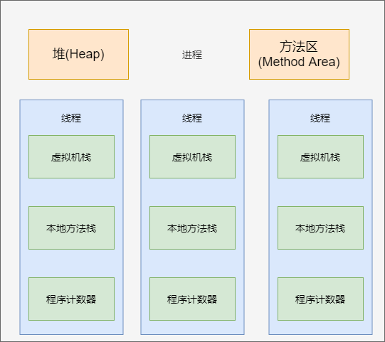

# 并发编程

> JUC：`java.util.concurrent`

## 线程 进程

### 简介

+ 线程：处理器任务调度和执行的基本单位
+ 进程：操作系统资源分配的基本单位

进程是程序的一次执行过程，是系统运行的基本单位

线程是一个比进程更小的执行单位，一个进程可以包含多个线程

### 区别

Java 虚拟机运行时数据区包含有：

+ 堆区
+ 方法区
+ 虚拟机栈
+ 本地方法栈
+ 程序计数器

各进程之间相互独立，每个进程会包含多个线程。这些线程会共享进程的堆区以及方法区，并且具有相互之间独立的虚拟机栈、本地方法栈、程序计数器。

主要区别在

+ 内存分配
  + 进程之间的地址空间和资源是相互独立的
  + 同进程的线程之间可以共享地址空间和资源（堆和方法区）
+ 资源开销
  + 每个进程拥有独立的资源空间，进程切换时有较大开销
  + 同一进程的线程会共享堆和方法区，同时具备私有的虚拟机栈、本地方法栈、程序计数器，线程之间的切换资源开销较小。

## 并行与并发的区别

+ 并行：多个处理器同时处理多个任务
+ 并发：一个处理器处理多个任务，按时间片轮流处理多个任务

## 多线程的优缺点

优点：当一个线程进入等待状态或阻塞时，可以执行其他线程，提高 cpu 利用率

缺点：

+ 频繁的上下文切换会影响多线程执行速度
+ 可能会产生线程安全问题，比如死锁
+ 调试困难，因为存在并发，又时可能出现难以重现bug

## 线程的上下文切换

为了实现多线程，cpu 会给每个线程分配一个时间片，也就是 cpu 处理这个线程的时间，为了看起来像是处理器同时处理多个任务，这个时间片非常的小，因此处理需要不停地切换线程。

当处理器处理完一个线程，切换到下一个线程时，需要将当前的任务状态保存，来保证下一个时间片到来线程重新加载这个状态以正常运行。从任务的保存，到下一个任务的加载过程就是一次上下文切换

## java中的守护线程和用户线程

+ 守护线程
  + 通常为其他线程提供服务
  + 生命周期依赖于是否存在其他用户线程，当所有的用户线程结束时，守护线程会自动退出
  + 通过 `setDaemon(true)` 来将一个线程设置为守护线程，需要在 `start()` 一个线程前调用
+ 用户线程
  + 除守护线程外都是用户线程
  + 它是程序的主要工作线程

## 死锁如何产生，如何避免

死锁如何产生：两个或两个以上的线程相互竞争对方的资源，同时又不释放自己的资源

死锁产生的条件：

+ 互斥条件：资源同一时刻只能有一个线程占用
+ 请求与保持条件：线程至少已保留了一个线程，但又提出的新的请求，但是改资源被其他线程占用，此时线程被阻塞，但对自己已获得的资源又不释放
+ 不可剥夺条件：线程对资源未使用完毕之前，不可被其他线程强行夺走，只能由获得改资源的线程主动释放
+ 循环等待条件：若干线程形成了首位相接的循环等待资源的关系

避免死锁：

+ 破坏请求与等待：请求资源时一次申请所有资源，要么全部成功，要么全部失败
+ 破坏不可剥夺条件：线程申请不到所有需要的资源时，主动释放掉所持有的资源

## 线程同步和线程调度相关的方法问题

### 相关方法

+ `wait()`：使线程主动进入等待（阻塞）状态，并释放所有持有的资源
+ `sleep()`：让线程进入指定毫秒数的休眠，暂停执行，需要处理 `InterruptedException`
+ `notify()`：唤醒等待状态的线程，具体唤醒的线程由 jvm 决定
+ `notifyAll()`：唤醒所有等待状态的线程，但只有成功抢占资源的线程才能进入就绪状态
+ `join()`：让当前线程进入阻塞状态，直到调用`join` 方法的线程执行完毕后才继续执行
+ `yield()`：提醒调度器当前线程愿意放弃当前 cpu 资源，使线程状态从 `running` 变为 `runable`

## ThreadLocal

