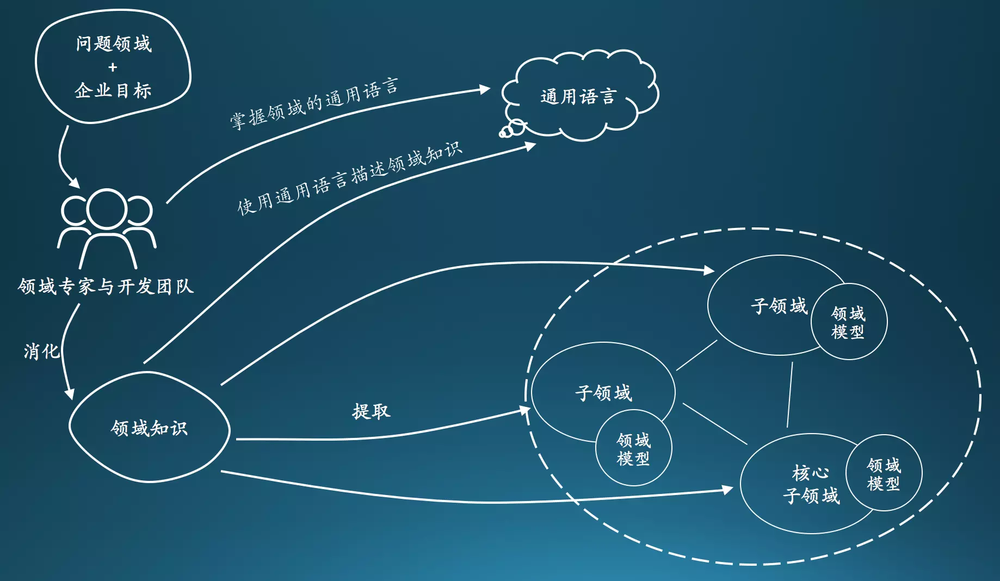
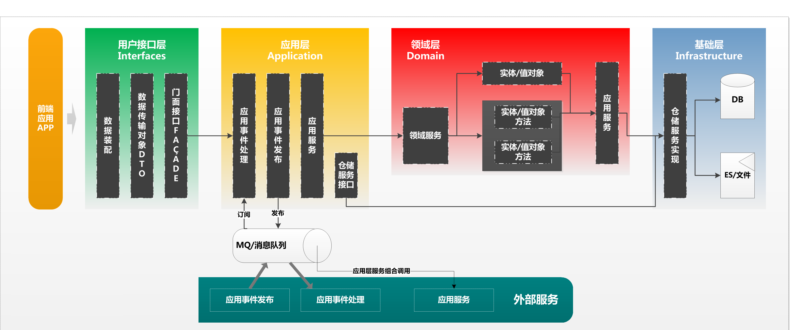
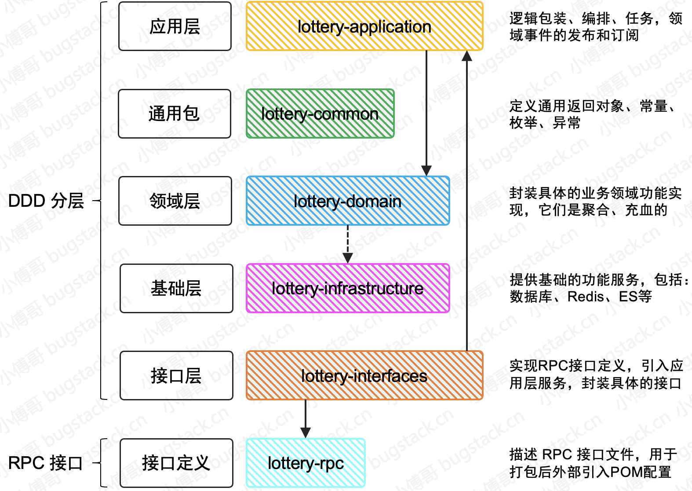
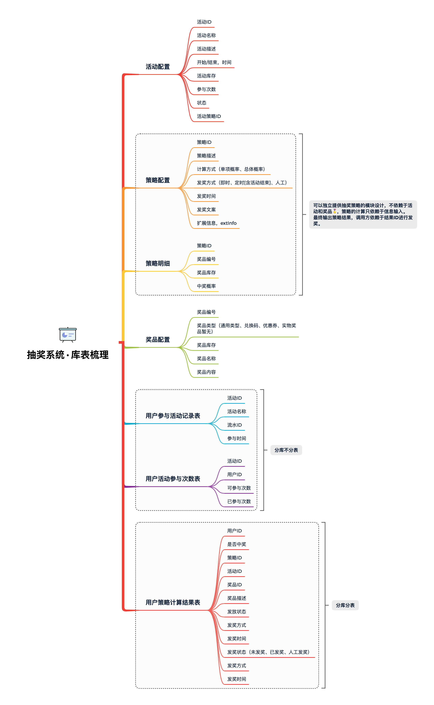

# 基本规范和介绍

## 开发规范

**分支命名**：日期\_姓名首字母缩写_功能单词，如：`210804_cc_buildFramework`

**提交规范**：`作者，type: desc` 如：`hemou，fix：修复查询用户信息逻辑问题`

```
# 主要type
feat:     增加新功能
fix:      修复bug

# 特殊type
docs:     只改动了文档相关的内容
style:    不影响代码含义的改动，例如去掉空格、改变缩进、增删分号
build:    构造工具的或者外部依赖的改动，例如webpack，npm
refactor: 代码重构时使用
revert:   执行git revert打印的message

# 暂不使用type
test:     添加测试或者修改现有测试
perf:     提高性能的改动
ci:       与CI（持续集成服务）有关的改动
chore:    不修改src或者test的其余修改，例如构建过程或辅助工具的变动
```

## DDD分层架构介绍

DDD（Domain-Driven Design 领域驱动设计）是由Eric Evans最先提出，目的是对软件所涉及到的领域进行建模，以应对系统规模过大时引起的软件复杂性的问题。整个过程大概是这样的，开发团队和领域专家一起通过 通用语言(Ubiquitous Language)去理解和消化领域知识，从领域知识中提取和划分为一个一个的子领域（核心子域，通用子域，支撑子域），并在子领域上建立模型，再重复以上步骤，这样周而复始，构建出一套符合当前领域的模型。



**服务架构调用关系**



+ 接口层{interfaces}
  - 接口服务位于用户接口层，用于处理用户发送的Restful请求和解析用户输入的配置文件等，并将信息传递给应用层。

+ 应用层{application}

  - 应用服务位于应用层。用来表述应用和用户行为，负责服务的组合、编排和转发，负责处理业务用例的执行顺序以及结果的拼装。

  - 应用层的服务包括应用服务和领域事件相关服务。

  - 应用服务可对微服务内的领域服务以及微服务外的应用服务进行组合和编排，或者对基础层如文件、缓存等数据直接操作形成应用服务，对外提供粗粒度的服务。

  - 领域事件服务包括两类：领域事件的发布和订阅。通过事件总线和消息队列实现异步数据传输，实现微服务之间的解耦。

+ 领域层{domain}

  - 领域服务位于领域层，为完成领域中跨实体或值对象的操作转换而封装的服务，领域服务以与实体和值对象相同的方式参与实施过程。

  - 领域服务对同一个实体的一个或多个方法进行组合和封装，或对多个不同实体的操作进行组合或编排，对外暴露成领域服务。领域服务封装了核心的业务逻辑。实体自身的行为在实体类内部实现，向上封装成领域服务暴露。

  - 为隐藏领域层的业务逻辑实现，所有领域方法和服务等均须通过领域服务对外暴露。

  - 为实现微服务内聚合之间的解耦，原则上禁止跨聚合的领域服务调用和跨聚合的数据相互关联。

+ 基础层{infrastructure}

  - 基础服务位于基础层。为各层提供资源服务（如数据库、缓存等），实现各层的解耦，降低外部资源变化对业务逻辑的影响。

  - 基础服务主要为仓储服务，通过依赖反转的方式为各层提供基础资源服务，领域服务和应用服务调用仓储服务接口，利用仓储实现持久化数据对象或直接访问基础资源。

## 项目架构




## 数据表总览


