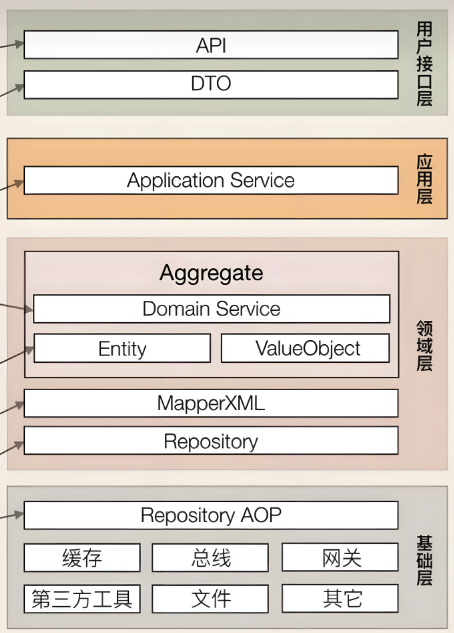
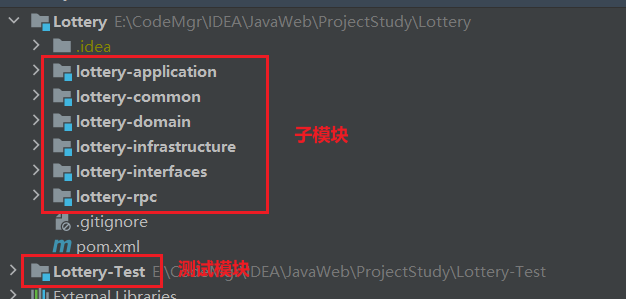

# 搭建架构并跑通RPC调用

## 搭建DDD+RPC架构

首先搭建DDD架构，我们按照如下的层次以及从上至下的调用关系创建不同的模块





其中：

+ interfaces 调用 application、rpc
+ application 调用 domain
+ domain 调用 infrastructure
+ common 其他模块均可调用，为避免重复调用我们使用 infrastructure，rpc 调用 common

注意 interfaces 的 pom 打包方式为 war

## 模块配置

### POM 配置

1、*总工程的 pom 配置*

```xml
<?xml version="1.0" encoding="UTF-8"?>
<project xmlns="http://maven.apache.org/POM/4.0.0"
         xmlns:xsi="http://www.w3.org/2001/XMLSchema-instance"
         xsi:schemaLocation="http://maven.apache.org/POM/4.0.0 http://maven.apache.org/xsd/maven-4.0.0.xsd">
    <modelVersion>4.0.0</modelVersion>

    <parent>
        <groupId>org.springframework.boot</groupId>
        <artifactId>spring-boot-starter-parent</artifactId>
        <version>2.3.5.RELEASE</version>
        <relativePath/> <!-- lookup parent from repository -->
    </parent>

    <groupId>com.hemou.lottery</groupId>
    <artifactId>Lottery</artifactId>
    <version>1.0-SNAPSHOT</version>
    <packaging>pom</packaging>
    <modules>
        <module>lottery-application</module>
        <module>lottery-common</module>
        <module>lottery-domain</module>
        <module>lottery-infrastructure</module>
        <module>lottery-interfaces</module>
        <module>lottery-rpc</module>
    </modules>

    <properties>
        <jdk.version>1.8</jdk.version>
        <maven.compiler.source>8</maven.compiler.source>
        <maven.compiler.target>8</maven.compiler.target>
        <project.build.sourceEncoding>UTF-8</project.build.sourceEncoding>
    </properties>

    <dependencyManagement>
        <dependencies>
            <!-- mybatis -->
            <dependency>
                <groupId>org.mybatis.spring.boot</groupId>
                <artifactId>mybatis-spring-boot-starter</artifactId>
                <version>2.1.4</version>
            </dependency>

            <!-- dubbo -->
            <dependency>
                <groupId>org.apache.dubbo</groupId>
                <artifactId>dubbo</artifactId>
                <version>2.7.1</version>
            </dependency>
            <dependency>
                <groupId>org.apache.dubbo</groupId>
                <artifactId>dubbo-spring-boot-starter</artifactId>
                <version>2.7.1</version>
            </dependency>

            <!-- mysql 驱动 -->
            <dependency>
                <groupId>com.mysql</groupId>
                <artifactId>mysql-connector-j</artifactId>
                <version>8.0.31</version>
            </dependency>

            <!-- fastjson -->
            <dependency>
                <groupId>com.alibaba</groupId>
                <artifactId>fastjson</artifactId>
                <version>1.2.58</version>
            </dependency>

            <!-- common-lang3 -->
            <dependency>
                <groupId>org.apache.commons</groupId>
                <artifactId>commons-lang3</artifactId>
                <version>3.8</version>
            </dependency>

            <!-- 项目内组件 -->
            <dependency>
                <groupId>com.hemou.lottery</groupId>
                <artifactId>lottery-application</artifactId>
                <version>1.0-SNAPSHOT</version>
            </dependency>

            <dependency>
                <groupId>com.hemou.lottery</groupId>
                <artifactId>lottery-common</artifactId>
                <version>1.0-SNAPSHOT</version>
            </dependency>

            <dependency>
                <groupId>com.hemou.lottery</groupId>
                <artifactId>lottery-domain</artifactId>
                <version>1.0-SNAPSHOT</version>
            </dependency>

            <dependency>
                <groupId>com.hemou.lottery</groupId>
                <artifactId>lottery-infrastructure</artifactId>
                <version>1.0-SNAPSHOT</version>
            </dependency>

            <dependency>
                <groupId>com.hemou.lottery</groupId>
                <artifactId>lottery-interfaces</artifactId>
                <version>1.0-SNAPSHOT</version>
            </dependency>

            <dependency>
                <groupId>com.hemou.lottery</groupId>
                <artifactId>lottery-rpc</artifactId>
                <version>1.0-SNAPSHOT</version>
            </dependency>
        </dependencies>
    </dependencyManagement>

</project>
```

2、*子模块的 pom 配置*

首先按照之前 DDD + RPC 的调用关系完成模块之间的相互依赖引用

（1）对于 `lotter-infrastructure` 基础层，由于涉及到 mysql 数据库的连接，要额外引用 mybatis-starter 以及 mysql 驱动包

```xml
<?xml version="1.0" encoding="UTF-8"?>
<project xmlns="http://maven.apache.org/POM/4.0.0"
         xmlns:xsi="http://www.w3.org/2001/XMLSchema-instance"
         xsi:schemaLocation="http://maven.apache.org/POM/4.0.0 http://maven.apache.org/xsd/maven-4.0.0.xsd">
    <modelVersion>4.0.0</modelVersion>
    <parent>
        <groupId>com.hemou.lottery</groupId>
        <artifactId>Lottery</artifactId>
        <version>1.0-SNAPSHOT</version>
    </parent>

    <artifactId>lottery-infrastructure</artifactId>

    <dependencies>
        <!-- mybatis -->
        <dependency>
            <groupId>org.mybatis.spring.boot</groupId>
            <artifactId>mybatis-spring-boot-starter</artifactId>
        </dependency>
        <!-- mysql 驱动 -->
        <dependency>
            <groupId>com.mysql</groupId>
            <artifactId>mysql-connector-j</artifactId>
        </dependency>
        
        <dependency>
            <groupId>com.hemou.lottery</groupId>
            <artifactId>lottery-common</artifactId>
        </dependency>
    </dependencies>

</project>
```

同时我们也在此模块的 `resources` 目录下创建 mybatis 的 `xxxMapper.xml` 以及 `mybatis-config.xml` 等文件

（2）`lottery-interfaces` 作为系统的 war 包工程，需要引用额外的 springboot-web-starter、dubbo、fastjson 等依赖，如下：

```xml
<?xml version="1.0" encoding="UTF-8"?>
<project xmlns="http://maven.apache.org/POM/4.0.0"
         xmlns:xsi="http://www.w3.org/2001/XMLSchema-instance"
         xsi:schemaLocation="http://maven.apache.org/POM/4.0.0 http://maven.apache.org/xsd/maven-4.0.0.xsd">
    <modelVersion>4.0.0</modelVersion>
    <parent>
        <groupId>com.hemou.lottery</groupId>
        <artifactId>Lottery</artifactId>
        <version>1.0-SNAPSHOT</version>
    </parent>
    <packaging>war</packaging>

    <artifactId>lottery-interfaces</artifactId>

    <dependencies>
        <!-- spring web  -->
        <dependency>
            <groupId>org.springframework.boot</groupId>
            <artifactId>spring-boot-starter-web</artifactId>
        </dependency>
        <!-- dubbo -->
        <dependency>
            <groupId>org.apache.dubbo</groupId>
            <artifactId>dubbo</artifactId>
        </dependency>
        <dependency>
            <groupId>org.apache.dubbo</groupId>
            <artifactId>dubbo-spring-boot-starter</artifactId>
        </dependency>
        <!-- fastjson -->
        <dependency>
            <groupId>com.alibaba</groupId>
            <artifactId>fastjson</artifactId>
        </dependency>
        <!-- common-lang3 -->
        <dependency>
            <groupId>org.apache.commons</groupId>
            <artifactId>commons-lang3</artifactId>
        </dependency>

        <!-- 项目内组件 -->
        <dependency>
            <groupId>com.hemou.lottery</groupId>
            <artifactId>lottery-application</artifactId>
        </dependency>

        <dependency>
            <groupId>com.hemou.lottery</groupId>
            <artifactId>lottery-rpc</artifactId>
        </dependency>
    </dependencies>

</project>
```

### yaml 配置

`lottery-interfaces` 作为顶级子模块的 web 工程，需要添加 `application.yaml` 文件完成一定的配置

```yaml
# 数据库配置
spring:
  datasource:
    username: root
    password: root
    url: jdbc:mysql://192.168.56.101:3306/lottery?useUnicode=true
    driver-class-name: com.mysql.cj.jdbc.Driver

mybatis:
  mapper-locations: classpath:/mybatis/mapper/*.xml
  config-location: classpath:/mybatis/config/mybatis-config.xml

# Dubbo 广播方式配置
dubbo:
  application:
    name: Lottery
    version: 1.0.0
  registry:
    address: N/A #multicast://224.5.6.7:1234
  protocol:
    name: dubbo
    port: 20880
  scan:
    base-packages: com.hemou.lottery.rpc
```

其中 dubbo 配置中

+ `dubbo.reigstry.address`：指示注册中心的地址。在这个示例中，它被设置为 "N/A"，表示未指定具体的注册中心地址。
+ `dubbo.protocol.name` 以及 `dubbo.protocol.prot`：让我们在本地开启了一个 dubbo 服务

## 定义和开发 RPC 接口

### 定义

在 `lottery-rpc` 模块下完成所有的 RPC 接口定义

```java
package com.hemou.lottery.rpc;

import com.hemou.lottery.rpc.req.ActivityReq;
import com.hemou.lottery.rpc.res.ActivityRes;

public interface IActivityBooth {

    ActivityRes queryActivityById(ActivityReq req);
}
```

### 实现接口

在 `lottery-rpc` 中定义好接口后，就需要在 `lottery-interfaces` 模块中完成对接口的实现

```java
@Service
public class ActivityBooth implements IActivityBooth {

    @Resource
    private IActivityDao activityDao;

    @Override
    public ActivityRes queryActivityById(ActivityReq req) {

        Activity activity = activityDao.queryActivityById(req.getActivityId());

        ActivityDto activityDto = new ActivityDto();
        activityDto.setActivityId(activity.getActivityId());
        activityDto.setActivityName(activity.getActivityName());
        activityDto.setActivityDesc(activity.getActivityDesc());
        activityDto.setBeginDateTime(activity.getBeginDateTime());
        activityDto.setEndDateTime(activity.getEndDateTime());
        activityDto.setStockAllTotal(activity.getStockAllTotal());
        activityDto.setStockDayTotal(activity.getStockDayTotal());
        activityDto.setTakeAllCount(activity.getStockAllTotal());
        activityDto.setTakeDayCount(activity.getStockDayTotal());

        return new ActivityRes(new Result(Constants.ResponseCode.SUCCESS.getCode(), Constants.ResponseCode.SUCCESS.getInfo()), activityDto);
    }

}
```

### 注意

由于使用的是 RPC，需要对数据进行序列化以及反序列化，因此所有的 RPC 使用的实体都有实现 `Serializable` 接口