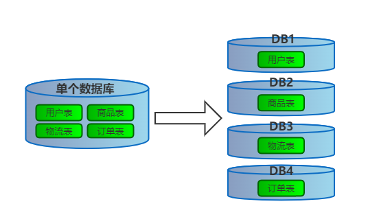
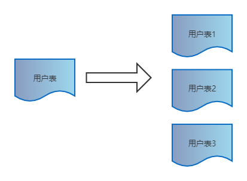
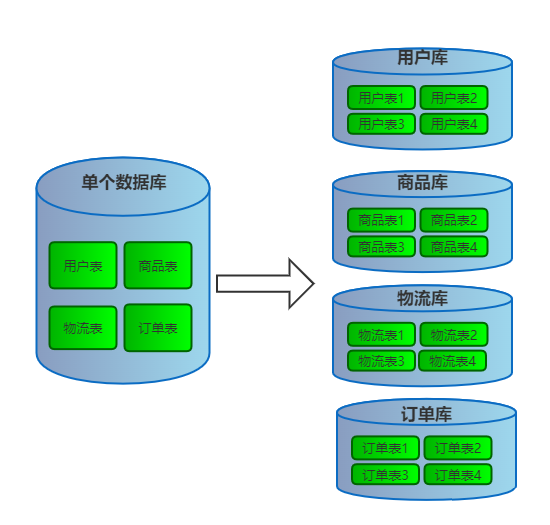

# 数据库路由组件

> 由于业务庞大，数据增长快，为了缓解数据库压力需要进行分库分表。本文的目标是展示一个具体的数据库路由组件的实践案例。这个案例通过自定义一个 springboot 的 starter 来实现。

## 什么是分库分表？

分库分表其实很好理解，**「顾名思义，即把存于一个库的数据分散到多个库中，把存于一个表的数据分散到多个表中」**。分库分表有三种方案：

- **「只分库不分表」**
- **「只分表不分库」**
- **「既分库又分表」**

### 只分库不分表

**「从单个数据库拆分成多个数据库的过程，将数据散落在多个数据库中，多个数据库同时提供服务」**



### 只分表不分库

**「从单张表拆分成多张表的过程，将数据散落在多张表内」**



### 既分库又分表

**「把存于一个数据库的单表数据分散到不同库的多个表中」**



## 配置

### 确定需要数据

知道了分库分表的概念，我们就可以确定 starter 所需要的数据了

```yaml
mini-db-router:
  jdbc:
    datasource:
      db-count: 2
      tb-count: 4
      router-key: uId
      default-db: db00
      list: db01,db02
      db-config-map:
        db00:
          url: jdbc:mysql://192.168.56.101:3306/lottery?useUnicode=true&characterEncoding=utf-8&serverTimezone=UTC
          username: root
          password: root
          driver-class-name: com.mysql.cj.jdbc.Driver
        db01:
          url: jdbc:mysql://192.168.56.101:3306/lottery_01?useUnicode=true&characterEncoding=utf-8&serverTimezone=UTC
          username: root
          password: root
          driver-class-name: com.mysql.cj.jdbc.Driver
        db02:
          url: jdbc:mysql://192.168.56.101:3306/lottery_02?useUnicode=true&characterEncoding=utf-8&serverTimezone=UTC
          username: root
          password: root
          driver-class-name: com.mysql.cj.jdbc.Driver
```

+ dbCount：分库数
+ tbCount：分表数
+ routerKey：路由键，用来确定哪一个库，哪一个表
+ defaultDb：默认数据库
+ list：分库数据库列表
+ dbConfigMap：数据库配置

### 创建 Properties

为了读取在 yaml 文件中的配置，我们创建 `Properties` 来帮助我们便捷的读取 yaml 数据。

```java
@Data
@Component
@ConfigurationProperties(prefix = "mini-db-router.jdbc.datasource")
public class DBRouterProperties {

    private Integer dbCount;

    private Integer tbCount;

    private String list;

    private String defaultDb;

    /**
     * 路由字段
     */
    private String routerKey;

    private Map<String, DbConfig> dbConfigMap;

    public DbConfig getDefaultDbConfig() {
        return dbConfigMap.get(defaultDb);
    }

    public DbConfig getDbConfig(String dbKey) {
        return dbConfigMap.get(dbKey);
    }

    @Data
    public static class DbConfig {
        private String driverClassName;
        private String url;
        private String username;
        private String password;
    }
}
```

## 运行时如何决定库表？

程序运行时我们需要判断具体要选择哪一个库，以及哪一个表，在这里就需要用到 `ThreadLocal`，它在线程中维护一个变量，并且能在同一线程中的任意上下文获取到这个变量，还起到线程间数据隔离的作用。

我们将 `dbKey` 以及 `tbKey` 用 `TreadLocal` 维护起来，它们两分别决定了该使用哪个库哪个表，如下：

```java
public class DBContextHolder {


    private static final ThreadLocal<String> dbKey = new ThreadLocal<String>();
    private static final ThreadLocal<String> tbKey = new ThreadLocal<String>();

    public static void setDbKey(String key) {
        dbKey.set(key);
    }

    public static String getDbKey() {
        return dbKey.get();
    }

    public static void setTbKey(String key) {
        tbKey.set(key);
    }

    public static String getTbKey() {
        return tbKey.get();
    }

    public static void clearDbKey() {
        dbKey.remove();
    }

    public static void clearTbKey() {
        tbKey.remove();
    }
}
```

这里我们只提到了如何维护 `dbKey` 和 `tbKey`，后面会再次说明如何设置以及使用这两个值

## 设置 `dbKey` 以及 `tbKey`

前面提到可以说用 `DBContextHolder` 来维护 `dbKey` 以及 `tbKey` 这两个值，那何时去设置它们呢，这就要用到注解以及 aop 了。

只要在方法上标注了注解就说明我们想要分库分表了，然后借助 aop 就可以在执行数据库操作之前设置好 `dbKey` 以及 `tbKey` 这两个值。

### 注解

`@DBRouter` 表明我们想要分库，同时可以用 key 来指定路由键

```java
@Documented
@Retention(RetentionPolicy.RUNTIME)
@Target({ElementType.TYPE, ElementType.METHOD})
public @interface DBRouter {

    String key() default "";
}
```

`@DBRouterStrategy`  表明我们想要分表

```java
@Documented
@Retention(RetentionPolicy.RUNTIME)
@Target({ElementType.TYPE, ElementType.METHOD})
public @interface DBRouterStrategy {

    boolean splitTable() default false;

}
```

### 创建切面

1、切点

```java
@Pointcut("@annotation(com.hemou.middleware.db.router.annotation.DBRouter)")
public void aopPoint() {
}
```

我们对标注了 `@DBRouter` 的地方进行增强

2、通知

我们使用环绕通知

1）我们获取 `@DBRouter` 上表明的路由键，若为空，则使用 yaml 中配置的默认路由键

2）通过路由键我们获取对应的路由值，大多数是全局唯一ID

3）根据路由值计算该路由到哪个库哪个表，（也就是设置 `dbKey` 以及 `tbKey`）

4）执行原本方法

5）原方法执行完毕后，清除 `dbKey` 以及 `tbKey`，避免内存泄露

```java
@Around("aopPoint() && @annotation(dbRouter)")
public Object doRouter(ProceedingJoinPoint jp, DBRouter dbRouter) throws Throwable {
    String dbKey = dbRouter.key();
    dbKey = StringUtils.isNotBlank(dbKey) ? dbKey : dbRouterProperties.getRouterKey();
    if (StringUtils.isBlank(dbKey)) {
        throw new RuntimeException("annotation DBRouter key is null!");
    }

    // 计算路由
    String dbKeyValue = this.getAttrValue(dbKey, jp.getArgs());
    dbRouterStrategy.doRouter(dbKeyValue);

    // 执行方法
    try {
        return jp.proceed();
    } finally {
        // 清除路由
        dbRouterStrategy.clear();
    }
}
```

3、具体路由值计算该路由到哪个库哪个表的方法

先通过 `dbCount` 以及 `tbCount` size，这个size必须是 2 的 n 次幂

```java
@Override
public void doRouter(String dbKeyAttr) {
    int size = dbRouterProperties.getDbCount() * dbRouterProperties.getTbCount();

    int idx = (size - 1) & (dbKeyAttr.hashCode() ^ (dbKeyAttr.hashCode() >>> 16));

    int dbIdx = idx / dbRouterProperties.getTbCount() + 1;
    int tbIdx = idx - dbRouterProperties.getTbCount() * (dbIdx - 1);

    DBContextHolder.setDbKey(String.format("%02d", dbIdx));
    DBContextHolder.setTbKey(String.format("%03d", tbIdx));
    log.debug("数据库路由 dbIdx：{} tbIdx：{}",  dbIdx, tbIdx);
}
```

## 分库 - 数据库动态切换

因为进行了分库，所以数据库不止一个，这里我们就可以根据 `dbKey` 来决定到底使用哪一个库了。我们将继承一个 `AbstractRoutingDataSource` 类，它的 `determineCurrentLookupKey()` 方法能帮我们动态的切换数据库，如下：

```java
public class DynamicDataSource extends AbstractRoutingDataSource {

    private final DBRouterProperties dbRouterProperties;

    public DynamicDataSource(DBRouterProperties dbRouterProperties) {
        this.dbRouterProperties = dbRouterProperties;
    }

    @Override
    protected Object determineCurrentLookupKey() {
        if (null == DBContextHolder.getDbKey()) {
            return dbRouterProperties.getDefaultDb();
        } else {
            return "db" + DBContextHolder.getDbKey();
        }
    }
}
```

在这里我们判断 DBContextHolder 维护的 `dbKey` 是否为空，如果为空则使用默认数据库，否则使用指定数据库。


我们所继承的这个 `AbstractRoutingDataSource` 构建时要求我们输入一个 Map 集合，它键对应的值就是数据源对象，如下：

```java
@Bean
public DataSource dataSource(DBRouterProperties dbRouterProperties) {
    // 创建数据源
    Map<Object, Object> targetDataSources = new HashMap<>();
    for (Map.Entry<String, DbConfig> entry : dbRouterProperties.getDbConfigMap().entrySet()) {
        DbConfig dbConfig = entry.getValue();
        targetDataSources.put(entry.getKey(),
                new DriverManagerDataSource(dbConfig.getUrl(), dbConfig.getUsername(), dbConfig.getPassword()));
    }

    // 设置数据源
    DynamicDataSource dynamicDataSource = new DynamicDataSource(dbRouterProperties);
    dynamicDataSource.setTargetDataSources(targetDataSources);
    dynamicDataSource.setDefaultTargetDataSource(targetDataSources.get(dbRouterProperties.getDefaultDb()));
    return dynamicDataSource;
}
```

因此 `determineCurrentLookupKey()` 就可以根据 `dbKey` 来决定具体的数据源

## 分表

通过创建 Mybatis 插件以及维护的 `tbKey`，我们为 SQL 语句所操作的数据表动态的添加后缀，从而起到分表的作用。

```java
@Intercepts({@Signature(type = StatementHandler.class, method = "prepare", args = {Connection.class, Integer.class})})
public class DynamicMybatisPlugin implements Interceptor {

    private final Pattern pattern = Pattern.compile("(from|into|update)[\\s]+(\\w+)", Pattern.CASE_INSENSITIVE);

    @Override
    public Object intercept(Invocation invocation) throws Throwable {
        // 获取StatementHandler
        StatementHandler statementHandler = (StatementHandler) invocation.getTarget();
        MetaObject metaObject = MetaObject.forObject(statementHandler, SystemMetaObject.DEFAULT_OBJECT_FACTORY, SystemMetaObject.DEFAULT_OBJECT_WRAPPER_FACTORY, new DefaultReflectorFactory());
        MappedStatement mappedStatement = (MappedStatement) metaObject.getValue("delegate.mappedStatement");

        // 获取自定义注解判断是否进行分表操作
        String id = mappedStatement.getId();
        String className = id.substring(0, id.lastIndexOf("."));
        Class<?> clazz = Class.forName(className);
     
        // 获取SQL
        BoundSql boundSql = statementHandler.getBoundSql();
        String sql = boundSql.getSql();


        // 替换SQL表名 USER 为 USER_03
        Matcher matcher = pattern.matcher(sql);
        String tableName = null;
        if (matcher.find()) {
            tableName = matcher.group().trim();
        }
        assert null != tableName;
        String replaceSql = matcher.replaceAll(tableName + "_" + DBContextHolder.getTbKey());

        // 通过反射修改SQL语句
        Field field = boundSql.getClass().getDeclaredField("sql");
        field.setAccessible(true);
        field.set(boundSql, replaceSql);

        return invocation.proceed();
    }
}
```

