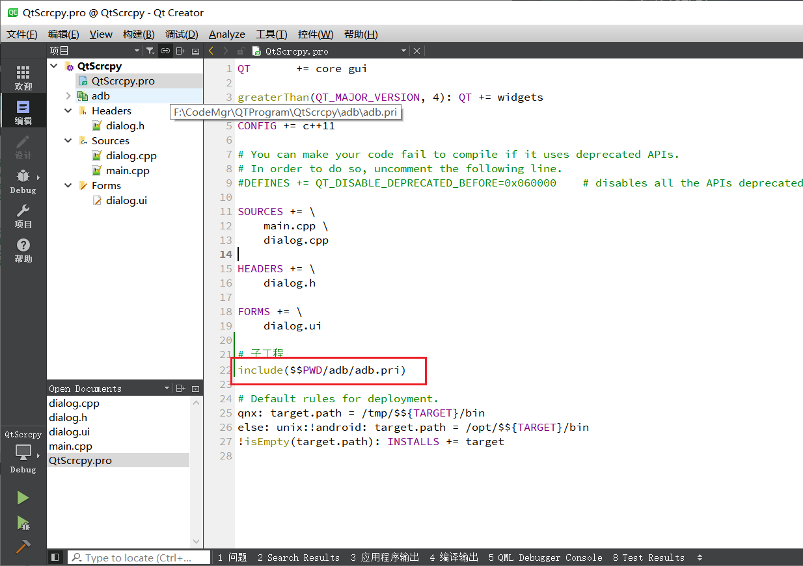
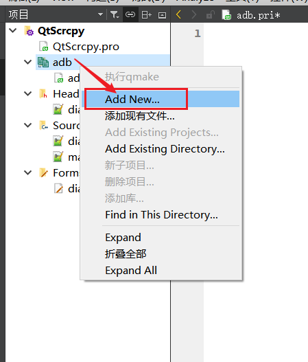

# QProcess封装adb操作

## 帮助文档

在帮助文档中查看QProcess的相关信息


主要了解`QProcess`的`start`含有三个参数方法

+ 参数1：要启动的程序
+ 参数2：参数
+ 参数3：进程模式


## 测试QProcess

### 添加槽函数

双击ui文件，创建一个pushButton，然后右击按钮转到槽


选择clicked()事件


### 测试事件代码 

测试打开记事本，并不传递参数

```c++
void Dialog::on_testBtn_clicked()
{
    QString program = "notepad";
    QStringList arguments;
    arguments << "-style" << "fusion";

    QProcess *myProcess = new QProcess(this);
    myProcess->start(program, Q_NULLPTR); // 参数为空指针
}
```

测试打开记事本，传递参数

```c++
void Dialog::on_testBtn_clicked()
{
    QString program = "notepad";
    QStringList arguments;
    arguments << "C:\\Users\\fangq\\Desktop\\webmusic.sql"; // 参数为桌面上的一个文件路径

    QProcess *myProcess = new QProcess(this);
    myProcess->start(program, arguments);
}
```

## 新建adb子工程

新建子工程，需要pri文件

### 创建子工程

首先找到项目根目录，在这个目录创建`adb`文件夹，并在`abd`目录下创建一个名称为`adb.pri`的文件，如下


### 添加子工程到父工程

在QtCreator中打开`QtScrcpy.pro`文件，添加如下代码



画框处代码`$$PWD`代表当前`pro`文件所在的文件夹

### 新建类

在adb模块中新建一个类




创建一个名为`AdbProcess`的类


## AdbProcess

### 创建

首先安装ctrl，查看QProcess的构造函数


能看到他需要一个`QParent`


然后将其参数复制到`AdbProcess`中，如下


### 测试


将其包含到`dialog.cpp`中时，会发现它报错，因为头文件并没有包含到目录中，因此要配置一下`pro`文件


这样就不会报错了


==最后要记得右击项目，重新`qmake`一下==

## 导入第三方模块

更具截图路径`third_party/adb/win`，将`paltform-tools`中的三个文件复制到`win`目录下


## 编写信号函数

### 查看所有信号

在帮助文档中能看到如下这些信号函数


### 初始化信号函数

可以看到除了前两个`errorOccurred`和`finished`有参数外，后面三个都没有参数，和如下代码槽函数的参数一一对应了起来

```c++
void AdbProcess::initSignals()
{
    connect(this, &QProcess::errorOccurred, this, [this](QProcess::ProcessError error){
        qDebug() << error;
    });

    connect(this, QOverload<int, QProcess::ExitStatus>::of(&QProcess::finished),
            [this](int exitCode, QProcess::ExitStatus exitStatus){
        qDebug() << exitCode << exitStatus;
    });

    connect(this, &QProcess::readyReadStandardError, this, [this](){
        qDebug() << readAllStandardError();
    });
    connect(this, &QProcess::readyReadStandardOutput, this, [this](){
        qDebug() << readAllStandardOutput();
    });
    connect(this, &QProcess::started, this, [this](){
        qDebug() << "start";
    });

}
```

## 添加adb路径属性


在这里可以学习到一点，通过`qputenv`和`qgetenv`可以存放和读取数据到环境变量中

## 封装常用函数

### 编码小技巧


如此可以在cpp文件自动添加实现

### execute 执行adb相关命令

用来执行adb相关命令，adbprocess.h文件如下所示

```c++
#ifndef ADBPROCESS_H
#define ADBPROCESS_H

#include <QProcess>

class AdbProcess : public QProcess
{
public:
    static QString getAdbPath();

    AdbProcess(QObject *parent = nullptr);
    ////新增////
    void execute(const QString& serial, const QStringList args);
    ///////////

private:
    static QString s_adbPath;

    void initSignals();
};

#endif // ADBPROCESS_H
```

adbprocess.cpp部分内容如下所示

```c++
void AdbProcess::execute(const QString &serial, const QStringList args)
{
    QStringList adbArgs;
    if (!serial.isEmpty()) {
        adbArgs << "-s" << serial;
    }
    adbArgs << args;
    qDebug() << getAdbPath() << adbArgs.join(" ");
    start(getAdbPath(), adbArgs);
}
```

### 自定义信号函数

头文件如下

```c++
#ifndef ADBPROCESS_H
#define ADBPROCESS_H

#include <QProcess>

class AdbProcess : public QProcess
{
    Q_OBJECT
public:
    ////新增/////
    enum ADB_EXEC_RESULT {
        AER_SUCCESS_START,          // 启动成功
        AER_ERROR_START,            // 启动失败
        AER_SUCCESS_EXEC,           // 执行成功
        AER_ERROR_EXEC,             // 执行失败
        AER_ERROR_MISSING_BINARY    // 找不到文件
    };
    ////////////

    static QString getAdbPath();

    AdbProcess(QObject *parent = nullptr);
    void execute(const QString& serial, const QStringList args);
    
    ////新增/////
signals:
    void adbProcessResult(ADB_EXEC_RESULT processResult);
    ////////////

private:
    static QString s_adbPath;

    void initSignals();
};

#endif // ADBPROCESS_H
```

cpp文件如下

```c++
void AdbProcess::initSignals()
{
    connect(this, &QProcess::errorOccurred, this, [this](QProcess::ProcessError error){
        if (QProcess::FailedToStart == error) {
            emit adbProcessResult(AER_ERROR_MISSING_BINARY);
        } else {
            emit adbProcessResult(AER_ERROR_START);
        }
        qDebug() << error;
    });

    connect(this, QOverload<int, QProcess::ExitStatus>::of(&QProcess::finished),
            [this](int exitCode, QProcess::ExitStatus exitStatus){
        if (QProcess::NormalExit == exitStatus && 0 == exitCode) {
            emit adbProcessResult(AER_SUCCESS_EXEC);
        } else {
            emit adbProcessResult(AER_ERROR_EXEC);
        }
        qDebug() << exitCode << exitStatus;
    });

    connect(this, &QProcess::readyReadStandardError, this, [this](){
        qDebug() << readAllStandardError();
    });
    connect(this, &QProcess::readyReadStandardOutput, this, [this](){
        qDebug() << readAllStandardOutput();
    });
    connect(this, &QProcess::started, this, [this](){
        emit adbProcessResult(AER_SUCCESS_START);
        qDebug() << "start";
    });

}
```

当执行的程序触发不同的QProcess信号时，手动触发AdbProcess信号

==注意：自定义的信号函数需要在头文件的开始，添加一个宏 Q_OBJECT==

然后在适当的地方加上如下代码

```c++
connect(myProcess, &AdbProcess::adbProcessResult, this, [this](AdbProcess::ADB_EXEC_RESULT processResult){
    qDebug() << ">>>>" << processResult;
});
```

### 推送删除文件、反向代理

头文件

```c++
#ifndef ADBPROCESS_H
#define ADBPROCESS_H

#include <QProcess>

class AdbProcess : public QProcess
{
    Q_OBJECT
public:
    enum ADB_EXEC_RESULT {
        AER_SUCCESS_START,          // 启动成功
        AER_ERROR_START,            // 启动失败
        AER_SUCCESS_EXEC,           // 执行成功
        AER_ERROR_EXEC,             // 执行失败
        AER_ERROR_MISSING_BINARY    // 找不到文件
    };

    static QString getAdbPath();

    AdbProcess(QObject *parent = nullptr);

    void execute(const QString& serial, const QStringList args);
    /////////新增//////
    void push(const QString& serial, const QString& local, const QString& remote);
    void remove(const QString& serial, const QString& path);
    void reverse(const QString& serial, const QString& deviceSocketName, quint16 localPort);
    void reverseRemove(const QString& serial, const QString& deviceSocketName);
    //////////////////

signals:
    void adbProcessResult(ADB_EXEC_RESULT processResult);

private:
    static QString s_adbPath;

    void initSignals();
};

#endif // ADBPROCESS_H
```

cpp文件

```c++
void AdbProcess::push(const QString &serial, const QString &local, const QString &remote)
{
    QStringList adbArgs;
    adbArgs << "push" << local << remote;
    execute(serial, adbArgs);
}

void AdbProcess::remove(const QString &serial, const QString &path)
{
    QStringList adbArgs;
    adbArgs << "shell" << "rm" << path;
    execute(serial, adbArgs);
}

void AdbProcess::reverse(const QString &serial, const QString &deviceSocketName, quint16 localPort)
{
    QStringList adbArgs;
    adbArgs << "reverse";
    adbArgs << QString("localabstract:%1").arg(deviceSocketName);
    adbArgs << QString("tcp:%1").arg(localPort);
    execute(serial, adbArgs);
}

void AdbProcess::reverseRemove(const QString &serial, const QString &deviceSocketName)
{
    QStringList adbArgs;
    adbArgs << "reverse";
    adbArgs << "--remove";
    adbArgs << QString("localabstract:%1").arg(deviceSocketName);
    execute(serial, adbArgs);
}
```

### 获取设备序列号、IP

头文件

```c++
#ifndef ADBPROCESS_H
#define ADBPROCESS_H

#include <QProcess>

class AdbProcess : public QProcess
{
    Q_OBJECT
public:
    enum ADB_EXEC_RESULT {
        AER_SUCCESS_START,          // 启动成功
        AER_ERROR_START,            // 启动失败
        AER_SUCCESS_EXEC,           // 执行成功
        AER_ERROR_EXEC,             // 执行失败
        AER_ERROR_MISSING_BINARY    // 找不到文件
    };

    static QString getAdbPath();

    AdbProcess(QObject *parent = nullptr);

    void execute(const QString& serial, const QStringList args);
    void push(const QString& serial, const QString& local, const QString& remote);
    void remove(const QString& serial, const QString& path);
    void reverse(const QString& serial, const QString& deviceSocketName, quint16 localPort);
    void reverseRemove(const QString& serial, const QString& deviceSocketName);
    /////////新增//////
    QStringList getDevicesSerialFromStdOut();
    QString getDeviceIPFromStdOut();
    //////////////////

signals:
    void adbProcessResult(ADB_EXEC_RESULT processResult);

private:
    static QString s_adbPath;

    void initSignals();
};

#endif // ADBPROCESS_H
```

cpp文件

```c++
QStringList AdbProcess::getDevicesSerialFromStdOut()
{
    QStringList serials;
    QStringList devicesInfoList = m_standardOutput.split(QRegExp("\r\n|\n"), QString::SkipEmptyParts);
    for (QString devicesInfo : devicesInfoList) {
        QStringList info = devicesInfo.split(QRegExp("\t"), QString::SkipEmptyParts);
        if (2 == info.count() && 0 == info[1].compare("device")) {
            serials << info[0];
        }
    }
    return serials;
}

QString AdbProcess::getDeviceIPFromStdOut()
{
    QString ip = "";
    QString strIPExp = "inet [\\d.]*";
    QRegExp ipRegExp(strIPExp, Qt::CaseInsensitive);
    if (ipRegExp.indexIn(m_standardOutput) != -1) {
        ip = ipRegExp.cap(0);
        ip = ip.right(ip.size() - 5);
    }
    return ip;
}
```

在这一块要注意**正则表达式**的使用

### 其他函数

```c++
#ifndef ADBPROCESS_H
#define ADBPROCESS_H

#include <QProcess>

class AdbProcess : public QProcess
{
    Q_OBJECT
public:
    enum ADB_EXEC_RESULT {
        AER_SUCCESS_START,          // 启动成功
        AER_ERROR_START,            // 启动失败
        AER_SUCCESS_EXEC,           // 执行成功
        AER_ERROR_EXEC,             // 执行失败
        AER_ERROR_MISSING_BINARY    // 找不到文件
    };

    static QString getAdbPath();

    AdbProcess(QObject *parent = nullptr);

    void execute(const QString& serial, const QStringList args);
    void push(const QString& serial, const QString& local, const QString& remote);
    void remove(const QString& serial, const QString& path);
    void reverse(const QString& serial, const QString& deviceSocketName, quint16 localPort);
    void reverseRemove(const QString& serial, const QString& deviceSocketName);
    QStringList getDevicesSerialFromStdOut();
    QString getDeviceIPFromStdOut();
    /////////新增//////
    QString getStdOut();
    QString getStdError();
    //////////////////

signals:
    void adbProcessResult(ADB_EXEC_RESULT processResult);

private:
    static QString s_adbPath;

    /////////新增//////
    QString m_standardOutput = "";
    QString m_standardError = "";
    //////////////////
    void initSignals();
};

#endif // ADBPROCESS_H
```

cpp文件

```c++
QString AdbProcess::getStdOut()
{
    return m_standardOutput;
}

QString AdbProcess::getStdError()
{
    return m_standardError;
}

void AdbProcess::initSignals()
{
    connect(this, &QProcess::errorOccurred, this, [this](QProcess::ProcessError error){
        if (QProcess::FailedToStart == error) {
            emit adbProcessResult(AER_ERROR_MISSING_BINARY);
        } else {
            emit adbProcessResult(AER_ERROR_START);
        }
        qDebug() << error;
    });

    connect(this, QOverload<int, QProcess::ExitStatus>::of(&QProcess::finished),
            [this](int exitCode, QProcess::ExitStatus exitStatus){
        if (QProcess::NormalExit == exitStatus && 0 == exitCode) {
            emit adbProcessResult(AER_SUCCESS_EXEC);
        } else {
            emit adbProcessResult(AER_ERROR_EXEC);
        }
        qDebug() << exitCode << exitStatus;
    });

    connect(this, &QProcess::readyReadStandardError, this, [this](){
        /////////变化//////
        m_standardError = QString::fromLocal8Bit(readAllStandardError()).trimmed();
        qDebug() << m_standardError;
        //////////////////
    });
    connect(this, &QProcess::readyReadStandardOutput, this, [this](){
        /////////变化//////
        m_standardOutput = QString::fromLocal8Bit(readAllStandardOutput()).trimmed();
        qDebug() << m_standardOutput;
        //////////////////
    });
    connect(this, &QProcess::started, this, [this](){
        emit adbProcessResult(AER_SUCCESS_START);
        qDebug() << "start";
    });
}
```

### 测试代码

```c++
void Dialog::on_testBtn_clicked()
{
    QStringList args;
    //args << "devices";
    args << "shell";
    args << "ip";
    args << "-f";
    args << "inet";
    args << "addr";
    args << "show";
    args << "wlan0"; // 获取手机ip

    AdbProcess *myProcess = new AdbProcess(this);
    connect(myProcess, &AdbProcess::adbProcessResult, this, [this, myProcess](AdbProcess::ADB_EXEC_RESULT processResult){
        qDebug() << ">>>>" << processResult;
        if (AdbProcess::AER_SUCCESS_EXEC == processResult) {
//            qDebug() << myProcess->getDevicesSerialFromStdOut().join("*");
            qDebug() << myProcess->getDeviceIPFromStdOut();
        }
    });
    //myProcess->push("","C:\\Users\\fangq\\Desktop\\webmusic.sql", "/sdcard/0.CodeMgr/test.txt");
    //myProcess->remove("", "/sdcard/0.CodeMgr/test.txt");
	//myProcess->reverse("", "scrcpy", 5037);
	//myProcess->reverseRemove("", "scrcpy");
    myProcess->execute("", args);
}
```

## 源代码

### adbprocess.h

```adbprocess.h
#ifndef ADBPROCESS_H
#define ADBPROCESS_H

#include <QProcess>

class AdbProcess : public QProcess
{
    Q_OBJECT
public:
    enum ADB_EXEC_RESULT {
        AER_SUCCESS_START,          // 启动成功
        AER_ERROR_START,            // 启动失败
        AER_SUCCESS_EXEC,           // 执行成功
        AER_ERROR_EXEC,             // 执行失败
        AER_ERROR_MISSING_BINARY    // 找不到文件
    };

    static QString getAdbPath();

    AdbProcess(QObject *parent = nullptr);

    void execute(const QString& serial, const QStringList args);
    void push(const QString& serial, const QString& local, const QString& remote);
    void remove(const QString& serial, const QString& path);
    void reverse(const QString& serial, const QString& deviceSocketName, quint16 localPort);
    void reverseRemove(const QString& serial, const QString& deviceSocketName);
    QStringList getDevicesSerialFromStdOut();
    QString getDeviceIPFromStdOut();
    QString getStdOut();
    QString getStdError();

signals:
    void adbProcessResult(ADB_EXEC_RESULT processResult);

private:
    static QString s_adbPath;

    QString m_standardOutput = "";
    QString m_standardError = "";
    void initSignals();
};

#endif // ADBPROCESS_H
```

### adbprocess.cpp

```c++
#include "adbprocess.h"

#include <QDebug>
#include <QFileInfo>
#include <QCoreApplication>

QString AdbProcess::s_adbPath = "";

QString AdbProcess::getAdbPath()
{
    if (s_adbPath.isEmpty()) {
        s_adbPath = QString::fromLocal8Bit(qgetenv("QTSCRCPY_ADB_PATH"));
        QFileInfo fileInfo(s_adbPath);
        if (s_adbPath.isEmpty() || !fileInfo.isFile()) {
            s_adbPath = QCoreApplication::applicationDirPath() + "\\third_party\\adb\\win\\adb.exe";
        }
    }
    return s_adbPath;
}

AdbProcess::AdbProcess(QObject *parent)
    : QProcess(parent)
{
    initSignals();
    getAdbPath();
}

void AdbProcess::initSignals()
{
    connect(this, &QProcess::errorOccurred, this, [this](QProcess::ProcessError error){
        if (QProcess::FailedToStart == error) {
            emit adbProcessResult(AER_ERROR_MISSING_BINARY);
        } else {
            emit adbProcessResult(AER_ERROR_START);
        }
        qDebug() << "errorOccurred:" << error;
    });

    connect(this, QOverload<int, QProcess::ExitStatus>::of(&QProcess::finished),
            [this](int exitCode, QProcess::ExitStatus exitStatus){
        if (QProcess::NormalExit == exitStatus && 0 == exitCode) {
            emit adbProcessResult(AER_SUCCESS_EXEC);
        } else {
            emit adbProcessResult(AER_ERROR_EXEC);
        }
        qDebug() << "exit: " << exitCode << exitStatus;
    });

    connect(this, &QProcess::readyReadStandardError, this, [this](){
        m_standardError = QString::fromLocal8Bit(readAllStandardError()).trimmed();
        qDebug() << "m_standardError:" << m_standardError;
    });
    connect(this, &QProcess::readyReadStandardOutput, this, [this](){
        m_standardOutput = QString::fromLocal8Bit(readAllStandardOutput()).trimmed();
        qDebug() << "m_standardOutput:" << m_standardOutput;
    });
    connect(this, &QProcess::started, this, [this](){
        emit adbProcessResult(AER_SUCCESS_START);
        qDebug() << "adbProcess start: ";
    });

}

void AdbProcess::execute(const QString &serial, const QStringList args)
{
    QStringList adbArgs;
    if (!serial.isEmpty()) {
        adbArgs << "-s" << serial;
    }
    adbArgs << args;
    qDebug() << getAdbPath() << adbArgs.join(" ");
    start(getAdbPath(), adbArgs);
}

void AdbProcess::push(const QString &serial, const QString &local, const QString &remote)
{
    QStringList adbArgs;
    adbArgs << "push" << local << remote;
    execute(serial, adbArgs);
}

void AdbProcess::remove(const QString &serial, const QString &path)
{
    QStringList adbArgs;
    adbArgs << "shell" << "rm" << path;
    execute(serial, adbArgs);
}

void AdbProcess::reverse(const QString &serial, const QString &deviceSocketName, quint16 localPort)
{
    QStringList adbArgs;
    adbArgs << "reverse";
    adbArgs << QString("localabstract:%1").arg(deviceSocketName);
    adbArgs << QString("tcp:%1").arg(localPort);
    execute(serial, adbArgs);
}

void AdbProcess::reverseRemove(const QString &serial, const QString &deviceSocketName)
{
    QStringList adbArgs;
    adbArgs << "reverse";
    adbArgs << "--remove";
    adbArgs << QString("localabstract:%1").arg(deviceSocketName);
    execute(serial, adbArgs);
}

QStringList AdbProcess::getDevicesSerialFromStdOut()
{
    QStringList serials;
    QStringList devicesInfoList = m_standardOutput.split(QRegExp("\r\n|\n"), QString::SkipEmptyParts);
    for (QString devicesInfo : devicesInfoList) {
        QStringList info = devicesInfo.split(QRegExp("\t"), QString::SkipEmptyParts);
        if (2 == info.count() && 0 == info[1].compare("device")) {
            serials << info[0];
        }
    }
    return serials;
}

QString AdbProcess::getDeviceIPFromStdOut()
{
    QString ip = "";
    QString strIPExp = "inet [\\d.]*";
    QRegExp ipRegExp(strIPExp, Qt::CaseInsensitive);
    if (ipRegExp.indexIn(m_standardOutput) != -1) {
        ip = ipRegExp.cap(0);
        ip = ip.right(ip.size() - 5);
    }
    return ip;
}

QString AdbProcess::getStdOut()
{
    return m_standardOutput;
}

QString AdbProcess::getStdError()
{
    return m_standardError;
}
```
