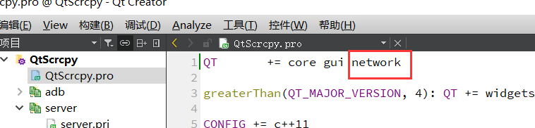

# server模块

## QtScrcpy启动流程

1. 将scrcpy-server推送到手机（adb push）

2. 启动反向代理（adb reverse）

3. pc端监听代理的端口

4. 启动scrcpy-server（adb shell app_process）

   ```shell
   # 在这里需要了解如下一行命令
   adb shell CLASSPATH=/data/local/tmp/scrcpy-server.jar app_process / com.genymoblie.scrcpy.Server maxsize bitrate false ""
   # /data/local/tmp/scrcpy-server.jar 指要运行的jar包
   # / com.genymoblie.scrcpy.Server 斜杠后面指要运行jar包中的那个类
   # maxsize 最大尺寸 0/480/720/1080 添加1080较合理
   # bitrate 比特率 
   # false 反向代理  true 为正向代理
   # “”  这个参数填 是否剪切区域
   ```

5. 接收scrcpy-server的连接，并进行通信

## 添加server模块

如之前创建adb模块，新建server文件夹以及server.pri文件，并在总配置文件`QtScrcpy.pro`中添加如下信息

```
# 子工程
include($$PWD/adb/adb.pri)
include($$PWD/server/server.pri)

# 包含目录
INCLUDEPATH += \
    $$PWD/adb \
    $$PWD/server
```

## 新建server类

> 本节内容需要时不时的切换子目录观看

同之前adb模块，添加新类Server

### 服务启动方法

`bool start(const QString& serial, quint16 localPort, quint16 maxSize, quint32 bitRate);`

+ serial：操作的序列号标识
+ localPort：代理的本地端口
+ maxSize：屏幕尺寸
+ bitRate：比特率

鉴于这些参数作用与整个server类，所以将其添加为server类的属性

```c++
#ifndef SERVER_H
#define SERVER_H

#include <QObject>

#include "adbprocess.h"

class server : public QObject
{
private:
    QString m_serial = "";
    quint16 m_localPort = 0;
    quint16 m_maxSize = 0;
    quint32 m_bitRate = 0;

public:

    bool start(const QString& serial, quint16 localPort, quint16 maxSize, quint32 bitRate);

};

#endif // SERVER_H
```

#### 启动步骤与信号

> 对于服务的启动具有一定的步骤，并且每一步的成功与失败都需要有相应的处理方法，因此需要**定义这些步骤**以做标识，并需要一个**状态变量**保存当前所处的步骤

> 对于每一个步骤要知道他是否成功的执行，因此这里还需要一个**自定义信号**

server.h 头文件

```c++
#ifndef SERVER_H
#define SERVER_H

#include <QObject>

#include "adbprocess.h"

class server : public QObject
{
    Q_OBJECT
    // 步骤
    enum SERVER_START_STEP {
        SSS_NULL,
        SSS_PUSH,
        SSS_ENABLE_REVERSE,
        SSS_EXEUTE_SERVER,
        SSS_RUNNING
    };

private:
    QString m_serial = "";
    quint16 m_localPort = 0;
    quint16 m_maxSize = 0;
    quint32 m_bitRate = 0;
    
    // 状态变量
    SERVER_START_STEP m_serverStartStep = SSS_NULL;

public:
    server(QObject *parent = Q_NULLPTR);

    // 服务启动方法
    bool start(const QString& serial, quint16 localPort, quint16 maxSize, quint32 bitRate);

signals:
    // 自定义信号，用于每个步骤处理完后判断是否成功
    void serverStartResult(bool success);
};

#endif // SERVER_H
```

server.cpp 

首先将传递的参数全部保存到类中，然后修改当前所处的步骤为`SSS_PUSH`

```c++
bool server::start(const QString &serial, quint16 localPort, quint16 maxSize, quint32 bitRate)
{
    m_serial = serial;
    m_localPort = localPort;
    m_maxSize = maxSize;
    m_bitRate = bitRate;

    // start push server
    m_serverStartStep = SSS_PUSH;
    return startServerByStep();
}
```

> **注意**：若想在类中自定义信号与槽，这个类需要继承`QObject`，并声明`Q_OBJECT`宏

#### 状态机函数

`bool startServerByStep();`

此函数设计的很巧妙，通过步骤状态、switch选择处理的方法、connect连接，使得每到达一个状态都能有条不紊的朝着下一个状态变化。

```c++
bool server::startServerByStep()
{
    bool stepSuccess = false;
    if (SSS_NULL != m_serverStartStep) {
        switch (m_serverStartStep) {
        case SSS_PUSH:
            stepSuccess = pushServer();
            break;
        case SSS_ENABLE_REVERSE:
            stepSuccess = enableTunnelReverse();
            break;
        case SSS_EXEUTE_SERVER:
            break;
        default:
            break;
        }
    }
    return stepSuccess;
}
```

1. 若处于`SSS_NULL`，则直接跳过处理，代表服务启动失败
2. 若处于`SSS_PUSH`，则执行`pushServer()`函数（参考pushServer方法），用来推送`server.jar`到手机中
3. 若处于`SSS_ENABLE_REVERSE`，则执行`enableTunnelReverse()`函数，用来进行反向代理

#### 信号连接

服务启动的每个步骤其实都涉及到adb的操作，自然而然也就用到了之前封装的`AdbProcess`类，它自定义了一个信号，并且封装的`AdbProcess`每执行一次操作时，都会触发这个信号，如下

adbprocess.h

```c++
#ifndef ADBPROCESS_H
#define ADBPROCESS_H

#include <QProcess>

class AdbProcess : public QProcess
{
public:
    enum ADB_EXEC_RESULT {
        AER_SUCCESS_START,          // 启动成功
        AER_ERROR_START,            // 启动失败
        AER_SUCCESS_EXEC,           // 执行成功
        AER_ERROR_EXEC,             // 执行失败
        AER_ERROR_MISSING_BINARY    // 找不到文件
    };
	....
signals:
    void adbProcessResult(ADB_EXEC_RESULT processResult);
	....
};

#endif // ADBPROCESS_H
```

adbprocess.cpp

`initSignals()`方法会在AdbProcess的构造方法里被调用

```c++
void AdbProcess::initSignals()
{
    connect(this, &QProcess::errorOccurred, this, [this](QProcess::ProcessError error){
        if (QProcess::FailedToStart == error) {
            emit adbProcessResult(AER_ERROR_MISSING_BINARY);
        } else {
            emit adbProcessResult(AER_ERROR_START);
        }
        qDebug() << error;
    });

    connect(this, QOverload<int, QProcess::ExitStatus>::of(&QProcess::finished),
            [this](int exitCode, QProcess::ExitStatus exitStatus){
        if (QProcess::NormalExit == exitStatus && 0 == exitCode) {
            emit adbProcessResult(AER_SUCCESS_EXEC);
        } else {
            emit adbProcessResult(AER_ERROR_EXEC);
        }
        qDebug() << exitCode << exitStatus;
    });

    connect(this, &QProcess::readyReadStandardError, this, [this](){
        m_standardError = QString::fromLocal8Bit(readAllStandardError()).trimmed();
        qDebug() << m_standardError;
    });
    connect(this, &QProcess::readyReadStandardOutput, this, [this](){
        m_standardOutput = QString::fromLocal8Bit(readAllStandardOutput()).trimmed();
        qDebug() << m_standardOutput;
    });
    connect(this, &QProcess::started, this, [this](){
        emit adbProcessResult(AER_SUCCESS_START);
        qDebug() << "start";
    });

}
```

因此，在这里，信号的发送者就是server类中AdbProcess类型的成员变量，每当他触发一次`adbProcessResult`信号时，都将其连接到server的一个名叫`onWorkProcessResult`槽函数

#### adb信号处理函数

上面提到的`onWorkProcessResult`槽函数主要用来处理状态机每次的处理结果

server.h

```c++
#ifndef SERVER_H
#define SERVER_H

#include <QObject>

#include "adbprocess.h"

class server : public QObject
{
	....
private slots:
    void onWorkProcessResult(AdbProcess::ADB_EXEC_RESULT processResult);
};

#endif // SERVER_H
```

server.cpp

```c++
void server::onWorkProcessResult(AdbProcess::ADB_EXEC_RESULT processResult)
{
    if (SSS_NULL != m_serverStartStep) {
        switch (m_serverStartStep) {
        case SSS_PUSH:
            if (AdbProcess::AER_SUCCESS_EXEC == processResult) {
                m_serverStartStep = SSS_ENABLE_REVERSE;
                m_serverCopiedToDevice = true;
                startServerByStep();
            } else if (AdbProcess::AER_SUCCESS_START != processResult) {
                qCritical("adb push failed");
                m_serverStartStep = SSS_NULL;
                emit serverStartResult(false);
            }
            break;
        case SSS_ENABLE_REVERSE:
            if (AdbProcess::AER_SUCCESS_EXEC == processResult) {
                m_serverStartStep = SSS_EXEUTE_SERVER;
                m_enableReverse = true;
                startServerByStep();
            } else if (AdbProcess::AER_SUCCESS_START != processResult) {
                qCritical("adb reverse failed");
                m_serverStartStep = SSS_NULL;
                // removeServer
                removeServer();
                emit serverStartResult(false);
            }
            break;
        case SSS_EXEUTE_SERVER:
            break;
        default:
            break;
        }
    }
}
```

判断当前步骤的状态函数

1. 若状态为`SSS_NULL`，则直接跳过状态处理
2. 若状态为`SSS_PUSH`，则进行`pushServer()`函数的结果处理，若pushServer函数中所执行的adbprocess
   1. 触发了信号`AER_SUCCESS_EXEC`，代表此步骤执行成功，需要跳转到下一个状态，所以需要修改当前步骤状态变量为`SSS_ENABLE_REVERSE`，然后标识`m_serverCopiedToDevice`为true，代表已经复制成功，并继续执行状态机函数（m_serverCopiedToDevice变量的意义参考失败处理函数，removeServer下同）
   2. 如果没有执行成功，并且信号不为`AER_SUCCESS_START`，则日志输出执行失败，修改修改当前步骤状态变量为`SSS_NULL`，并触发server自定义的`serverStartResult(false)`信号
3. 若状态为`SSS_ENABLE_REVERSE`，则进行`enableTunnelReverse()`函数的结果处理，若方法内adbprocess
   1. 触发了信号`AER_SUCCESS_EXEC`，代表此步骤执行成功，需要跳转到下一个状态，所以需要修改当前步骤状态变量为`SSS_EXEUTE_SERVER`，然后标识`m_enableReverse`为true，代表已经代理成功，并继续执行状态机函数
   2. 如果没有执行成功，并且信号不为`AER_SUCCESS_START`，则日志输出执行失败，修改修改当前步骤状态变量为`SSS_NULL`，多了一步擦屁股操作，就是删除上一步push的jar包，最后触发server自定义的`serverStartResult(false)`信号

### pushServer()

此方法主要将`scrcpy-server.jar`推送到手机上，所以会使用到adb命令，因此这里会用到之前封装的`AdbProcess`，因此这里将定义一个AdbProcess成员变量。

因为`scrcpy-server.jar`需要开发者自己准备，所以需要定义一个方法获取这个jar包的位置，也就是`getServerPath()`函数

server.h

```c++
#ifndef SERVER_H
#define SERVER_H

#include <QObject>

#include "adbprocess.h"

class server : public QObject
{
  	....
private:
    ....
    QString m_serverPath = "";
    
    AdbProcess m_workProcess;

    bool startServerByStep();
    bool pushServer();
    ...

    QString getServerPath();
    ....
};

#endif // SERVER_H
```

server.cpp

因为需要将jar包推送到手机的一个固定位置，所以这里定义了一个`DEVICE_SERVER_PATH`常量

```c++
#define DEVICE_SERVER_PATH "/data/local/tmp/scrcpy-server.jar"

bool server::pushServer()
{
    m_workProcess.push(m_serial, getServerPath(), DEVICE_SERVER_PATH);
    return true;
}

QString server::getServerPath()
{
    if (m_serverPath.isEmpty()) {
        m_serverPath = QString::fromLocal8Bit(qgetenv("QTSCRCPY_SERVER_PATH"));
        QFileInfo fileInfo(m_serverPath);
        if (m_serverPath.isEmpty() || !fileInfo.isFile()) {
            m_serverPath = QCoreApplication::applicationDirPath() + "/scrcpy-server.jar";
        }
    }
    return m_serverPath;
}
```

main.cpp

将jar包所在位置置于env中

```c++
#include "dialog.h"

#include <QApplication>

int main(int argc, char *argv[])
{
    ....
    ////新增/////
    qputenv("QTSCRCPY_SERVER_PATH", "..\\QtScrcpy\\third_party\\scrcpy-server.jar");
    ////////////
	
    QApplication a(argc, argv);
    Dialog w;
    w.show();
    return a.exec();
}
```

文件结构图

```
QtScrcpy/
|--adb/ 		# adb模块代码
|--server/		# server模块代码
|--third_party/
|	|-- adb/ 	# adb.exe
	|-- scrcpy-server.jar # jar包所在位置
```

### removeServer()

因为当一个步骤执行失败时，需要抹除上一个正确的步骤产生的影响，在这里此方法用来删除push推送的jar包

server.h

```c++
#ifndef SERVER_H
#define SERVER_H

#include <QObject>

#include "adbprocess.h"

class server : public QObject
{
private:
    ...
    bool m_serverCopiedToDevice = false;
    bool removeServer();
    ...
};

#endif // SERVER_H
```

server.cpp

```c++
bool server::removeServer()
{
    if (!m_serverCopiedToDevice) {
        return true;
    }
    m_serverCopiedToDevice = false;
    
    AdbProcess* adb = new AdbProcess();
    if (!adb) return false;
    connect(adb, &AdbProcess::adbProcessResult, this, [this](AdbProcess::ADB_EXEC_RESULT processResult) {
        if (AdbProcess::AER_SUCCESS_START != processResult) {
            sender()->deleteLater();
        }
    });
    adb->remove(m_serial, DEVICE_SERVER_PATH);
    return true;
}
```

为什么要有`m_serverCopiedToDevice`这个变量呢，主要是怕多次执行这个清理函数，具体还要看之后的代码


这里有个小知识点，删除操作是异步的，会消耗一定的时间，所以这里使用connect信号连接的方式来释放adbprocess所占用的内存，在槽函数内部，`sender()`代表信号的发送者，所以如下操作

```c++
sender()->deleteLater();
```

会自动释放信号发送者的内存

### enableTunnelReverse()

此方法用来进行反向代理

server.h

```c++
#ifndef SERVER_H
#define SERVER_H

#include <QObject>

#include "adbprocess.h"

class server : public QObject
{
private:
    ...
    bool enableTunnelReverse();
    ...
};

#endif // SERVER_H
```

server.cpp

```c++
bool server::enableTunnelReverse()
{
    m_workProcess.reverse(m_serial, SOCKET_NAME, m_localPort);
    return true;
}
```

## Adb阻塞

> 本节内容需要在上一节全部看完后才能阅读

编码到这，状态机函数就到了`SSS_EXEUTE_SERVER`这个步骤，也就是启动scrcpy-server（adb shell app_process），但是adb shell这个命令是阻塞的，所以不能使用同一个AdbProcess，所以需要新添加一个AdbProcess成员变量，以这个新的adbprocess来执行adb shell操作

### execute()

还有就是执行execute之前，需要监听本地的端口，需要用到`QTcpServer`和`QTcpSocket`类，要使用这两个类需要先在Scrcpy.pro添加`network`模块，如下




server.h

```c++
#ifndef SERVER_H
#define SERVER_H

#include <QObject>
/// 新增 ////
#include <QTcpServer>
#include <QTcpSocket>
////////////

#include "adbprocess.h"

class server : public QObject
{
    ....
private:
    ....

    AdbProcess m_workProcess;
    
    /// 新增 ////
    AdbProcess m_serverProcess;
    
    QTcpServer m_serverSocket;
    QTcpSocket* m_deviceSocket = Q_NULLPTR;
    ////////////

    bool execute();
    .....
};

#endif // SERVER_H
```

server.cpp

```c++
bool server::execute()
{
    QStringList args;
    args << "shell";
    args << QString("CLASSPATH=%1").arg(DEVICE_SERVER_PATH);
    args << "app_process";
    args << "/";
    args << "com.genymobile.scrcpy.Server";
    args << QString::number(m_maxSize);
    args << QString::number(m_bitRate);
    args << "false";
    args << "";
    m_serverProcess.execute(m_serial, args);
    return true;
}
```

### 状态机函数

```c++
bool server::startServerByStep()
{
    bool stepSuccess = false;
    if (SSS_NULL != m_serverStartStep) {
        switch (m_serverStartStep) {
        case SSS_PUSH:
            stepSuccess = pushServer();
            break;
        case SSS_ENABLE_REVERSE:
            stepSuccess = enableTunnelReverse();
            break;
        case SSS_EXEUTE_SERVER:
            ///新增////
            m_serverSocket.setMaxPendingConnections(1);
            if (!m_serverSocket.listen(QHostAddress::LocalHost, m_localPort)) {
                qCritical(QString("Could not listen on port %1").arg(m_localPort).toStdString().c_str());
                m_serverStartStep = SSS_NULL;
                disableTunnelReverse();
                removeServer();
                emit serverStartResult(false);
                return false;
            }
            stepSuccess = execute();
            //////////
            break;
        default:
            break;
        }
    }
    return stepSuccess;
}
```

监听本地端口首先通过`setMaxPendingConnections()`设置socket的最大连接数，然后执行`listen()`，判断之前反向代理是否成功，如果不成功，则输出错误日志，然后清除上一个产生的影响

### adb信号处理函数

虽然 adb shell 是阻塞方法，所以需要另一个AdbProcess来发起信号，但是信号处理仍然可以用这个 onWorkProcessResult 处理函数，只不过需要用 if 来区分一下 这个信号是谁发起的，并作相应处理

```c++
server::server(QObject *parent)
    : QObject(parent)
{
    connect(&m_workProcess, &AdbProcess::adbProcessResult, this, &server::onWorkProcessResult);
    /// 新增 ///
    connect(&m_serverProcess, &AdbProcess::adbProcessResult, this, &server::onWorkProcessResult);
    ///////////
}

void server::onWorkProcessResult(AdbProcess::ADB_EXEC_RESULT processResult)
{
    if (sender() == &m_workProcess) {
        if (SSS_NULL != m_serverStartStep) {
            switch (m_serverStartStep) {
            case SSS_PUSH:
                if (AdbProcess::AER_SUCCESS_EXEC == processResult) {
                    m_serverStartStep = SSS_ENABLE_REVERSE;
                    m_serverCopiedToDevice = true;
                    startServerByStep();
                } else if (AdbProcess::AER_SUCCESS_START != processResult) {
                    qCritical("adb push failed");
                    m_serverStartStep = SSS_NULL;
                    emit serverStartResult(false);
                }
                break;
            case SSS_ENABLE_REVERSE:
                if (AdbProcess::AER_SUCCESS_EXEC == processResult) {
                    m_serverStartStep = SSS_EXEUTE_SERVER;
                    m_enableReverse = true;
                    startServerByStep();
                } else if (AdbProcess::AER_SUCCESS_START != processResult) {
                    qCritical("adb reverse failed");
                    m_serverStartStep = SSS_NULL;
                    // removeServer
                    removeServer();
                    emit serverStartResult(false);
                }
                break;
            case SSS_EXEUTE_SERVER:
                break;
            default:
                break;
            }
        }
    } else if (sender() == &m_serverProcess) {
        /// 新增 ///
        if (SSS_EXEUTE_SERVER == m_serverStartStep) {
            if (AdbProcess::AER_SUCCESS_START == processResult) {
                m_serverStartStep = SSS_RUNNING;
                emit serverStartResult(true);
            } else if (AdbProcess::AER_ERROR_START == processResult) {
                qCritical("adb server failed");
                m_serverStartStep = SSS_NULL;
                removeServer();
                disableTunnelReverse();
                emit serverStartResult(false);
            }
        }
        /////////
    }
}
```

这个处理就是判断步骤状态变量是否为`SSS_EXEUTE_SERVER`，若是则进行`execute()`函数的结果处理，若方法内adbprocess

1. 触发了信号`AER_SUCCESS_START`，代表此步骤执行成功，需要跳转到下一个状态，所以需要修改当前步骤状态变量为`SSS_RUNNING`，代表已经代理成功，并继续执行状态机函数
2. 如果没有执行成功，并且信号不为`AER_SUCCESS_START`，则日志输出执行失败，修改修改当前步骤状态变量为`SSS_NULL`，多了两步擦屁股操作，就是删除上一步push的jar包，并取消反向代理（`disableTunnelReverse()`函数），最后触发server自定义的`serverStartResult(false)`信号

### disableTunnelReverse()

server.h

```c++
#ifndef SERVER_H
#define SERVER_H

#include <QObject>

#include "adbprocess.h"

class server : public QObject
{
  	....
private:
    ....
    bool disableTunnelReverse();
    ...
};

#endif // SERVER_H
```

server.cpp

```c++
bool server::disableTunnelReverse()
{
    if (!m_enableReverse) {
        return true;
    }
    m_enableReverse = false;

    AdbProcess* adb = new AdbProcess();
    if (!adb) return false;
    connect(adb, &AdbProcess::adbProcessResult, this, [this](AdbProcess::ADB_EXEC_RESULT processResult) {
        if (AdbProcess::AER_SUCCESS_START != processResult) {
            sender()->deleteLater();
        }
    });
    adb->reverseRemove(m_serial, SOCKET_NAME);
    return true;
}
```

## 建立socket连接

当执行完`execute()`函数以及后续得adb信号处理函数后，当前步骤变量已经变成了`SSS_RUNNING`，这时只要等待socket连接得建立就行，因此需要一个新连接建立得槽函数来保存建立的socket连接

server.cpp

```c++
server::server(QObject *parent)
    : QObject(parent)
{
    connect(&m_workProcess, &AdbProcess::adbProcessResult, this, &server::onWorkProcessResult);
    connect(&m_serverProcess, &AdbProcess::adbProcessResult, this, &server::onWorkProcessResult);
    //// 新增 /////
    connect(&m_serverSocket, &QTcpServer::newConnection, this, [this]() {
        m_deviceSocket = m_serverSocket.nextPendingConnection(); // 获取这个socket连接

        QString deviceName;
        QSize size;

        if (m_deviceSocket && m_deviceSocket->isValid() && readInfo(deviceName, size)) { // 代表socket建立成功
            // socket 建立成功后，之前的server.jar和反向代理就没有存在的必要，可以清除了
            disableTunnelReverse();
            removeServer();
            emit connectToResult(true, deviceName, size);
        } else {
            stop();
            emit connectToResult(false, deviceName, size);
        }
    });
    ///////////////
}
```

### 读取信息

server.cpp

```c++
#define DEVICE_NAME_FIELD_LENGTH 64

bool server::readInfo(QString &deviceName, QSize &size)
{
    // abk001-----------------------0x0438 0x02d0
    //                64b            2b w   2b h
    unsigned char buf[DEVICE_NAME_FIELD_LENGTH + 4];
    if (m_deviceSocket->bytesAvailable() <= (DEVICE_NAME_FIELD_LENGTH + 4)) {
        m_deviceSocket->waitForReadyRead(300);
    }

    qint64 len = m_deviceSocket->read((char*)buf, sizeof(buf));
    if (len < DEVICE_NAME_FIELD_LENGTH + 4) {
        qInfo("Could not retrieve device information");
        return false;
    }
    buf[DEVICE_NAME_FIELD_LENGTH - 1] = '\0';
    deviceName = (char*)buf;
    size.setWidth((buf[DEVICE_NAME_FIELD_LENGTH] << 8) | buf[DEVICE_NAME_FIELD_LENGTH + 1]);
    size.setHeight((buf[DEVICE_NAME_FIELD_LENGTH + 2] << 8) | buf[DEVICE_NAME_FIELD_LENGTH + 3]);
    return true;
}
```

建立连接后会返回一段关于设备名（64字节）和大小（4字节）信息

## 源代码

### server.h

```server.h
#ifndef SERVER_H
#define SERVER_H

#include <QObject>
#include <QTcpServer>
#include <QTcpSocket>
#include <QSize>
#include <QFileInfo>
#include <QCoreApplication>

#include "adbprocess.h"

class server : public QObject
{
    Q_OBJECT
    enum SERVER_START_STEP {
        SSS_NULL,
        SSS_PUSH,
        SSS_ENABLE_REVERSE,
        SSS_EXEUTE_SERVER,
        SSS_RUNNING
    };

private:
    QString m_serial = "";
    quint16 m_localPort = 0;
    quint16 m_maxSize = 0;
    quint32 m_bitRate = 0;
    QString m_serverPath = "";
    bool m_serverCopiedToDevice = false;
    bool m_enableReverse = false;

    SERVER_START_STEP m_serverStartStep = SSS_NULL;

    AdbProcess m_workProcess;
    AdbProcess m_serverProcess;

    QTcpServer m_serverSocket;
    QTcpSocket* m_deviceSocket = Q_NULLPTR;

    bool startServerByStep();
    bool pushServer();
    bool removeServer();
    bool enableTunnelReverse();
    bool disableTunnelReverse();
    bool execute();
    bool readInfo(QString& deviceName, QSize& size);

    QString getServerPath();

public:
    server(QObject *parent = Q_NULLPTR);

    bool start(const QString& serial, quint16 localPort, quint16 maxSize, quint32 bitRate);
    void stop();

signals:
    void serverStartResult(bool success);
    void connectToResult(bool success, const QString& deviceName, const QSize& size);

private slots:
    void onWorkProcessResult(AdbProcess::ADB_EXEC_RESULT processResult);
};

#endif // SERVER_H
```

### server.cpp

```c++
#include "server.h"

#define DEVICE_SERVER_PATH "/data/local/tmp/scrcpy-server.jar"
#define SOCKET_NAME "scrpcy"
#define DEVICE_NAME_FIELD_LENGTH 64

server::server(QObject *parent)
    : QObject(parent)
{
    connect(&m_workProcess, &AdbProcess::adbProcessResult, this, &server::onWorkProcessResult);
    connect(&m_serverProcess, &AdbProcess::adbProcessResult, this, &server::onWorkProcessResult);
    connect(&m_serverSocket, &QTcpServer::newConnection, this, [this]() {
        m_deviceSocket = m_serverSocket.nextPendingConnection(); // 获取这个socket连接

        QString deviceName;
        QSize size;

        if (m_deviceSocket && m_deviceSocket->isValid() && readInfo(deviceName, size)) { // 代表socket建立成功
            // socket 建立成功后，之前的server.jar和反向代理就没有存在的必要，可以清除了
            disableTunnelReverse();
            removeServer();
            emit connectToResult(true, deviceName, size);
        } else {
            stop();
            emit connectToResult(false, deviceName, size);
        }
    });
}

bool server::start(const QString &serial, quint16 localPort, quint16 maxSize, quint32 bitRate)
{
    m_serial = serial;
    m_localPort = localPort;
    m_maxSize = maxSize;
    m_bitRate = bitRate;

    // start push server
    m_serverStartStep = SSS_PUSH;
    return startServerByStep();
}

void server::stop()
{
    if (m_deviceSocket) {
        m_deviceSocket->close();
    }
    m_serverProcess.kill();
    disableTunnelReverse();
    removeServer();
    m_serverSocket.close();
}

void server::onWorkProcessResult(AdbProcess::ADB_EXEC_RESULT processResult)
{
    if (sender() == &m_workProcess) {
        if (SSS_NULL != m_serverStartStep) {
            switch (m_serverStartStep) {
            case SSS_PUSH:
                if (AdbProcess::AER_SUCCESS_EXEC == processResult) {
                    m_serverStartStep = SSS_ENABLE_REVERSE;
                    m_serverCopiedToDevice = true;
                    startServerByStep();
                } else if (AdbProcess::AER_SUCCESS_START != processResult) {
                    qCritical("adb push failed");
                    m_serverStartStep = SSS_NULL;
                    emit serverStartResult(false);
                }
                break;
            case SSS_ENABLE_REVERSE:
                if (AdbProcess::AER_SUCCESS_EXEC == processResult) {
                    m_serverStartStep = SSS_EXEUTE_SERVER;
                    m_enableReverse = true;
                    startServerByStep();
                } else if (AdbProcess::AER_SUCCESS_START != processResult) {
                    qCritical("adb reverse failed");
                    m_serverStartStep = SSS_NULL;
                    // removeServer
                    removeServer();
                    emit serverStartResult(false);
                }
                break;
            case SSS_EXEUTE_SERVER:
                break;
            default:
                break;
            }
        }
    } else if (sender() == &m_serverProcess) {
        if (SSS_EXEUTE_SERVER == m_serverStartStep) {
            if (AdbProcess::AER_SUCCESS_START == processResult) {
                m_serverStartStep = SSS_RUNNING;
                emit serverStartResult(true);
            } else if (AdbProcess::AER_ERROR_START == processResult) {
                qCritical("adb server failed");
                m_serverStartStep = SSS_NULL;
                removeServer();
                disableTunnelReverse();
                emit serverStartResult(false);
            }
        }
    }
}

bool server::startServerByStep()
{
    bool stepSuccess = false;
    if (SSS_NULL != m_serverStartStep) {
        switch (m_serverStartStep) {
        case SSS_PUSH:
            stepSuccess = pushServer();
            break;
        case SSS_ENABLE_REVERSE:
            stepSuccess = enableTunnelReverse();
            break;
        case SSS_EXEUTE_SERVER:
            m_serverSocket.setMaxPendingConnections(1);
            if (!m_serverSocket.listen(QHostAddress::LocalHost, m_localPort)) {
                qCritical(QString("Could not listen on port %1").arg(m_localPort).toStdString().c_str());
                m_serverStartStep = SSS_NULL;
                disableTunnelReverse();
                removeServer();
                emit serverStartResult(false);
                return false;
            }
            stepSuccess = execute();
            break;
        default:
            break;
        }
    }
    return stepSuccess;
}

bool server::pushServer()
{
    m_workProcess.push(m_serial, getServerPath(), DEVICE_SERVER_PATH);
    return true;
}

bool server::removeServer()
{
    if (!m_serverCopiedToDevice) {
        return true;
    }
    m_serverCopiedToDevice = false;

    AdbProcess* adb = new AdbProcess();
    if (!adb) return false;
    connect(adb, &AdbProcess::adbProcessResult, this, [this](AdbProcess::ADB_EXEC_RESULT processResult) {
        if (AdbProcess::AER_SUCCESS_START != processResult) {
            sender()->deleteLater();
        }
    });
    adb->remove(m_serial, DEVICE_SERVER_PATH);
    return true;
}

bool server::enableTunnelReverse()
{
    m_workProcess.reverse(m_serial, SOCKET_NAME, m_localPort);
    return true;
}

bool server::disableTunnelReverse()
{
    if (!m_enableReverse) {
        return true;
    }
    m_enableReverse = false;

    AdbProcess* adb = new AdbProcess();
    if (!adb) return false;
    connect(adb, &AdbProcess::adbProcessResult, this, [this](AdbProcess::ADB_EXEC_RESULT processResult) {
        if (AdbProcess::AER_SUCCESS_START != processResult) {
            sender()->deleteLater();
        }
    });
    adb->reverseRemove(m_serial, SOCKET_NAME);
    return true;
}

bool server::execute()
{
    QStringList args;
    args << "shell";
    args << QString("CLASSPATH=%1").arg(DEVICE_SERVER_PATH);
    args << "app_process";
    args << "/";
    args << "com.genymobile.scrcpy.Server";
    args << QString::number(m_maxSize);
    args << QString::number(m_bitRate);
    args << "false";
    args << "";
    m_serverProcess.execute(m_serial, args);
    return true;
}

bool server::readInfo(QString &deviceName, QSize &size)
{
    // abk001-----------------------0x0438 0x02d0
    //                64b            2b w   2b h
    unsigned char buf[DEVICE_NAME_FIELD_LENGTH + 4];
    if (m_deviceSocket->bytesAvailable() <= (DEVICE_NAME_FIELD_LENGTH + 4)) {
        m_deviceSocket->waitForReadyRead(300);
    }

    qint64 len = m_deviceSocket->read((char*)buf, sizeof(buf));
    if (len < DEVICE_NAME_FIELD_LENGTH + 4) {
        qInfo("Could not retrieve device information");
        return false;
    }
    buf[DEVICE_NAME_FIELD_LENGTH - 1] = '\0';
    deviceName = (char*)buf;
    size.setWidth((buf[DEVICE_NAME_FIELD_LENGTH] << 8) | buf[DEVICE_NAME_FIELD_LENGTH + 1]);
    size.setHeight((buf[DEVICE_NAME_FIELD_LENGTH + 2] << 8) | buf[DEVICE_NAME_FIELD_LENGTH + 3]);
    return true;
}

QString server::getServerPath()
{
    if (m_serverPath.isEmpty()) {
        m_serverPath = QString::fromLocal8Bit(qgetenv("QTSCRCPY_SERVER_PATH"));
        QFileInfo fileInfo(m_serverPath);
        if (m_serverPath.isEmpty() || !fileInfo.isFile()) {
            m_serverPath = QCoreApplication::applicationDirPath() + "/scrcpy-server.jar";
        }
    }
    return m_serverPath;
}
```

## server改造

因为要`QTcpSocket`要获取数据，但是解码是一个耗时的过程，需要在一个单独的线程中完成。

又因为`QTcpSocket`是在主线程中创建的，他的一些接口不能跨线程访问，这样子线程就不能调用他的接口了

`QTcpSocket`继承自`QObject`，他有个方法moveToThread，可以将其移动到指定线程中，而本程序使用的方式是多线程同步方式共享数据，UI线程作为生产者和解码器线程作为消费者获取数据，以此来解决通信的问题

### DeviceSocket

devicesocket.h

```c++
#ifndef DEVICESOCKET_H
#define DEVICESOCKET_H

#include <QTcpSocket>
#include <QWaitCondition> // 条件变量，通知消费者数据到来
#include <QMutex>         // 互斥锁，保证条件变量的安全性，一般和条件变量一起使用

class DeviceSocket : public QTcpSocket
{
    Q_OBJECT
public:
    DeviceSocket(QObject *parent = nullptr);
    ~DeviceSocket();
    
    qint32 subThreadRecvData(quint8* buf, qint32 bufSize);
    
protected:
    bool event(QEvent* event);
    
private:
    // 锁
    QMutex m_mutex;
    QWaitCondition m_recvDataCond;
    
    // 标志
    bool m_recvData = false;
    bool m_quit = false;
    
    // 数据缓存
    quint8* m_buffer = Q_NULLPTR;
    qint32 m_bufferSize = 0;    // 缓存区大小
    qint32 m_dataSize = 0;      // 收到数据的大小
    
protected slots:
    void onReadyRead();
    void quitNotify();
};

#endif // DEVICESOCKET_H
```

devicesocket.cpp

```c++
#include <QCoreApplication>
#include <QThread>

#include "devicesocket.h"
#include "qscrcpyevent.h"

DeviceSocket::DeviceSocket(QObject *parent)
    : QTcpSocket(parent)
{
    connect(this, &DeviceSocket::readyRead, this, &DeviceSocket::onReadyRead);
    connect(this, &DeviceSocket::disconnected, this, &DeviceSocket::quitNotify);
    connect(this, &DeviceSocket::aboutToClose, this, &DeviceSocket::quitNotify);
}

DeviceSocket::~DeviceSocket()
{
    
}

qint32 DeviceSocket::subThreadRecvData(quint8 *buf, qint32 bufSize)
{
    // 保证这个函数在子线程中调用
    Q_ASSERT(QCoreApplication::instance()->thread() != QThread::currentThread());
    if (m_quit) return 0; // 推出标志为true，则不返回任何数据
    
    QMutexLocker locker(&m_mutex);
    
    // 初始化所有变量
    m_buffer = buf;
    m_bufferSize = bufSize;
    m_dataSize = 0;
    
    // 参考3级标题发送事件
    DeviceSocketEvent* getDataEvent = new DeviceSocketEvent();
    QCoreApplication::postEvent(this, getDataEvent);
    
    while(!m_recvData) {
        m_recvDataCond.wait(&m_mutex); // 阻塞在条件变量上
    }
    
    m_recvData = false;
    return m_dataSize; // 将收到的数据返回
}

bool DeviceSocket::event(QEvent *event)
{
    if (event->type() == QScrcpyEvent::DeviceSocket) {
        onReadyRead();
    }
    return QTcpSocket::event(event);
}

void DeviceSocket::onReadyRead()
{
    QMutexLocker locker(&m_mutex);
    if (m_buffer && 0 < bytesAvailable()) {
        qint64 readSize = qMin(bytesAvailable(), (qint64)m_bufferSize); // 获取可用可转载数据
        m_dataSize = read((char*)m_buffer, readSize); // 装填数据
        
        m_buffer = Q_NULLPTR;
        m_bufferSize = 0;
        m_recvData = true;
        
        m_recvDataCond.wakeOne(); // 唤醒消费者
    }
}

void DeviceSocket::quitNotify()
{
    m_quit = true;
    QMutexLocker locker(&m_mutex);
    if (m_buffer) {
        m_buffer = Q_NULLPTR;
        m_bufferSize = 0;
        m_recvData = true;
        m_dataSize = 0;
        m_recvDataCond.wakeOne();
    }
}
```

+ `QMutexLocker locker(&m_mutex)`：
  + 声明时会自动加锁，相当于执行`locker.lock()`
  + 当变量销毁时，会自动解锁，相当于执行`locker.unlock()`
  + 这样可以用c++的生命周期来管理加锁、解锁，防止忘记解锁了

### 发送事件

考虑一种情况，在`subThreadRecvData`函数调用之前，就传递过来了一个信号`readyRead`，由于如下代码

```c++
connect(this, &DeviceSocket::readyRead, this, &DeviceSocket::onReadyRead);
```

程序将执行`onReadyRead`函数，但是没有通过`subThreadRecvData`函数进行初始化操作，可能会发生一些问题，这时就要用到事件处理

#### 创建模块common

参考adb模块编写，配置pro文件

在common模块新建`qscrcpyevent.h`头文件，以此来申明一些自定义事件

```c++
#ifndef QSCRCPYEVENT_H
#define QSCRCPYEVENT_H

#include <QEvent>

class QScrcpyEvent : public QEvent 
{
public:
    enum Type {
        DeviceSocket = QEvent::User + 1,
        
    };
    
    QScrcpyEvent(Type type) : QEvent(QEvent::Type(type)) {}
    
    
};

// DeviceSocketEvent
class DeviceSocketEvent : public QScrcpyEvent
{
public:
    DeviceSocketEvent() : QScrcpyEvent(DeviceSocket) {}
};

#endif // QSCRCPYEVENT_H
```

+ 对于自定义的事件，枚举值要在`QEvent::User`之后才行，所以设置`DeviceSocket = QEvent::User + 1`

#### 触发事件

在`subThreadRecvData`方法执行的时候，触发事件，尝试执行`onReadyRead`函数

```c++
qint32 DeviceSocket::subThreadRecvData(quint8 *buf, qint32 bufSize)
{
    ....
    DeviceSocketEvent* getDataEvent = new DeviceSocketEvent();
    QCoreApplication::postEvent(this, getDataEvent);
    
	....
    
    m_recvData = false;
    return m_dataSize; // 将收到的数据返回
}
```

==注意，DeviceSocketEvent被new出来后，可以不用管他，当事件被处理后，他所占用的内存会被自动释放==

#### 事件处理

每个继承自`QObject`的对象都有一个虚函数`event()`，重写他可以完成对自定义事件的处理

devicesocket.h

```c++
#ifndef DEVICESOCKET_H
#define DEVICESOCKET_H

....

class DeviceSocket : public QTcpSocket
{
    Q_OBJECT
.... 
protected:
    bool event(QEvent* event);
....
};

#endif // DEVICESOCKET_H
```

devicesocket.cpp

```c++
bool DeviceSocket::event(QEvent *event)
{
    if (event->type() == QScrcpyEvent::DeviceSocket) {
        onReadyRead(); // 尝试收取数据
    }
    return QTcpSocket::event(event);
}
```

### 修改server类

server.h

```c++
#ifndef SERVER_H
#define SERVER_H

#include <QObject>
#include <QTcpServer>
#include <QTcpSocket> // 改为 #include "devicesocket.h"
#include <QSize>
#include <QFileInfo>
#include <QCoreApplication>

#include "adbprocess.h"

class server : public QObject
{
	....
private:
    QTcpServer m_serverSocket;
    QTcpSocket* m_deviceSocket = Q_NULLPTR; // QTcpSocket改为DeviceSocket
    .....
};

#endif // SERVER_H
```

如此修改后会发现server.cpp的connect匿名函数会报错

```c++
connect(&m_serverSocket, &QTcpServer::newConnection, this, [this]() {
    m_deviceSocket = m_serverSocket.nextPendingConnection()); // 报错
	....
});
```

#### tcpserver

在server模块新建tcpserver类

tcpserver.h

```c++
#ifndef TCPSERVER_H
#define TCPSERVER_H

#include <QTcpServer>

class TcpServer : public QTcpServer
{
    Q_OBJECT
public:
    TcpServer(QObject *parent = nullptr);

protected:
    virtual void incomingConnection(qintptr handle);
};

#endif // TCPSERVER_H
```

实现`incomingConnection`虚函数

tcpserver.cpp

```c++
#include "tcpserver.h"
#include "devicesocket.h"

TcpServer::TcpServer(QObject *parent)
    : QTcpServer(parent)
{

}

void TcpServer::incomingConnection(qintptr handle)
{
    DeviceSocket* socket = new DeviceSocket();
    socket->setSocketDescriptor(handle);
    addPendingConnection(socket);
}
```

在这里new的时候并没有写成`new DeviceSocket(this)`，如此写的话DeviceSocket将会由qt来管理生命周期，但这里并不需要，所以没有添加this参数


下面接着修改server类

server.h中

```c++
#include <QTcpServer> // 改为 #include "tcpserver.h"

class server : public QObject
{
	....
private:
    QTcpServer m_serverSocket; // QTcpServer改为TcpServer
    DeviceSocket* m_deviceSocket = Q_NULLPTR; 
    .....
};
```

server.cpp

```c++
connect(&m_serverSocket, &QTcpServer::newConnection, this, [this]() {
    m_deviceSocket = dynamic_cast<DeviceSocket*>(m_serverSocket.nextPendingConnection()); // 获取这个socket连接
	...
});
```

通过`dynamic_cast`可以将qtcpsocket安装的转换为devicesocket

