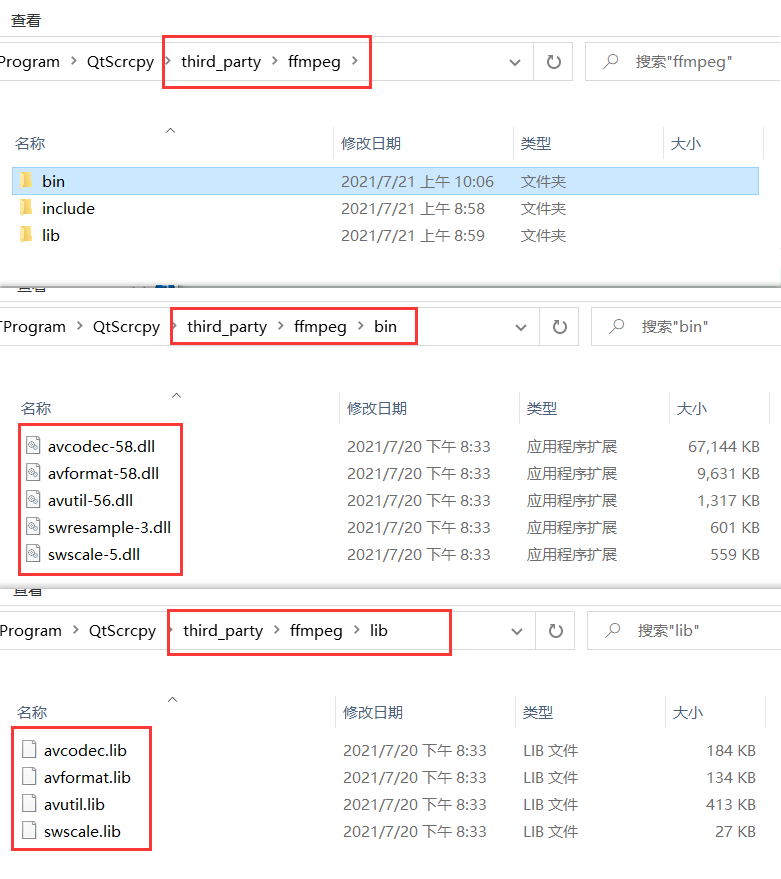
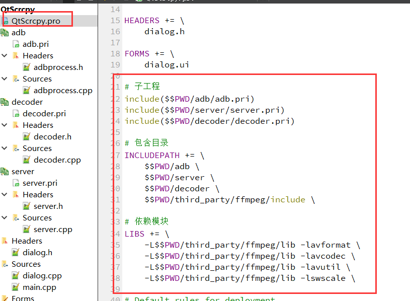
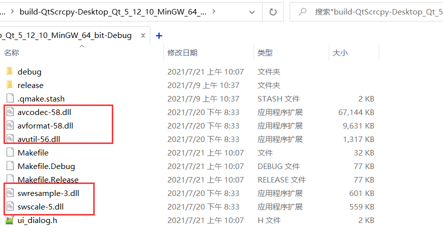

# ffmpeg模块

## 准备工作

### 资源下载

> [Download FFmpeg](https://ffmpeg.org/download.html)
>
> [Releases · BtbN/FFmpeg-Builds (github.com)](https://github.com/BtbN/FFmpeg-Builds/releases)

首先在github的releases下载share文件

打开需要用到3个文件夹，`lib`、`bin`以及`include`



需要复制的文件如上图所示，include内所有的文件都复制过去

### 配置



创建decoder模块，添加必要的配置

```pro
# 子工程
include($$PWD/adb/adb.pri)
include($$PWD/server/server.pri)
include($$PWD/decoder/decoder.pri)

# 包含目录
INCLUDEPATH += \
    $$PWD/adb \
    $$PWD/server \
    $$PWD/decoder \
    $$PWD/third_party/ffmpeg/include \

# 依赖模块
LIBS += \
    -L$$PWD/third_party/ffmpeg/lib -lavformat \
    -L$$PWD/third_party/ffmpeg/lib -lavcodec \
    -L$$PWD/third_party/ffmpeg/lib -lavutil \
    -L$$PWD/third_party/ffmpeg/lib -lswscale \
```

### cpp引入外部依赖

因为cpp要使用c文件，所以要通过`extern “C”`来引入

decoder.h

```c++
#ifndef DECODER_H
#define DECODER_H

extern "C"
{
#include "libavcodec/avcodec.h"
#include "libavformat/avformat.h"
}

class Decoder
{
public:
    Decoder();

    static bool init();
};

#endif // DECODER_H
```

decoder.cpp

```c++
#include "decoder.h"

Decoder::Decoder()
{

}

bool Decoder::init()
{
    if (avformat_network_init()) { // 返回1代表初始化失败
        return false;
    }
    return true;
}
```

### 测试

当运行时应该会报错，因为这需要将所有的`dll`文件复制到程序的工作目录中，如下复制过相应的文件后运行就不会报错了



## 源代码

由于代码实在有点难，有的看不懂，就直接复制源代码了，注意编写此代码之前先要完成server的改造工作

### decoder.h 

```C++
#ifndef DECODER_H
#define DECODER_H

extern "C"
{
#include "libavcodec/avcodec.h"
#include "libavformat/avformat.h"
}

#include <QPointer>
#include <QThread>

#include "devicesocket.h"
#include "frames.h"

class Decoder : public QThread
{
    Q_OBJECT
public:
    Decoder();
    virtual ~Decoder();

    static bool init();
    static void deInit();

    bool startDecode();
    void stopDecode();
    void setFrames(Frames* frames);
    void setDeviceSocket(DeviceSocket* deviceSocket);
    qint32 recvData(quint8* buf, qint32 bufSize);

protected:
    void run();
    void pushFrame();

private:
    // 接受h264数据
    QPointer<DeviceSocket> m_deviceSocket;
    // 退出标记
    bool m_quit = false;
    // 解码出的帧
    Frames* m_frames;

signals:
    void onNewFrame();
    void onDecodeStop();
};

#endif // DECODER_H
```

### decoder.cpp

```c++
#include "decoder.h"

#define BUFSIZE 0x10000

Decoder::Decoder()
{

}

Decoder::~Decoder()
{

}

bool Decoder::init()
{
    // 初始化
    if (avformat_network_init()) { // 返回1代表初始化失败
        return false;
    }
    return true;
}

void Decoder::deInit()
{
    // 清理
    avformat_network_deinit();
}

bool Decoder::startDecode()
{
    if (!m_deviceSocket) return false;
    m_quit = false;
    start();
    return true;
}

void Decoder::stopDecode()
{
    m_quit = true;
    if (m_frames) m_frames->stop();
    wait();
}

void Decoder::setFrames(Frames *frames)
{
    // 保存解码帧
    m_frames = frames;
}

void Decoder::setDeviceSocket(DeviceSocket *deviceSocket)
{
    // 设置socket
    m_deviceSocket = deviceSocket;
}

// 参数： Decoder对象，解码数据缓存，解码数据缓存大小
static qint32 readPacket(void *opaque, quint8 *buf, qint32 bufSize) {
    Decoder *decoder = (Decoder*)opaque;
    if (decoder) {
        return decoder->recvData(buf, bufSize);
    }
    return 0;
}

qint32 Decoder::recvData(quint8 *buf, qint32 bufSize)
{
    if (!buf) {
        return 0;
    }
    if (m_deviceSocket) {
        // 从deviceSocket获取h264数据
        qint32 len = m_deviceSocket->subThreadRecvData(buf, bufSize);
        if (len == -1) {
            return AVERROR(errno);
        }
        if (len == 0) {
            return AVERROR_EOF;
        }
        return len;
    }
    return AVERROR_EOF;
}

void Decoder::run()
{
    // 临时缓冲区:保存解码时产生的数据
    unsigned char *decoderBuffer = Q_NULLPTR;
    // io上下文：读取数据
    AVIOContext *avioCtx = Q_NULLPTR;
    // 封装上下文：解封装
    AVFormatContext *formatCtx = Q_NULLPTR;
    // 解码器：解码视频
    AVCodec *codec = Q_NULLPTR;
    // 解码器上下文：配合解码器来使用
    AVCodecContext *codecCtx = Q_NULLPTR;
    // 清理标记
    // 封装上下文清理标记
    bool isFormatCtxOpen = false;
    // 解码上下文清理标记
    bool isCodecCtxOpen = false;

    // 申请解码缓冲区
    decoderBuffer = (unsigned char*)av_malloc(BUFSIZE);
    if (!decoderBuffer) {
        qCritical("Could not allocate buffer");
        goto runQuit;
    }

    // 初始化io上下文
    // 参数 ： 解码缓冲区，解码缓冲区大小，写标记（0即可），readPacket参数，数据读取回调函数
    avioCtx = avio_alloc_context(decoderBuffer, BUFSIZE, 0, this, readPacket, NULL, NULL);
    if (!avioCtx) {
        qCritical("Could not allocate avio context");
        av_free(decoderBuffer);
        goto runQuit;
    }

    // 初始化封装上下文
    formatCtx = avformat_alloc_context();
    if (!formatCtx) {
        qCritical("Could not allocate format context");
        goto runQuit;
    }
    // 为封装上下文指定io上下文
    formatCtx->pb = avioCtx;
    // 打开封装上下文
    if (avformat_open_input(&formatCtx, NULL, NULL, NULL) < 0) {
        qCritical("Could not open video stream");
        goto runQuit;
    }
    isFormatCtxOpen = true;

    // 初始化解码器
    codec = avcodec_find_decoder(AV_CODEC_ID_H264);
    if (!codec) {
        qCritical("H.264 decoder not found");
        goto runQuit;
    }

    // 初始化解码器上下文
    codecCtx = avcodec_alloc_context3(codec);
    if (!codecCtx) {
        qCritical("Could not allocate decoder context");
        goto runQuit;
    }
    // 打开解码器上下文
    if (avcodec_open2(codecCtx, codec, NULL) < 0) {
        qCritical("Could not open H.264 codec");
        goto runQuit;
    }
    isCodecCtxOpen = true;

    // 解码数据包：保存解码前的一帧h264数据
    AVPacket packet;
    // 初始化解码数据包
    av_init_packet(&packet);
    packet.data = Q_NULLPTR;
    packet.size = 0;

    // 从封装上下文中读取一帧解码前的数据，保存到AVPacket中
    while (!m_quit && !av_read_frame(formatCtx, &packet)) {
        // 获取AVFrame用来保存解码出来的yuv数据
        AVFrame* decodingFrame = m_frames->decodingFrame();
        // 解码
        int ret;
        // 解码h264
        if ((ret = avcodec_send_packet(codecCtx, &packet)) < 0) {
            qCritical("Could not send video packet: %d", ret);
            goto runQuit;
        }
        // 取出yuv
        if (decodingFrame) {
            ret = avcodec_receive_frame(codecCtx, decodingFrame);
        }
        if (!ret) {
            // 成功解码出一帧
            pushFrame();
        } else if (ret != AVERROR(EAGAIN)) {
            qCritical("Could not receive video frame: %d", ret);
            av_packet_unref(&packet);
            goto runQuit;
        }

        av_packet_unref(&packet);

        if (avioCtx->eof_reached) {
            break;
        }
    }
    qDebug() << "End of frames";

runQuit:
    if (avioCtx) {
        av_freep(&avioCtx);
    }
    if (formatCtx && isFormatCtxOpen) {
        avformat_close_input(&formatCtx);
    }
    if (formatCtx) {
        avformat_free_context(formatCtx);
    }
    if (codecCtx && isCodecCtxOpen) {
        avcodec_close(codecCtx);
    }
    if (codecCtx) {
        avcodec_free_context(&codecCtx);
    }

    emit onDecodeStop();
}

void Decoder::pushFrame()
{
    bool previousFrameConsumed = m_frames->offerDecodedFrame();
    if (!previousFrameConsumed) {
        return;
    }
    emit onNewFrame();
}
```

### frames.h

```c++
#ifndef FRAMES_H
#define FRAMES_H

#include <QMutex>
#include <QWaitCondition>

extern "C"
{
#include "libavutil/avutil.h"
#include "libavformat/avformat.h"
}

typedef struct AVFrame AVFrame;

class Frames
{
public:
    Frames();
    virtual ~Frames();

    bool init();
    void deInit();
    void lock();
    void unLock();

    AVFrame* decodingFrame();
    bool offerDecodedFrame();
    const AVFrame* consumeRenderedFrame();
    void stop();

private:
    // 解码出来的一帧数据（yuv）
    // 保存正在解码的yuv
    AVFrame* m_decodingFrame = Q_NULLPTR;
    // 保存正在渲染的yuv
    AVFrame* m_renderingframe = Q_NULLPTR;
    // 保证AVFrame的多线程安全
    QMutex m_mutex;
    // 标记当前帧是否渲染完毕
    bool m_renderingFrameConsumed = true;

    void swap();
};

#endif // FRAMES_H
```

### frames.cpp

```c++
#include "frames.h"

Frames::Frames()
{

}

Frames::~Frames()
{

}

bool Frames::init()
{
    m_decodingFrame = av_frame_alloc();
    if (!m_decodingFrame) {
        goto error;
    }

    m_renderingframe = av_frame_alloc();
    if (!m_renderingframe) {
        goto error;
    }

    m_renderingFrameConsumed = true;
    return true;

error:
    deInit();
    return false;
}

void Frames::deInit()
{
    if (m_decodingFrame) {
        av_frame_free(&m_decodingFrame);
        m_decodingFrame = Q_NULLPTR;
    }
    if (m_renderingframe) {
        av_frame_free(&m_renderingframe);
        m_renderingframe = Q_NULLPTR;
    }
}

void Frames::lock()
{
    m_mutex.lock();
}

void Frames::unLock()
{
    m_mutex.unlock();
}

AVFrame *Frames::decodingFrame()
{
    return m_decodingFrame;
}

// 交换 m_decodingFrame 和 m_renderingframe
bool Frames::offerDecodedFrame()
{
    m_mutex.lock();
    swap();
    bool previousFrameConsumed = m_renderingFrameConsumed;
    m_renderingFrameConsumed = false;
    m_mutex.unlock();
    return previousFrameConsumed;
}

// 渲染器使用
const AVFrame *Frames::consumeRenderedFrame()
{
    Q_ASSERT(!m_renderingFrameConsumed);
    m_renderingFrameConsumed = true;

    return m_renderingframe;
}

void Frames::stop()
{

}

void Frames::swap()
{
    AVFrame *tmp = m_decodingFrame;
    m_decodingFrame = m_renderingframe;
    m_renderingframe = tmp;
}
```