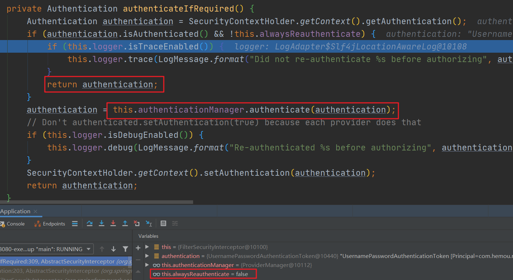

# 登录功能

## 底层类

### web 公共类

#### domain层

##### BaseEntity

```java
public class BaseEntity implements Serializable {

    private static final long serialVersionUID = -5662247762912920385L;

    /** 搜索值 */
    private String searchValue;

    /** 创建者 */
    private String createBy;

    /** 创建时间 */
    @JsonFormat(pattern = "yyyy-MM-dd HH:mm:ss")
    private Date createTime;

    /** 更新者 */
    private String updateBy;

    /** 更新时间 */
    @JsonFormat(pattern = "yyyy-MM-dd HH:mm:ss")
    private Date updateTime;

    /** 备注 */
    private String remark;

    /** 数据权限 */
    private String dataScope;

    /** 请求参数 */
    @JsonIgnore
    private String params;
    
    ...getter and setter
```

首先记住我自己直到作用的属性

+ createBy
+ createTime
+ updateBy
+ updateTime
+ remark

还有几个暂时不知道有啥用

+ searchValue
+ dataScope
+ params

然后系统中所有业务相关的实体类都要继承它

##### AjaxResult

```java
public class AjaxResult extends HashMap<String, Object> {

    private static final long serialVersionUID = 1172613439460951429L;

    /** 状态码 */
    public static final String CODE_TAG = "code";

    /** 返回内容 */
    public static final String MSG_TAG = "msg";

    /** 数据对象 */
    public static final String DATA_TAG = "data";

    public AjaxResult(){}

    public AjaxResult(int code, String msg, Object obj){
        super.put(CODE_TAG, code);
        super.put(MSG_TAG, msg);
        super.put(DATA_TAG, obj);
    }

    public static AjaxResult success(){
        return new AjaxResult(HttpStatus.SUCCESS, "操作成功", null);
    }

    public static AjaxResult success(String msg){
        return new AjaxResult(HttpStatus.SUCCESS, msg, null);
    }

    public static AjaxResult success(String msg, Object obj){
        return new AjaxResult(HttpStatus.SUCCESS, msg, obj);
    }

    public static AjaxResult error(){
        return new AjaxResult(HttpStatus.ERROR, "操作成功", null);
    }

    public static AjaxResult error(String msg){
        return new AjaxResult(HttpStatus.ERROR, msg, null);
    }

    public static AjaxResult error(String msg, Object obj){
        return new AjaxResult(HttpStatus.ERROR, msg, obj);
    }

    public static AjaxResult code(int code, String msg){
        return new AjaxResult(code, msg, null);
    }
}
```

可以看出AjaxResult继承了HashMap，若以后有什么额外的数据，直接put，这是一大优点。

以后所有的响应数据都用这个AjaxResult封装，使响应数据统一

### 异常类

#### 异常基类

```java
public class BaseException extends RuntimeException {

    private static final long serialVersionUID = -7470232183019998217L;

    /**
     * 所属模块
     */
    private String module;

    /**
     * 错误码
     */
    private String key;

    /**
     * 错误码对应的参数
     */
    private Object[] args;

    /**
     * 错误消息
     */
    private String defaultMessage;

    public BaseException(String defaultMessage) {
        this.defaultMessage = defaultMessage;
    }

    public BaseException(String module, String key, Object[] args, String defaultMessage) {
        this.module = module;
        this.key = key;
        this.args = args;
        this.defaultMessage = defaultMessage;
    }

    @Override
    public String getMessage() {
        String msg = null;
        if (!StringUtils.isEmpty(key)) {
            msg = MessageUtils.message(key, args);
        }
        if (msg == null) {
            msg = defaultMessage;
        }
        return msg;
    }
    
    ...getter and setter
```

异常基类继承了 `RuntimeException`。所有业务相关或者可以知晓原因的异常都要继承它

先来了解一下属性

+ module：项目到后期会有不同模块，用此属性来记录
+ key：因为项目用了 i18n 国际化，所以对应的消息都已一个键
+ args：有的错误消息是根据不同参数来显示的
+ defaultMessage：当没有配置提示信息时，就用默认的

再来看一下构造方法

+ 第一个构造方法都需要传递一个 defaultMessage 参数，也就是默认的提示信息
+ 而参数较多的构造方法，需要传递所有的属性值

最后了解一下重写的 `getMessage` 方法，他先通过一个工具类获取 i18n 中对应消息值，若有则直接返回，反之返回默认的消息。

还要介绍一下获取国际化信息的工具类

```java
public class MessageUtils {

    /**
     * 根据消息键和参数 获取消息 委托给spring messageSource
     *
     * @param key 消息键
     * @param args 参数
     * @return 获取国际化翻译值
     */
    public static String message(String key, Object... args) {
        MessageSource messageSource = SpringUtils.getBean(MessageSource.class);
        return messageSource.getMessage(key, args, LocaleContextHolder.getLocale());
    }
}
```


#### 自定义异常类

```java
public class CustomException extends RuntimeException {

    private static final long serialVersionUID = 3639619661872858914L;

    private int code;
    private String message;

    public CustomException(String message) {
        this.message = message;
    }

    public CustomException(String message, int code) {
        this.code = code;
        this.message = message;
    }

    public CustomException(String message, Throwable cause) {
        super(message, cause);
        this.message = message;
    }

    public int getCode() {
        return code;
    }

    @Override
    public String getMessage() {
        return message;
    }
}
```

自定义异常类继承了 `RuntimeException`。对于未知因果的异常可以使用它来抛出

先看一下属性

+ code：抛出异常的状态码，对应项目中的 HTTPStatus
+ message

然后看一下构造方法

+ `public CustomException(String message)`
+ `public CustomException(String message, int code)`
+ `public CustomException(String message, Throwable cause)`

由此可以看出异常的 message 是是否重要的，每个异常都需要它，其次便是异常编号，最后再是throwable

#### 用户异常类

##### UserException

```java
public class UserException extends BaseException {

    private static final long serialVersionUID = -2606792711126205685L;

    public UserException(String key, Object[] args) {
        super("user", key, args, null);
    }
}
```

所有与用户相关的异常，因为可知晓原因，所以继承了 `BaseException`

然后构造方法指出所有 `UserException` 都属于 `user`模块，并且没有指出默认的 `message`，所以相关异常我们需要在国际化文件中指出

构造方法只要求我们传递两个参数，一个 `key`，另一个就是 `args`

##### UserPasswordNotMatchException

```java
public class UserPasswordNotMatchException extends UserException {

    private static final long serialVersionUID = -2188704517200948648L;

    public UserPasswordNotMatchException() {
        super("user.password.not.match", null);
    }
}
```

##### CaptchaException

```java
public class CaptchaException extends UserException {

    private static final long serialVersionUID = -379278764520539259L;

    public CaptchaException() {
        super("user.captcha.error", null);
    }
}
```

##### CaptchaExpireException

```
public class CaptchaExpireException extends UserException {

    private static final long serialVersionUID = 3179046744786651599L;

    public CaptchaExpireException() {
        super("user.captcha.expire", null);
    }
}
```

有了前面的基础这四个类看起来就容易多了

### 异步任务

#### 线程池 

```java
@Configuration
public class ThreadPoolConfig {

    // 核心线程池大小
    private int corePoolSize = 50;

    @Bean("scheduledExecutorService")
    protected ScheduledExecutorService scheduledExecutorService(){
        return new ScheduledThreadPoolExecutor(corePoolSize, new BasicThreadFactory.Builder().namingPattern("schedule-pool-%d").daemon(true).build()){
            @Override
            protected void afterExecute(Runnable r, Throwable t) {
                super.afterExecute(r, t);
                ThreadUtils.printException(r, t);
            }
        };
    }
}
```

在这里我们通过@Configuration和@Bean创建一个大小为50的线程池

+ namingPattern：线程命名规则
+ daemon：守护线程，在没有用户线程可服务时会自动离开，用于为系统中的其它对象和线程提供服务。

然后重写一下 `afterExecute`方法，若出现异常，可以打印一下异常信息，打印异常的工具类可以看后面

#### 异步任务管理器

可以用来**执行**和停止异步任务

```java
@Component
public class AsyncManager {

    private static final Logger logger = LoggerFactory.getLogger("sys-user");

    /**
     * 操作延迟10毫秒
     */
    private final int OPERATE_DELAY_TIME = 10;

    /**
     * 异步操作任务调度线程池
     */
    private ScheduledExecutorService executor = SpringUtils.getBean("scheduledExecutorService");

    /**
     * 单例模式
     */
    private AsyncManager() {
    }

    private static AsyncManager me = new AsyncManager();

    public static AsyncManager me() {
        return me;
    }

    /**
     * 执行任务
     *
     * @param task 任务
     */
    public void execute(TimerTask task) {
        executor.schedule(task, OPERATE_DELAY_TIME, TimeUnit.MILLISECONDS);
    }

    /**
     * 停止异步执行任务
     */
    @PreDestroy
    private void destroy() {
        try {
            logger.info("====关闭后台任务任务线程池====");
            // 停止任务线程池
            ThreadUtils.shutdownAndAwaitTermination(executor);
        } catch (Exception e) {
            logger.error(e.getMessage(), e);
        }
    }
}
```

#### 异步任务工厂

用来定义一些异步任务，方便异步任务管理器调用

在此之前先来熟悉一下LoginInfo这个实体类，可以看出他继承了实体基类

```java
public class SysLoginInfo extends BaseEntity {

    private static final long serialVersionUID = 1735404906117022454L;

    /** ID */
    private Long infoId;

    /** 用户账号 */
    private String userName;

    /** 登录状态 0成功 1失败 */
    private String status;

    /** 登录IP地址 */
    private String ipAddr;

    /** 登录地点 */
    private String loginLocation;

    /** 浏览器类型 */
    private String browser;

    /** 操作系统 */
    private String os;

    /** 提示消息 */
    private String msg;

    /** 访问时间 */
    private Date loginTime;
    
    ... getter and setter
```

具有以下几个部分的信息

账户信息：`username`

操作信息：`status`表示成功或失败、`msg`具体的操作信息、`loginTime`操作时间

用户信息：`ipAddr`、`loginLocation`、`browser`、`os`

现在正式看一下AsyncFactory

```java
public class AsyncFactory {

    private static final Logger logger = LoggerFactory.getLogger("sys-user");

    /**
     * 记录登陆信息
     *
     * @param username 用户名
     * @param status 状态
     * @param message 消息
     * @param args 列表
     * @return 任务task
     */
    public static TimerTask recordLoginInfo(final String username, final String status, final String message, final Object... args ){
        final UserAgent userAgent = UserAgentUtil.parse(ServletUtils.getRequest().getHeader("User-Agent"));
        final String ip = IpUtils.getIpAddr(ServletUtils.getRequest());
        return new TimerTask() {
            @Override
            public void run() {
                String address = AddressUtils.getRealAddressByIP(ip);
                String sb = LogUtils.toBlocks(ip, address, username, status, message);
                // 输出日志
                logger.info(sb, args);
                // 登录信息
                String browser = userAgent.getBrowser().toString();
                String os = userAgent.getOs().getName();
                SysLoginInfo loginInfo = new SysLoginInfo(username, ip, address, browser, os, message);
                // 状态
                if(Constants.LOGIN_SUCCESS.equals(status) || Constants.LOGOUT.equals(status)){
                    loginInfo.setStatus(Constants.SUCCESS);
                }else if(Constants.LOGIN_FAIL.equals(status)){
                    loginInfo.setStatus(Constants.FAIL);
                }
                SpringUtils.getBean(ISysLoginInfoService.class).insertLoginInfo(loginInfo);
            }
        };
    }
}
```

+ 通过工具类获取header的User-Agent信息，然后通过hutool的UserAgent工具解析它，这就后面可以获取浏览器和操作的信息
+ 然后我们自己编写一个IpUtils，用来从request中获取ip地址信息，然后再根据一个工具类获取其ip所在的地址
+ 将所有解析得出的数据格式化一下，然后输出到日志
+ 封装LoginInfo，然后插入到数据库。这里有个sql语句挺好，对于时间的插入，可以直接调用数据库的一个 `sysdate()`方法
+ 将这些所有的操作用TimeTask包装起来，用以异步管理器调用

### RedisCache

缓存一些数据数据

```java
@Component
public class RedisCache {

    @Autowired
    private RedisTemplate redisTemplate;

    /**
     * 缓存基本的对象，Integer、String、实体类等
     *
     * @param key   缓存的键值
     * @param value 缓存的值
     * @return 缓存的对象
     */
    public <T> ValueOperations<String, T> setCacheObject(String key, T value) {
        ValueOperations<String, T> operation = redisTemplate.opsForValue();
        operation.set(key, value);
        return operation;
    }

    /**
     * 缓存基本的对象，Integer、String、实体类等
     *
     * @param key      缓存的键值
     * @param value    缓存的值
     * @param timeout  时间
     * @param timeUnit 时间颗粒度
     * @return 缓存的对象
     */
    public <T> ValueOperations<String, T> setCacheObject(String key, T value, Integer timeout, TimeUnit timeUnit) {
        ValueOperations<String, T> operation = redisTemplate.opsForValue();
        operation.set(key, value, timeout, timeUnit);
        return operation;
    }

    /**
     * 获得缓存的基本对象。
     *
     * @param key 缓存键值
     * @return 缓存键值对应的数据
     */
    public <T> T getCacheObject(String key)
    {
        ValueOperations<String, T> operation = redisTemplate.opsForValue();
        return operation.get(key);
    }

    /**
     * 删除单个对象
     *
     * @param key
     */
    public void deleteObject(String key)
    {
        redisTemplate.delete(key);
    }
}
```

因为添加了 `spring-boot-starter-data-redis`，所以底层就不需要管太多，先将 `RedisTemplate`注入到当前类，然后添加增删改查的几个方法，因为添加和修改可以共用一个方法，但是重载了一个修改的方法，所以总共有四个方法

+ `public <T> ValueOperations<String, T> setCacheObject(String key, T value)` 
+ `public <T> ValueOperations<String, T> setCacheObject(String key, T value, Integer timeout, TimeUnit timeUnit)`
+ `public <T> T getCacheObject(String key)`
+ `public void deleteObject(String key)`

前两个都是添加和修改的方法，只不过第二个可以设置具体缓存时间和粒度

### TokenService

用于生成 token 信息

```java
@Component
public class TokenService {

    protected static final long MILLIS_SECOND = 1000;

    protected static final long MILLIS_MINUTE = 60 * MILLIS_SECOND;

    private static final long MILLIS_MINUTE_20 = 20 * 60 * 1000L;

    // 令牌自定义标识
    @Value("${token.header}")
    private String header;

    // 令牌秘钥
    @Value("${token.secret}")
    private String secret;

    // 令牌有效期（默认30分钟）
    @Value("${token.expireTime}")
    private int expireTime;

    @Autowired
    private RedisCache redisCache;

    /**
     * 创建令牌
     *
     * @param loginUser 用户信息
     * @return 令牌
     */
    public String createToken(LoginUser loginUser) {
        String token = IdUtil.fastUUID();
        loginUser.setToken(token);
        setUserAgent(loginUser);
        refreshToken(loginUser);

        Map<String, Object> claims = new HashMap<>();
        claims.put(Constants.LOGIN_TOKEN_KEY, token);
        return createToken(claims);
    }

    /**
     * 验证令牌有效期，相差不足20分钟，自动刷新缓存
     *
     * @param loginUser 登录用户
     * @return 令牌
     */
    public void verifyToken(LoginUser loginUser) {
        long expireTime = loginUser.getExpireTime();
        long currentTime = System.currentTimeMillis();
        if (expireTime - currentTime <= MILLIS_MINUTE_20) {
            refreshToken(loginUser);
        }
    }

    /**
     * 刷新令牌有效期
     *
     * @param loginUser 登录信息
     */
    public void refreshToken(LoginUser loginUser) {
        loginUser.setLoginTime(System.currentTimeMillis());
        loginUser.setExpireTime(loginUser.getLoginTime() + expireTime * MILLIS_MINUTE);
        // 根据uuid将loginUser缓存
        String userKey = getTokenKey(loginUser.getToken());
        redisCache.setCacheObject(userKey, loginUser, expireTime, TimeUnit.MINUTES);
    }

    /**
     * 获取 token 的 redis 键前缀
     *
     * @param uuid
     * @return
     */
    private String getTokenKey(String uuid) {
        return Constants.LOGIN_TOKEN_TAG + uuid;
    }

    /**
     * 设置用户代理信息
     *
     * @param loginUser 登录信息
     */
    public void setUserAgent(LoginUser loginUser) {
        UserAgent userAgent = UserAgentUtil.parse(ServletUtils.getRequest().getHeader("User-Agent"));
        String ip = IpUtils.getIpAddr(ServletUtils.getRequest());
        loginUser.setIpAddr(ip);
        loginUser.setLoginLocation(AddressUtils.getRealAddressByIP(ip));
        loginUser.setBrowser(userAgent.getBrowser().getName());
        loginUser.setOs(userAgent.getOs().getName());
    }

    /**
     * 从数据声明生成令牌
     *
     * @param claims 数据声明
     * @return 令牌
     */
    private String createToken(Map<String, Object> claims) {
        return Jwts.builder().setClaims(claims).signWith(SignatureAlgorithm.HS512, secret).compact();
    }

    /**
     * 从令牌中获取数据声明
     *
     * @param token 令牌
     * @return 数据声明
     */
    private Claims parseToken(String token) {
        return Jwts.parser().setSigningKey(secret).parseClaimsJws(token).getBody();
    }

    /**
     * 获取用户身份信息
     *
     * @return 用户信息
     */
    public LoginUser getLoginUser(HttpServletRequest request) {
        // 获取请求携带的令牌
        String token = getRespToken(request);
        if (StringUtils.isNotEmpty(token)) {
            Claims claims = parseToken(token);
            // 解析对应的权限以及用户信息
            String uuid = (String) claims.get(Constants.LOGIN_TOKEN_KEY);
            String userKey = getTokenKey(uuid);
            return redisCache.getCacheObject(userKey);
        }
        return null;
    }

    /**
     * 获取请求token
     *
     * @param request
     * @return token
     */
    private String getRespToken(HttpServletRequest request) {
        String token = request.getHeader(this.header);
        if (StringUtils.isNotEmpty(token) && token.startsWith(Constants.REQ_TOKEN_PREFIX)) {
            token = token.replace(Constants.REQ_TOKEN_PREFIX, "");
        }
        return token;
    }
}
```


## 环境配置

### 数据源

首先配置一下数据库，新建一个 application-druid.yaml，将数据源分离一下

```yaml
# 数据源配置
spring:
  datasource:
    url: jdbc:mysql://localhost:3306/ry-vue?useUnicode=true&characterEncoding=utf8&zeroDateTimeBehavior=convertToNull&useSSL=true&serverTimezone=GMT%2B8
    username: root
    password: root
    type: com.alibaba.druid.pool.DruidDataSource
    driverClassName: com.mysql.cj.jdbc.Driver
```

主要的就`url`、`username`、`password`、`type`和`driverClassName`

注意他们一定要跟在`spring.datasource`之下

### MybatisConfig

```java
@Configuration
@MapperScan("com.hemou.ruoyi.project.**.mapper")
public class MybatisConfig {

    @Autowired
    private Environment env;

    private static final String DEFAULT_RESOURCE_PATTERN = "**/*.class";

    public static String setTypeAliasesPackage(String typeAliasesPackage) {
        ResourcePatternResolver resolver = (ResourcePatternResolver) new PathMatchingResourcePatternResolver();
        MetadataReaderFactory metadataReaderFactory = new CachingMetadataReaderFactory(resolver);
        List<String> allResult = new ArrayList<String>();
        try {
            for (String aliasesPackage : typeAliasesPackage.split(",")) {
                List<String> result = new ArrayList<String>();
                aliasesPackage = ResourcePatternResolver.CLASSPATH_ALL_URL_PREFIX
                        + ClassUtils.convertClassNameToResourcePath(aliasesPackage.trim()) + "/" + DEFAULT_RESOURCE_PATTERN;
                Resource[] resources = resolver.getResources(aliasesPackage);
                if (resources != null && resources.length > 0) {
                    MetadataReader metadataReader = null;
                    for (Resource resource : resources) {
                        if (resource.isReadable()) {
                            metadataReader = metadataReaderFactory.getMetadataReader(resource);
                            try {
                                result.add(Class.forName(metadataReader.getClassMetadata().getClassName()).getPackage().getName());
                            } catch (ClassNotFoundException e) {
                                e.printStackTrace();
                            }
                        }
                    }
                }
                if (result.size() > 0) {
                    HashSet<String> hashResult = new HashSet<String>(result);
                    allResult.addAll(hashResult);
                }
            }
            if (allResult.size() > 0) {
                typeAliasesPackage = String.join(",", (String[]) allResult.toArray(new String[0]));
            } else {
                throw new RuntimeException("mybatis typeAliasesPackage 路径扫描错误,参数typeAliasesPackage:" + typeAliasesPackage + "未找到任何包");
            }
        } catch (IOException e) {
            e.printStackTrace();
        }
        return typeAliasesPackage;
    }

    @Bean
    public SqlSessionFactory sqlSessionFactory(DataSource dataSource) throws Exception {
        String typeAliasesPackage = env.getProperty("mybatis.type-aliases-package");
        String mapperLocations = env.getProperty("mybatis.mapper-locations");
        typeAliasesPackage = setTypeAliasesPackage(typeAliasesPackage);
        VFS.addImplClass(SpringBootVFS.class);

        SqlSessionFactoryBean sessionFactory = new SqlSessionFactoryBean();
        sessionFactory.setDataSource(dataSource);
        sessionFactory.setTypeAliasesPackage(typeAliasesPackage);
        sessionFactory.setMapperLocations(new PathMatchingResourcePatternResolver().getResources(mapperLocations));
        return sessionFactory.getObject();
    }
}
```

application.yaml

```yaml
mybatis:
  type-aliases-package: com.hemou.ruoyi.project.**.domain
  mapper-locations: classpath:mybatis/**/*Mapper.xml
```

主要要配置的东西

+ MapperScan：找到所有的 mapper java文件
+ typeAliasesPackage：类名昵称，说是不支持 ant 格式，但是目前就这么写在配置文件中还没出现啥叉子
+ mapperLocations：xml文件所在位置

### RedisConfig 

默认redis序列化方式是JDK序列化机制，不便于可视化工具查看与管理，下面使用 json 序列化方式

```java
@Configuration
public class RedisConfig {

    @Bean
    public RedisTemplate<Object, Object> redisTemplate(RedisConnectionFactory factory){
        RedisTemplate<Object, Object> template = new RedisTemplate<>();
        template.setConnectionFactory(factory);

        // 使用 JSON 格式缓存序列化对象
        Jackson2JsonRedisSerializer<Object> serializer = new Jackson2JsonRedisSerializer<>(Object.class);
        // 解决查询缓存转换异常问题
        ObjectMapper om = new ObjectMapper();
        om.configure(DeserializationFeature.FAIL_ON_UNKNOWN_PROPERTIES, false);
        om.setVisibility(PropertyAccessor.ALL, JsonAutoDetect.Visibility.ANY);
        om.enableDefaultTyping(ObjectMapper.DefaultTyping.NON_FINAL);
        serializer.setObjectMapper(om);

        template.setValueSerializer(serializer);
        // 使用StringRedisSerializer来序列化和反序列化redis的key值
        template.setKeySerializer(new StringRedisSerializer());
        template.afterPropertiesSet();
        return template;
    }
}
```

需要注意的一点是，如果实体类中存在getter方法，但是并没有对应得属性，则需要配置一下ObjectMapper，如下

```java
om.configure(DeserializationFeature.FAIL_ON_UNKNOWN_PROPERTIES, false);
```

### SecruityCofing

安全配置，这个是重头戏，因为登录主要就是要进行身份认证，而相关内容全部由他实现

#### 开启注解

首先开启注解功能，在配置类上

```java
@EnableGlobalMethodSecurity(securedEnabled = true, prePostEnabled = true)
public class SecurityConfig extends WebSecurityConfigurerAdapter {
```

+ securedEnabled ：开启注解，允许使用 `@Secured`
+ prePostEnabled：允许使用如 `@PreAuthorize`或 `@PostAuthorize`等注解

#### 密码加密

SecurityConfig.java

```java
/**
* 自定义用户认证逻辑
*/
@Autowired
private UserDetailsService userDetailsService;

/**
* 强散列哈希加密实现
*/
@Bean
public BCryptPasswordEncoder bCryptPasswordEncoder() {
    return new BCryptPasswordEncoder();
}

@Override
protected void configure(AuthenticationManagerBuilder auth) throws Exception {
    auth.userDetailsService(userDetailsService).passwordEncoder(bCryptPasswordEncoder());
}
```

使用官方推荐的 `BCryptPasswordEncoder`对前端密码进行加密，并设置userDetailsService

#### HttpSecurity配置

SecurityConfig.java

```java
@Override
protected void configure(HttpSecurity http) throws Exception {
    // CRSF禁用，不使用session
    http.csrf().disable();
    // 认证失败处理类
    http.exceptionHandling().authenticationEntryPoint(unauthorizedHandler);
    // 基于token，所以不需要session
    http.sessionManagement().sessionCreationPolicy(SessionCreationPolicy.STATELESS);
    // 过滤请求
    http.authorizeRequests()
        .antMatchers("/login", "/captchaImage").anonymous()
        .anyRequest().authenticated();
    // 退出处理
    http.logout().logoutUrl("/logout").logoutSuccessHandler(logoutSuccessHandler);
    // 添加JWT filter
    http.addFilterBefore(authenticationTokenFilter, UsernamePasswordAuthenticationFilter.class);
}

/**
     * 解决无法直接注入 AuthenticationManager
     *
     * @return
     * @throws Exception
     */
@Bean
@Override
public AuthenticationManager authenticationManagerBean() throws Exception {
    return super.authenticationManagerBean();
}
```

大体就是

+ 关闭 session 与 csrf，避免不需要的损耗
+ 认证失败处理
+ 登出处理
+ 过滤请求
+ jwt Filter 手动添加登录信息

这几个配置比较重要

+ `http.authorizeRequests()`：用于设置需要或不需要认证的路径
+ `http.addFilterBefore`：当之前登录时认证过后，后面访问校验是否认证了

## 功能实现

### 验证码功能

首先分析一下流程

1、打开登录页面，在vue的create生命周期函数中添加获取验证码的方法 `/captchaImage`

2、后端收到 `[get] /captchaImage`请求，来到相应的 controller 处理方法

```java
@RestController
public class CaptchaController {

    @Autowired
    private RedisCache redisCache;

    @GetMapping("captchaImage")
    public Object getCode(){
        // 生成验证码
        ShearCaptcha captcha = CaptchaUtil.createShearCaptcha(120, 44, 4, 4);
        String verifyCode = captcha.getCode();
        // 唯一标识
        String uuid = IdUtil.simpleUUID();
        String verifyKey = Constants.CAPTCHA_CODE_TAG + uuid;
        // 存入缓存
        redisCache.setCacheObject(verifyKey, verifyCode, Constants.CAPTCHA_EXPIRATION, TimeUnit.MINUTES);

        try(ByteArrayOutputStream stream = new ByteArrayOutputStream()){
            captcha.write(stream);
            AjaxResult ajax = AjaxResult.success();
            ajax.put("uuid", uuid);
            ajax.put("img", Base64.encode(stream.toByteArray()));
            return ajax;
        }catch (Exception e){
            e.printStackTrace();
            return AjaxResult.error(e.getMessage());
        }
    }
}
```

2.1 在controller方法中，第一件事就是生成验证码，并获取正确的验证码值

2.2 生成一个随机的字符串，这个字符串就是来区分不同的用户的。然后定义一个验证码相关的前缀，方便识别，拼接之后，将其作为键，而正确验证码值作为值，然后将其放入 redis 缓存，当然可以定义一个验证码的失效时间

2.3 将验证码输出到页面，因为前后端分离，这里就使用base64将图片编码，再回传到页面，下面分析具体流程

1）创建一个字节输出流，将图片写入到流中

2）使用工具类Base64.encode，它接受一个字节数据作为参数，我们使用输出流的 `toByteArray` 方法将其转化，然后 encode 方法就可以返回一个编码后的 string 类型的img了

3）创建返回对象AjaxResult，将识别信息uuid，和已经编码的 img 放入其中，并返回

### 登录认证

首先分析一下流程

1、前端填写完表单数据后，发送请求 `[post] /login`，传递 username、password、code、uuid这四个数据

2、后端收到 `[post] /login`请求，来到相应的 controller 处理方法

```java
@RestController
public class SysLoginController {

    @Autowired
    private SysLoginService loginService;

    @PostMapping("login")
    public AjaxResult login(String username, String password, String code, String uuid){
        AjaxResult result = AjaxResult.success();
        String token = loginService.login(username, password, code, uuid);
        result.put(Constants.TOKEN, token);
        return result;
    }
```

在这里调用 loginService 的 login方法，其中内部是具体的验证登录逻辑，验证通过后返回一个token，然后回传给前端。前端这时就可以将token数据存入本地了

**注意**：这里需要注意的是，之前SpringSecurity配置的HttpSecurity（如下），将 `/captcha` 和 `/login`这两个路径设置了匿名可访问，所以请求到达这个controller方法时并没有任何阻拦

```java
http.authorizeRequests().antMatchers("/login", "/captchaImage").anonymous()
```

3、接下来进入 `loginService.login()`内，进行详细分析

```java
@Component
public class SysLoginService {

    @Autowired
    private RedisCache redisCache;

    @Autowired
    private TokenService tokenService;

    @Autowired
    private AuthenticationManager authenticationManager;
    
    /**
     * 登录验证
     *
     * @param username 用户名
     * @param password 密码
     * @param code 验证码
     * @param uuid 唯一标识
     * @return 结果
     */
    public String login(String username, String password, String code, String uuid) {
        String verifyKey = Constants.CAPTCHA_CODE_TAG + uuid;
        String verifyCode = redisCache.getCacheObject(verifyKey);
        redisCache.deleteObject(verifyKey);
        if (null == verifyCode) {
            AsyncManager.me().execute(AsyncFactory.recordLoginInfo(username, Constants.LOGIN_FAIL, MessageUtils.message("user.captcha.expire")));
            throw new CaptchaExpireException();
        }
        if (!verifyCode.equalsIgnoreCase(code)) {
            AsyncManager.me().execute(AsyncFactory.recordLoginInfo(username, Constants.LOGIN_FAIL, MessageUtils.message("user.captcha.error")));
            throw new CaptchaException();
        }
        // 认证 该方法会去调用UserDetailsServiceImpl.loadUserByUsername
        Authentication authenticate = null;
        try {
            authenticate = authenticationManager.authenticate(new UsernamePasswordAuthenticationToken(username, password));
        } catch (Exception e) {
            if (e instanceof BadCredentialsException) {
                AsyncManager.me().execute(AsyncFactory.recordLoginInfo(username, Constants.LOGIN_FAIL, ("user.password.not.match")));
                throw new UserPasswordNotMatchException();
            } else {
                AsyncManager.me().execute(AsyncFactory.recordLoginInfo(username, Constants.LOGIN_FAIL, e.getMessage()));
                throw new CustomException(e.getMessage());
            }
        }
        AsyncManager.me().execute(AsyncFactory.recordLoginInfo(username, Constants.LOGIN_SUCCESS, MessageUtils.message("user.login.success")));
        return tokenService.createToken((LoginUser) authenticate.getPrincipal());
    }
}
```

3.1 首先我们通过 redisCache **获取缓存中的验证码**信息，获取完毕后删除它，为什么要删除呢，因为后面校验验证码时会抛出异常，这时前端会收到错误的状态码，然后就会刷新验证码

3.2 **校验验证码**，如果校验失败，则通过异步任务记录此登录失败的信息，并抛出对应的异常

3.3 通过 `AuthenticationManager` 的`authenticate()`获取认证信息

+ 认证的过程可能会发生异常，这时再通过异步任务管理器记录错误，并抛出相应的异常
+ 如果认证的过程没有发生异常，则说明认证成功，然后我们再通过异步任务管理器记录成功登录

下面来详细分析一下 `authenticationManager.authenticate()`的**认证过程**

在分析之前先来了解一下 `UsernamePasswordAuthenticationToken` 这个类，它拥有两个构造方法

```java
// 1、只有两个参数的构造方法表示[当前没有认证]
public UsernamePasswordAuthenticationToken(Object principal, Object credentials)
// 2、拥有三个参数的构造方法表示[当前已经认证完毕]
public UsernamePasswordAuthenticationToken(Object principal, Object credentials, Collection<? extends GrantedAuthority> authorities)
```


下面开始分析认证过程


1）实现了`AuthenticationMananger`的`ProviderManger`调用接口的`authenticate`方法


 2）然后遍历所有的 AuthenticProvider，其中的`supports`方法，返回时一个boolean值，参数是一个Class，就是根据Token的类来确定用什么Provider来处理

而源码中的toTest类，就是我们认证传递的 `UsernamePasswordAuthenticationToken`，而他对应的provider就是`AbstractUserDetailsAuthenticationProvider`

SysLoginService.java

```java
authenticationManager.authenticate(new UsernamePasswordAuthenticationToken(username, password));
```

AbstractUserDetailsAuthenticationProvider.java

```java
@Override
public boolean supports(Class<?> authentication) {
    return (UsernamePasswordAuthenticationToken.class.isAssignableFrom(authentication));
}
```

3）找到合适的Provider后，在本例中也即是AbstractUserDetailsAuthenticationProvider（抽象类），会调用provider 的authenticate 方法


4）从下面可以看到  retrieveUser 方法返回一个 UserDetails


5）接着深入，可以发现 DaoAuthenticationProvider 继承了 AbstractUserDetailsAuthenticationProvider，所以DaoAuthenticationProvider 才是真正的实现类，他会调用 retrieveUser  方法，接着调用 loaderUserByUsername() 方法


看到 loaderUserByUsername()，应该就很熟悉了，因为这就是我们自己实现 `UserDetailsService` 接口，自定义的认证过程

6）接着看我们自定义的 UserDetailServiceImpl 

```java
@Service("userDetailsService")
public class UserDetailServiceImpl implements UserDetailsService {

    private static final Logger log = LoggerFactory.getLogger(UserDetailServiceImpl.class);

    @Autowired
    private ISysUserService userService;

    @Autowired
    private SysPermissionService permissionService;

    @Override
    public UserDetails loadUserByUsername(String username) throws UsernameNotFoundException {
        SysUser user = userService.selectUserByUserName(username);
        if (null == user) {
            log.info("登录用户：{} 不存在.", username);
            throw new UsernameNotFoundException("登录用户：" + username + " 不存在");
        } else if (UserStatus.DELETED.getCode().equals(user.getDelFlag())) {
            log.info("登录用户：{} 已被删除.", username);
            throw new BaseException("对不起，您的账号：" + username + " 已被删除");
        } else if (UserStatus.DISABLE.getCode().equals(user.getStatus())) {
            log.info("登录用户：{} 已被停用.", username);
            throw new BaseException("对不起，您的账号：" + username + " 已停用");
        }
        return createLoginUser(user);
    }

    public UserDetails createLoginUser(SysUser user) {
        return new LoginUser(user, permissionService.getMenuPermission(user));
    }
}
```

上面就是我们自己的认证逻辑。通过一个唯一标识查询用户，在这里就是username，当所有校验都通过后就会调用 createLoginUser 方法，装填用户拥有的权限以及**从数据库中获取的密码**，返回一个 LoginUser 对象，而这个对象实现了 UserDetails接口。

7）然后我们回看AbstractUserDetailsAuthenticationProvider 的 authenticate 方法


8）接着深入，可以发现`createSuccessAuthentication`方法创建了一个UsernamePasswordAuthenticationToken，并且他的构造方法有三个参数，这表明这个token是已近认证过后的


4、至此认证已经结束，我再回到 `loginService.login()`这个我们自己写的方法内，上面分析的8个步骤，也就是调用 `authenticationManager.authenticate()`的过程会返回一个 Authentication，然后就可以利用这个 Authentication 生成一个 token。

loginService.java

```java
return tokenService.createToken((LoginUser) authenticate.getPrincipal());
```

5、接着回到前面第二步controller调用的 `loginService.login()`，这时它已近拿到了 token ，于是将其返回到前端。前端收到相应后，就可以把这个token存在本地，以后每次访问请求时都带上这个token 信息。

```java
@PostMapping("login")
public AjaxResult login(String username, String password, String code, String uuid){
    AjaxResult result = AjaxResult.success();
    String token = loginService.login(username, password, code, uuid);
    result.put(Constants.TOKEN, token);
    return result;
}
```

### 请求认证

1、上面说到前端每次发送请求都带上这个 token，但是为啥带上这个 token，SpringSecurity就会认为此次请求已近认证通过了呢，别忘了，因为之前配置 SecurityConfig，如下

```java
public class SecurityConfig extends WebSecurityConfigurerAdapter {
    @Override
    protected void configure(HttpSecurity http) throws Exception {
        ...
        // 过滤请求
        http.authorizeRequests()
            .antMatchers("/login", "/captchaImage").anonymous()
            .anyRequest().authenticated();
        // 添加JWT filter,后面马上就讲
        http.addFilterBefore(authenticationTokenFilter, 
                             UsernamePasswordAuthenticationFilter.class);
    }
```
因为我们设置了放行 `/login`请求，所以才没遭受拦截，而其他请求都是要被拦截的

2、因此我们就要自定义一个JWT filter，使用 `addFilterBefore` 把它添加到过滤器列表中，下面来看我们写的 JWT过滤器

JwtAuthenticationTokenFilter.java

```java
@Component
public class JwtAuthenticationTokenFilter extends OncePerRequestFilter {

    @Autowired
    private TokenService tokenService;

    @Override
    protected void doFilterInternal(HttpServletRequest request, HttpServletResponse response, FilterChain chain) throws ServletException, IOException {
        LoginUser loginUser = tokenService.getLoginUser(request);
        if (ObjectUtil.isNotNull(loginUser) && ObjectUtil.isNull(SecurityUtils.getAuthentication()))
        {
            tokenService.verifyToken(loginUser);
            UsernamePasswordAuthenticationToken authenticationToken = new UsernamePasswordAuthenticationToken(loginUser, null, loginUser.getAuthorities());
            authenticationToken.setDetails(new WebAuthenticationDetailsSource().buildDetails(request));
            SecurityContextHolder.getContext().setAuthentication(authenticationToken);
        }
        chain.doFilter(request, response);
    }
}
```

1）TokenService#getLoginUser() 是我们编写的一个方法，可以从 request 中获取 token，然后再解析成LoginUser，也就是我们之前编写继承了UserDetails的类

2）如果1）能解析成功，也就是loginUser不为空，就说明请求含带了token认证信息，又因为这是个前后端分离项目，`SecurityUtils.getAuthentication()`肯定获取不到当前请求的认证信息

```java
public static Authentication getAuthentication() {
    return SecurityContextHolder.getContext().getAuthentication();
}
```

3）而没有认证信息，这次请求势必会被拦截下来，所以我们要手动加上这个认证信息

3.1）我们先刷新一下token，也就是在redis缓存中更新一下到期时间

3.2）然后创建UsernamePasswordAuthenticationToken，注意这是个有三个 参数的构造方法，前面也说了，这代表已经经过认证，然后 `SecurityContextHolder.getContext().setAuthentication();`设置一下认证信息

这样每次带token的请求，都会有了认证信息，也就不会被拦截了

3、但是为了更深刻的了解，我们接下来**具体分析**一下流程。

再次之前先介绍一个类 `FilterSecurityInterceptor`：是一个方法级的权限过滤器，基本位于过滤链的最底部，下面来看看源码。


下面来打个断点，查看一下


这说明来到`beforeInvocation`方法时我们前面编写的jwtFilter已经被执行，认证信息已近被手动添加过了


进入`beforeInvocation()`里面，由调试信息可以看到当前请求需要被认证


接着我们进入`authenticateIfRequired`方法的内部



因为我们之前jwtfilter手动添加了认证信息，所以`authenticateIfRequired`就直接返回了authentication，

否则的还要进行`authenticationManager.authenticate();`进行验证，如果没有之前jwtfilter手动添加认证信息，那么中途一定会抛出异常，导致此次请求失败被拦截

至此也没啥好讲了，filterInvocation.getChain().doFilter() 调用我们的后台服务了


## 错误记录

### 数据源

起先配置时，直接复制的配置文件，大概类似这样

```yaml
# 数据源配置
spring:
  datasource:
    type: com.alibaba.druid.pool.DruidDataSource
    driverClassName: com.mysql.cj.jdbc.Driver
    druid:
      # 主库数据源
      master:
        url: jdbc:mysql://localhost:3306/ry-vue?useUnicode=true&characterEncoding=utf8&zeroDateTimeBehavior=convertToNull&useSSL=true&serverTimezone=GMT%2B8
        username: root
        password: root
      # 从库数据源
      slave:
        # 从数据源开关/默认关闭
        enabled: false
        url:
        username:
        password:
```

若依用了多数据源，然后相关的配置有多，其中有个关键的property文件没有复制，然后连接数据库时总是 url 未定义，原来正常情况下url、username等信息是跟在 spring.datasource 下面的，而又没有应用property文件，最终配置文件中的值注入不进去

## 参考

1、[vue axios post后台接收不到数据的解决方案](https://blog.csdn.net/zxh1220/article/details/88544272)

2、[js打印catch中的err信息]( https://www.cnblogs.com/shanxinxin/p/12739686.html)

3、Base64-encoded key bytes may only be specified for HMAC signatures.  If using RSA or Elliptic Curve, use the signWith(SignatureAlgorithm, Key) method instead. 

将加密算法由ES265 改为了HS265

4、Error creating bean with name ‘redisConnectionFactory‘ defined in class path resource https://blog.csdn.net/skybboy/article/details/108703858


Spring Security做JWT认证和授权 https://www.jianshu.com/p/d5ce890c67f7

Spring@PostConstruct和@PreDestroy注解详解 https://www.cnblogs.com/myblogs-miller/p/9139082.html

[RedisTemplate配置的jackson.ObjectMapper里的一个enableDefaultTyping方法过期解决](https://blog.csdn.net/zzhongcy/article/details/105813105)