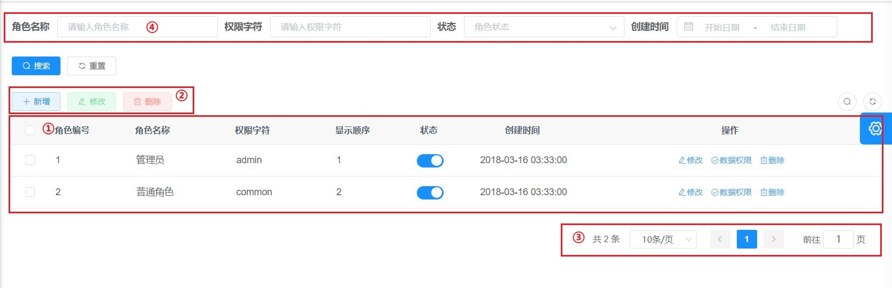
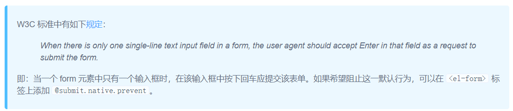

# 实体管理

## 组件解析

+ el-row
  
  + gutter：用来设置每一栏之间的间隔
+ el-col
  
  + span：用来确定每一栏宽度多少，宽度和为 24
+ el-tree
  + ref：用来引用 el-tree 这个组件
  
  + node-key：节点的唯一标识
  
  + :data：要加载的数据
  
  + :props：数据的格式
  
  + :filter-node-method：过滤节点的方法，比如搜索某个节点
  
  + default-expand-all：默认全部展开
  
  + @node-click：当点击节点时回调函数
  
  + check-strictly：是否严格模式，就是父子联动
  
  + empty-text：内容为空时，展示的文本
  
  + show-checkbox：加上此属性后，会展示复选框
  
  + 手动控制 el-tree 是否展开
  
    ```js
    handleCheckedTreeExpand(value, type) {
        const treeList = this.menuOptions
        for (let i = 0; i < treeList.length; i++) {
            this.$refs.menu.store.nodesMap[treeList[i].id].expanded = value
        }
    }
    ```
  
  + `setCheckedNodes(checkList)`，通过节点数组展开元素，必须设置 node-key 属性
  
  + `setCheckedKeys(checkList)`，通过节点 id 展开元素，必须设置 node-key 属性
+ el-input
  + clearable：添加了这个属性后，会有个 `x` 来清空输入框内容
  + prefix-icon：设置 input 的前图标
  + size：控制输入框大小
+ el-select
  + v-model：此选择框的值
  + placeholder
+ el-option：选择框的选项
+ el-form
  + inline：设置行内表单模式
  + rules：校验规则
  + label-width：表单域标签的宽度
  + label-position：表单标签域对齐方式
  + size：控制表单内组件的大小
+ el-form-item
  + label：标签文本
  + prop：校验规则对应名，如果要重置表单时，此属性也一点要写并保持和 model 对应值一致
+ el-date-picker：日期选择器
  + type：选择的类型，是日期、星期、还是范围
  + value-format：绑定值的格式
  + range-separator：选择范围时的分隔符
  + start-placeholder：范围选择时开始日期的占位内容
  + end-placeholder：范围选择时结束日期的占位内容
+ el-button
  + plain：添加上这个属性后，hover 效果会更好看
  + icon：设置按钮的图标
+ el-table
  + data：数据
  + @selection-change：选择某一个行的回调方法
  + row-key：渲染树形组件时一点要有此属性，可以将其对应某个id值
  + :tree-props：指定树形结构的数据格式
+ v-loading：他是一个单独的指令，可以结合 el-table 使用，当时等待查询数据的结果时，会产生遮罩层
+ el-table-column
  + type：设置当前列的类型，是 复选框、当前行索引还是按钮
  + index：如果上面的 type 设置为了 索引，则可以通过此属性设置索引值大小
  + label：当前列显示的标题
  + prop：当前列对应数据中的字段名
  + width：对应列的宽度
  + align：对齐方式，如居中
  + :show-overflow-tooltip：设置为 true 时，当这个列太长放不下后会显示个 tip
+ el-dialog
  + title：对话框的名称
  + visible：是否显示对话框
  + widht：弹出框的宽度
  + append-to-body：是否将其添加到 body 中
+ el-popover：弹出框
  + placement：出现的位置
  + content：弹出框内容，或者在 el-popover 内部添加想要的内容
  + `<el-button slot="reference">hover 激活</el-button> `，在标有slot且值为reference的标签内填写内容，就是触发弹出的按钮
  
+ 

  

## Vue 方法分类

主要分为 3 类

+ 获取数据
+ 重置表单、格式化数据
+ 处理事件
+ 表单提交

写的时候依次进行

## 书写技巧



### 查询数据

1、先来看看编号为①的部分，首先需要用 el-table 来展示所有的数据，其中数据源用 roleList 来表示了，为了方便复制粘贴，其实 dataList 也该也可以

```vue
<el-table v-loading="loading" :data="roleList" @selection-change="handleSelectionChange">
	...
</el-table>
```

当数据加载缓慢时，table内容可能为空，为了带来良好的用户体验，可以添加一个`v-loading`，也就是等待时转圈圈的动画来美化一下。

接着我们就可以获取表格数据了，因为大多数一个页面就一个表格，所以写一个`getList()`方法就可以了，如下

```js
getList() {
    this.loading = true
    listRole(this.addDateRange(this.queryParams, this.dateRange)).then(
        response => {
            this.roleList = response.rows
            this.total = response.total
            this.loading = false
        }
    )
}
```

再来看看`this.queryParams`的内容

```json
queryParams: {
    pageNum: 1,
    pageSize: 10,
    roleName: undefined,
    roleKey: undefined,
    status: undefined
}
```

其实这里我认为写的十分高明，先在后台编写一个根据条件查询的 list 方法，然后前端将分页数据和查询条件全部放在 `queryParams` 中，虽然日期范围数据不在其中，因为他需要一个单独的数组来存储，不过可以通过如下方法将日期范围数据添加到`queryParams`中

```js
// 添加日期范围
export function addDateRange(params, dateRange, propName) {
  var search = params
  search.params = {}
  // eslint-disable-next-line
  if (dateRange != null && dateRange != '') {
    if (typeof (propName) === 'undefined') {
      search.params['beginTime'] = dateRange[0]
      search.params['endTime'] = dateRange[1]
    } else {
      search.params['begin' + propName] = dateRange[0]
      search.params['end' + propName] = dateRange[1]
    }
  }
  return search
}
```

再回到前面`getList()`方法先将 loading 属性置为 true ，然后发送请求并后台数据，修改 total 信息，这个可以用来进行分页，最后将 loading 置为 false。

这样`getList()`完成了，然后我们只要编写`created()`方法，在这个方法里面请求 dataList 和 相关字典的信息就可以了

2、接着看②部分，我们可以通过选择复选框来进行批量操作。首先修改和删除按钮应该是禁用的，当选中单个时，可以进行修改和删除操作，这时按钮的禁用状态也解除。当选中多个时，只能进行删除操作，而修改按钮回到禁用状态，这里我们就需要借助三个变量`ids`、 `multiple` 和 `single`，以及 el-table 的 `selection-change` 事件回调函数帮忙

```vue
<template>
	<el-table v-loading="loading" :data="roleList" @selection-change="handleSelectionChange">
        <el-table-column type="selection" width="55" align="center" />
        ...
    </el-table>
</template>

<script>
export default {
    data() {
      return {
        // 选中数组
        ids: [],
        // 非单个禁用
        single: true,
        // 非多个禁用
        multiple: true
      }
    }
}
</script>
```

当然我们首先需要一个复选框，并初始化那三个变量，如上

我们知道在这个案例中 el-table 中的数据全部来自于 roleList，而 `selection-change` 的作用就是当选中状态改变时，将所用选中的行作为参数，传递到这个事件对应的回调函数中

有了上面所说的回调函数，那么按钮的状态调整就很方便了，如下

```js
handleSelectionChange(selection) {
    this.ids = selection.map(item => item.roleId)
    this.single = selection.length !== 1
    this.multiple = !selection.length
}
```

这样我们就处理好了修改和删除按钮的状态，这时给相应按钮添加 `disable=xx`就可以了

3、接着看③部分，这块是分页部分，特别简单

```vue
<pagination
      v-show="total>0"
      :total="total"
      :page.sync="queryParams.pageNum"
      :limit.sync="queryParams.pageSize"
      @pagination="getList"
    />
```

4、然后再来看看④部分，这里是个按条件查询操作

因为注意到有搜索和重置操作，所以这里可以使用 el-form 构建一个表单，这样就可以使用其内置的`this.$refs[refName].resetFields()`方法来进行重置表单，由此可见 el-form 的 `ref`、`model`属性是少不了的了，并且为了美观还要将表单设置为行内格式，所以还需要个`inline`属性

```vue
<el-form v-show="showSearch" ref="queryForm" :model="queryParams" :inline="true">
    ...
    <el-form-item>
        <el-button type="primary" 
                   icon="el-icon-search" size="mini" @click="handleQuery">搜索</el-button>
        <el-button icon="el-icon-refresh" size="mini" @click="resetQuery">重置</el-button>
      </el-form-item>
</el-form>
```

先来看看`handleQuery()`方法

```js
handleQuery() {
    this.queryParams.pageNum = 1
    this.getList()
}
```

因为是按条件查询，所以需要将页数置为第一页，然后直接调用`getList()`即可，由此可以看出之前的`getList()`写的十分的高明。

再来看看`resetQuery()`方法

```js
resetQuery() {
    this.dateRange = []
    this.resetForm('queryForm')
    this.handleQuery()
}
```

其实也就是重置所有的搜索要素，然后执行一次查询就好了

### 添加数据

1、这时我们需要一个 el-dialog 对话框来添加数据，大概会涉及到3个属性，`title`、`open`以及`form`，分别用来表示跳出框的标题，是否打开弹出框、以及将要添加的数据。如下

```vue
<!-- 添加或修改角色配置对话框 -->
<el-dialog :title="title" :visible.sync="open" width="500px" append-to-body>
    <el-form ref="form" :model="form" :rules="rules" label-width="80px">
        ...
    </el-form>
    <div slot="footer" class="dialog-footer">
        <el-button type="primary" @click="submitForm">确 定</el-button>
        <el-button @click="cancel">取 消</el-button>
    </div>
</el-dialog>
```

打开这个弹出时需要进行重置表单，修改标题，当然有的可能需要字典数据，这个都在之前的`created`方法中获取过了，又或者是某些下拉框，这我们就要定义一些获取数据的方法了，例子如下

```js
handleAdd() {
    this.reset()
    this.getMenuTreeselect()
    this.open = true
    this.title = '添加角色'
}
```

不过需要注意的是，重置表单也需要个流程，先定义好 form 中的初始值，然后调用内置的resetForm方法，如下

```js
reset() {
    this.form = {
        menuId: undefined,
        parentId: 0,
        menuName: undefined,
        icon: undefined,
		...
    }
    this.resetForm('form')
}
```

总的来说流程，就是先重置表单 -> 获取数据 -> 修改标题，打开弹出框

2、然后我们就要进行提交表单的操作了

```js
submitForm() {
    this.$refs['form'].validate(valid => {
        if (valid) {
            if (this.form.menuId !== undefined) {
                updateMenu(this.form).then(resp => {
                    this.msgSuccess('修改成功')
                    this.open = false
                    this.getList()
                })
            } else {
                addMenu(this.form).then(resp => {
                    this.msgSuccess('新增成功')
                    this.open = false
                    this.getList()
                })
            }
        }
    })
}
```

先判断表单验证是否通过，然后再进行相关操作。

这里也有个小技巧，校验通过后，通过判断 id 是否存在，就可以知道是添加还是修改，这样就将这两个操作整合到一个方法里面去了

### 删除数据

这里也有一个技巧，通过`row.infoId || this.ids`来判断是删除多行还是单行，如下

```js
handleDelete(row) {
    const infoIds = row.infoId || this.ids
    this.warnConfirm('是否确认删除访问编号为"' + infoIds + '"的数据项?').then(() => {
        return delLoginInfo(infoIds)
    }).then(() => {
        this.getList()
        this.msgSuccess('删除成功')
    })
}
```

大致流程就是先获取要删除的 id -> 弹出提示框确定删除 -> 发送删除请求 -> 获取数据，弹出删除成功

### 修改数据

```js
handleUpdate(row) {
    this.reset()
    const noticeId = row.noticeId || this.ids
    getNotice(noticeId).then(response => {
        this.form = response.data
        this.open = true
        this.title = '修改公告'
    })
}
```

大致流程就是先重置表单 -> 获取要修改数据的 id -> 发送获取该 id 实体数据的请求 -> 将数据赋到 form 中，修改弹框标题并打开

## 树形table

通过`listMenu`的API接口，获取所有的`Menu`信息，然后通过js代码转为树形结构的json数据

```js
/**
 * 构造树型结构数据
 * @param {*} data 数据源
 * @param {*} id id字段 默认 'id'
 * @param {*} parentId 父节点字段 默认 'parentId'
 * @param {*} children 孩子节点字段 默认 'children'
 * @param {*} rootId 根Id 默认 0
 */
export function handleTree(data, id = 'id', parentId = 'parentId', children = 'children', rootId) {
  rootId = rootId || Math.min.apply(Math, data.map(item => { return item[parentId] })) || 0
  // 对源数据深度克隆
  const cloneData = JSON.parse(JSON.stringify(data))
  // 循环所有项
  const treeData = cloneData.filter(father => {
    const branchArr = cloneData.filter(child => {
      // 返回每一项的子级数组
      return father[id] === child[parentId]
    })
    branchArr.length > 0 ? father.children = branchArr : ''
    // 返回第一层
    return father[parentId] === rootId
  })
  return treeData !== '' ? treeData : data
}
```

具体思想就是先遍历每个元素，并给他填装子级元素，然后返回父级元素是顶级元素的元素

## 回显数据字典

这里用了很巧妙的设计方法，也涉及到后端，首先创建字典类型，然后根据类型获取当前字典类型对应的所有数据，将其存放在 data 域中。

然后编写一个 selectDictLabel 的方法用来回显对应值

```js
// 回显数据字典
export function selectDictLabel(datas, value) {
  var actions = []
  Object.keys(datas).map((key) => {
    if (datas[key].dictValue === ('' + value)) {
      actions.push(datas[key].dictLabel)
    }
  })
  return actions.join('')
}
```

## el-tree操作

**展开el-tree**

```js
const treeList = this.menuOptions
for (let i = 0; i < treeList.length; i++) {
    this.$refs.menu.store.nodesMap[treeList[i].id].expanded = value
}
```

**勾选el-tree**

通过node节点来勾选，文档上还有一种通过key来勾选的

```js
this.$refs.menu.setCheckedNodes(value ? this.menuOptions : [])
```

## 注意



` @submit.native.prevent`

## 参考

[vue中的.sync修饰符用法及原理详解](https://blog.csdn.net/liushijun_/article/details/92426854)