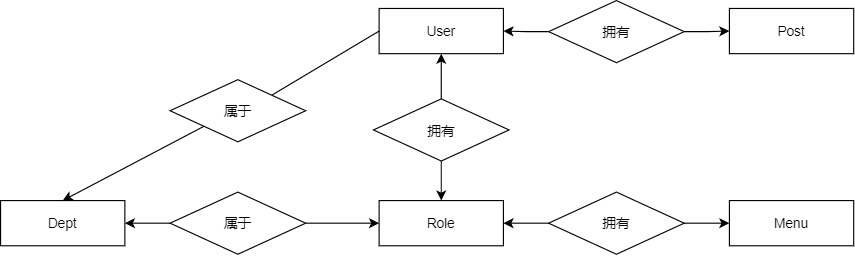

# 实体管理-后端



## 菜单管理

### 实体类

#### RouterVo

```java
@JsonInclude(JsonInclude.Include.NON_EMPTY)
public class RouterVo {

    /**
     * 路由名字
     */
    private String name;

    /**
     * 路由地址
     */
    private String path;

    /**
     * 是否隐藏路由，当设置 true 的时候该路由不会再侧边栏出现
     */
    private String hidden;

    /**
     * 重定向地址，当设置 noRedirect 的时候该路由在面包屑导航中不可被点击
     */
    private String redirect;

    /**
     * 组件地址
     */
    private String component;

    /**
     * 当你一个路由下面的 children 声明的路由大于1个时，自动会变成嵌套的模式--如组件页面
     */
    private Boolean alwaysShow;

    /**
     * 其他元素
     */
    private MetaVo meta;

    /**
     * 子路由
     */
    private List<RouterVo> children;
    ... 省略 getter 和 setter
```

注意需要加`@JsonInclude(JsonInclude.Include.NON_EMPTY)`这样当属性为空时就不会被序列化了

#### MetaVo

```java
public class MetaVo {

    /**
     * 设置该路由在侧边栏和面包屑中展示的名字
     */
    private String title;

    /**
     * 设置该路由的图标，对应路径src/icons/svg
     */
    private String icon;

    public MetaVo() {
    }

    public MetaVo(String title, String icon) {
        this.title = title;
        this.icon = icon;
    }
    ... 省略 getter 和 setter
```

#### SysMenu

因为上面的内容都是 vo 对象，现在我们要想办法将其转化为数据库中存放的形式

1. 首先存放实体一定要有个主键
2. 因需要实现父子级菜单的关系，所以需要个父菜单的id
3. 因为前端通过动态生成的路由，所以路由会按照后端传递的数据来生成，如果顺序乱了可能不美观，所以可以设置一个值来进行排序
4. 根据前端路由，所以需要 菜单名、路径、组件所在地址、是否可见、是否为 noRedirect、是否总是展示自菜单和图标，但是由于某些信息可以由某个属性推导出来，所以可以减去很多属性
5. 因为是权限系统，所以每个菜单都需要相应的权限才能访问
6. 还有个菜单描述信息

总的来说需要一下信息

+ menuId
+ menuName
+ parentId
+ path
+ component
+ orderNum
+ perms
+ visbile
+ menuType

```java
public class SysMenu extends BaseEntity {

    private static final long serialVersionUID = -8640539910050036106L;

    /** 菜单ID */
    @TableId
    private Long menuId;

    /** 菜单名称 */
    private String menuName;

    /** 父菜单名称 */
    private String parentName;

    /** 父菜单ID */
    private Long parentId;

    /** 显示顺序 */
    private String orderNum;

    /** 路由地址 */
    private String path;

    /** 组件路径 */
    private String component;

    /** 是否为外链（0是 1否） */
    private String isFrame;

    /** 类型（M目录 C菜单 F按钮） */
    private String menuType;

    /** 菜单状态:0显示,1隐藏 */
    private String visible;

    /** 权限字符串 */
    private String perms;

    /** 菜单图标 */
    private String icon;

    /** 子菜单 */
    private List<SysMenu> children = new ArrayList<SysMenu>();
    ... 省略 getter 和 setter
```

### 接口分析

1、`[get] /system/menu/list`

列出当前用户所能访问的菜单，用来在前端的 el-table 中展示，因为可以使用前端的方法构造树形结构，所以只通过 list 获取所有就行

2、`[post] /system/menu`

添加菜单，为了防止菜单重复，需要在添加菜单前校验菜单名是否存在，在校验成功后再设置创建者名，最后完成添加

+ 校验注意点
  + 校验时判断同一个父菜单下是否存在相同名称的菜单
  + 因为可能是修改菜单时的校验，所以先保存待校验菜单的ID，然后查询菜单名，如果能查到菜单记录，并且ID还不一样，就说明重复了

3、`[delete] /system/menu/{menuId}`

根据id进行删除，但是删除之前要校验，是否存在子菜单、菜单是否已被分配给角色

4、`[put] /system/menu`

同添加菜单，需要校验菜单名是否重复，同添加时的校验注意点，并判断父菜单是不是自己，然后再设置修改者姓名，最后完成修改

5、`[get] /system/menu/{menuId}`

这个比较普通，就是根据菜单id查询数据

6、`[get] /system/menu/treeselect`

获取菜单树形结构，大概流程就是查询当前用户能访问的菜单，然后将其封装为 `TreeSelect`（只有 id 和 label 信息），可以用在添加角色时，给角色分配菜单访问权

7、`[get] /system/menu/roleMenuTreeselect/{roleId}`

这个接口其实和上面的 treeselect 类似，都是获取菜单的下拉列表，只不过比 treeselect 接口多返回了一个 当前角色已分配的菜单，用在修改角色所拥有权的那块。只不过SQL语句有点小复杂，

```sql
select m.menu_id, m.parent_id
from sys_menu m
left join sys_role_menu rm on m.menu_id = rm.menu_id
where rm.role_id = #{roleId} 
and m.menu_id not in 
	(select m.parent_id from sys_menu m inner join sys_role_menu rm on m.menu_id = rm.menu_id
     and rm.role_id = #{roleId})
order by m.parent_id, m.order_num
```

大概意思就是查找当前角色的所有菜单，但是排除掉父级id也在结果集中的菜单，因为前端设置了级联勾选，如果把父级菜单也查询过来后，那么子项全部都会被选上

### 操作分析

1、`public List<SysMenu> selectMenuList(Long userId);`

上述方法是根据用户所拥有的角色来查询他所能看到的菜单，不管菜单是否启用，因为这块是来对菜单的各参数进行配置的

2、`public List<SysMenu> selectMenuList(SysMenu menu, Long userId);`

上述方法和第一个类似，只不过多了个根据菜单条件来进行查询，可以用在前端按条件查询

3、`public Set<String> selectMenuPermsByUserId(Long userId);`

上述方法是根据用户所拥有的角色来查询他所拥有的权限标识，在用户登录时可以用此方法来获取当前用户所拥有权限信息，然后可以存在 vuex 中

4、`public List<SysMenu> selectMenuTreeByUserId(Long userId);`

上述方法是用来获取系统侧边栏菜单信息的，和上面的不同，因为上面的菜单信息含有 btn

5、`public List<RouterVo> buildMenus(List<SysMenu> menus);`

上述方法是用来==转换前端路由格式==的，因为前面的`selectMenuTreeByUserId()`查询的只是多项菜单数据，其格式即不与前端所需要的匹配，也没有相应的父子关系，所以需要进行格式转化

6、`public List<SysMenu> buildMenuTree(List<SysMenu> menus);`

上述方法是用来构建菜单父子关系的，目前只用在了后端

7、`public List<TreeSelect> buildMenuTreeSelect(List<SysMenu> menus)`

上述方法是用来产生下拉数结构，这里就用到了之前的`buildMenuTree()`方法

## 部门管理

部门管理就是为了实现数据权限，使用户只能看见某些部门的数据

### 实体类

```java
public class SysDept extends BaseEntity {

    private static final long serialVersionUID = 1L;

    /** 部门ID */
    private Long deptId;

    /** 父部门ID */
    private Long parentId;

    /** 祖级列表 */
    private String ancestors;

    /** 部门名称 */
    private String deptName;

    /** 显示顺序 */
    private String orderNum;

    /** 负责人 */
    private String leader;

    /** 联系电话 */
    private String phone;

    /** 邮箱 */
    private String email;

    /** 部门状态:0正常,1停用 */
    private String status;

    /** 删除标志（0代表存在 2代表删除） */
    private String delFlag;

    /** 父部门名称 */
    private String parentName;

    /** 子部门 */
    private List<SysDept> children = new ArrayList<SysDept>();
```

### 数据权限

#### 含义

权限管理主要是通过用户、角色、资源三方面来进行权限的分配。具体来说，就是赋予用户某个角色，角色能访问及操作不同范围的资源。

从控制力度来看，将权限控制分为两大类

1、功能级权限管理

举个例子就是，给某个用户分配某个角色，而不同角色拥有不同的操作权限

2、数据级权限管理

举个例子，因为张三是北京分公司的“人力资源经理”，所以他能够也只能够管理北京分公司员工和北京分公司下属的子公司（海淀子公司、朝阳子公司、西城子公司、东城子公司等）的员工；而王五是海淀子公司的“人力资源经理”，所以他能够也只能够管理海淀子公司的员工；

从上面可以看到数据权限涉及到4个实体类，User、Role、Dept、Menu

其中User，Role分别是用户和角色，不难理解。而部门Dept就是为了辅助实现数据级权限控制而存在的。Menu则是相应的资源。

#### 实现

1、在这个项目中为了实现数据权限，可以通过AOP。首先要定义一个注解

```java
@Target(ElementType.METHOD)
@Retention(RetentionPolicy.RUNTIME)
@Documented
public @interface DataScope {

    /**
     * 部门表的别名
     */
    public String deptAlias() default "";

    /**
     * 用户表的别名
     */
    public String userAlias() default "";
}
```

因为数据权限说到底还是运用sql语句，那这个注解的作用就是对sql内容加以部分控制

2、接下来就是配置切面了，首先定义切点，然后配置增强用在哪个地方

```java
@Pointcut("@annotation(com.hemou.ruoyi.framework.aspectj.lang.annotation.DataScope)")
public void dataScopePointCut() {}

@Before("dataScopePointCut()")
public void doBefore(JoinPoint point) throws Throwable {
    handleDataScope(point);
}
```

3、核心就是如何来进行增强了

1）首先获取当前切点的注解信息

```java
private DataScope getAnnotationLog(JoinPoint joinPoint) {
    // 获取切点方法签名
    Signature signature = joinPoint.getSignature();
    MethodSignature methodSignature = (MethodSignature) signature;
    // 从方法签名中获取方法
    Method method = methodSignature.getMethod();

    // 从方法获取附在其上的注解
    if (method != null) {
        return method.getAnnotation(DataScope.class);
    }
    return null;
}
```

2）然后获取当前用户信息，若是管理员则不用过滤数据，否则则过滤数据

```java
protected void handleDataScope(final JoinPoint joinPoint) {
    // 获得注解
    DataScope controllerDataScope = getAnnotationLog(joinPoint);
    if (controllerDataScope == null) {
        return;
    }
    // 获取当前的用户
    LoginUser loginUser = SpringUtils.getBean(TokenService.class)
        .getLoginUser(ServletUtils.getRequest());
    SysUser currentUser = loginUser.getUser();
    if (currentUser != null) {
        // 如果是超级管理员，则不过滤数据
        if (!currentUser.isAdmin()) {
            dataScopeFilter(joinPoint, currentUser, controllerDataScope.deptAlias(),
                            controllerDataScope.userAlias());
        }
    }
}
```

3）实现数据过滤

```java
public static void dataScopeFilter(JoinPoint joinPoint, SysUser user, String deptAlias, String userAlias) {
    StringBuilder sqlString = new StringBuilder();

    for (SysRole role : user.getRoles()) {
        String dataScope = role.getDataScope();
        if (DATA_SCOPE_ALL.equals(dataScope)) {
            sqlString = new StringBuilder();
            break;
        } else if (DATA_SCOPE_CUSTOM.equals(dataScope)) {
            sqlString.append(String.format(
                " OR %s.dept_id IN ( SELECT dept_id FROM sys_role_dept WHERE role_id = %s ) ", deptAlias,
                role.getRoleId()));
        } else if (DATA_SCOPE_DEPT.equals(dataScope)) {
            sqlString.append(String.format(" OR %s.dept_id = %s ", deptAlias, user.getDeptId()));
        } else if (DATA_SCOPE_DEPT_AND_CHILD.equals(dataScope)) {
            sqlString.append(
                String.format(
                " OR %s.dept_id IN ( SELECT dept_id FROM sys_dept WHERE dept_id = %s or find_in_set( %s , ancestors ) )",
                deptAlias, user.getDeptId(), user.getDeptId()));
        } else if (DATA_SCOPE_SELF.equals(dataScope)) {
            if (StringUtils.isNotBlank(userAlias)) {
                sqlString.append(
                    String.format(" OR %s.user_id = %s ", userAlias, user.getUserId()));
            } else {
                // 数据权限为仅本人且没有userAlias别名不查询任何数据
                sqlString.append(" OR 1=0 ");
            }
        }
    }

    if (StringUtils.isNotBlank(sqlString.toString())) {
        Object params = joinPoint.getArgs()[0];
        if (ObjectUtil.isNotNull(params) && params instanceof BaseEntity) {
            BaseEntity baseEntity = (BaseEntity) params;
            baseEntity.getParams().put("dataScope", " AND (" + sqlString.substring(4) + ")");
        }
    }
}
```

+ 全部数据权限：这个很简单，就是不用添加任何的sql过滤语句
+ 自定义数据权限：这个需要需要借助另一张表`sys_role_dept`，这张表来记录角色能访问哪个部门记录。而过滤的 sql 大致含义就是找到当前角色所能访问的部门
+ 本部门权限：sql 含义就是部门的 id 必须和当前用户所在部门的相同
+ 本部门及下级部门权限：这个需要在部门表中多添加一个字段`ancestors`，来记录当前部门有哪些父级部门，然后就可以使用 sql 中的一个函数`find_in_set(val, list)`，这样就能找到所有的子级部门了
+ 仅本人数据权限：这个就和部门没有关系了，添加sql时只要指定id和库中的用户id相同就行

然后在需要进行数据过滤的地方加上`${params.dataScope}`，因为如果括号内的元素为null时，插值表达式不会插入任何值，而`#{}`会插入一个`null`

### 接口分析

1、`[get] /system/dept/list`

就单纯的调用一下`selectDeptList()`方法就行，不过`selectDeptList()`里面另有乾坤(也就是加个小注解)，可以看之后的操作分析。虽然部门也有父子关系，但是与前面的菜单相同，只要查询就够了，前端可以将他转化为树形结构

2、`[post] /system/dept/`

添加部门，在添加前校验部门名是否存在，然后设置添加者

3、`[delete] /system/dept/{deptId}`

删除部门，删除前判断当前部门是否存在下级部门，是否存在用户

4、`[put] /system/dept/`

修改部门，修改前校验部门名是否重复了，上级部门是否不是自己，如果是停用该部门还要判断当前部门的下级部门是否有没被停用的

5、`[get] /system/dept/treeselect`

获取部门的下拉结构，将其封装到`treeselect`中

6、`[get] /system/dept/roleDeptTreeselect/{roleId}`

与上方法类似，也会返回下拉树结构，但是多了个指点角色所能访问部门的数据

### 操作分析

1、`public List<SysDept> selectDeptList(SysDept dept)`

虽然这个方法也只是仅仅调用了一下mapper接口的查询list方法，但是他的上面标注了`@DataScope`注解，则说明当前数据需要进行过滤

2、`public int insertDept(SysDept dept)`

添加部门，添加部门前要先判断当前待添加部门的父级本门是否启用，如果不启用就要抛出异常。

然后查询当前部门的父部门（此项目设置了只有一个顶级部门），设置待添加部门的祖级部门为 `父部门的祖级部门,父部门`，然后执行插入操作

3、`public int deleteDeptById(Long deptId)`

删除部门，这里只调用了mapper的删除方法，因为controller层已经进行了校验，但是我感觉在service进行校验更好一些，不过貌似又不是，因为其他所有的校验方法全部都在controller层进行的

**再次更新**：通过观察发现，简单单一的校验可以在controller层完成，但是若较复杂的校验，比如需要查询信息，并在添加或修改数据时还要用到之前查询的信息时，这种最好写在service层

4、`public int updateDept(SysDept dept)`

修改部门信息，这块逻辑稍微有点复杂。

1）首先获取待修改部门的父级部门，并从数据库中取出待修改部门的数据

2）若上面两个都不为null的话，则设置待修改部门的祖级部门为`父部门的祖级部门，父部门`，并修改待修改部门的下级部门

```java
String ancestors = parentDept.getAncestors() + "," + dept.getParentId();
String oldAncestors = oldDept.getAncestors();
dept.setAncestors(ancestors);
updateChildDept(dept.getDeptId(), ancestors, oldAncestors);
```

3）修改部门的下级部门时，首先获取所有的下级部门，然后还要传递两个参数，新的上级部门和旧的上级部门，然后遍历所有的下级部门，使用 replace 方法，即

```java
child.setAncestors(child.getAncestors().replace(oldAncestors, newAncestors));
```

这样就完成了修改下级部门的问题。当然这里还接触到了点sql的高级语法`case语句`，格式如下

```sql
case <表达式>
	when <表达式> then <表达式>
	...
	when <表达式> then <表达式>
	[else <表达式>]
end
```

执行过程是，将case后面的表达式的值与各when子句的表达式的值进行比较，如果相等则返回then后面表达式中的值，然后跳出case语句，否则返回else子句的表达式的值，else子句时可选项。当case语句中不含else子句，且所有比较都失败时，case语句会返回null

看完上面的语法格式，看下面的就应该比较容易了

```xml
<update id="updateDeptChildren" parameterType="java.util.List">
    update sys_dept set ancestors =
    <foreach collection="depts" item="item" index="index"
             separator=" " open="case dept_id" close="end">
        when #{item.deptId} then #{item.ancestors}
    </foreach>
    where dept_id in
    <foreach collection="depts" item="item" index="index"
             separator="," open="(" close=")">
        #{item.deptId}
    </foreach>
</update>
```

4）若待修改的部门状态为正常，则要将他的所有上级部门状态设为正常，这里设计到的sql如下

```sql
update sys_dept
  <set>
    <if test="status != null and status != ''">status = #{status},</if>
    <if test="updateBy != null and updateBy != ''">update_by = #{updateBy},</if>
    update_time = sysdate()
  </set>
where dept_id in (${ancestors})
```

这个sql使用了插值表达式，结果如`where dept_id in (100, 101, 102)`

## 角色管理

### 实体类

```java
public class SysRole extends BaseEntity {

    private static final long serialVersionUID = 4237657771943100617L;

    /** 角色ID */
    @TableId
    private Long roleId;

    /** 角色名称 */
    private String roleName;

    /** 角色权限 */
    private String roleKey;

    /** 角色排序 */
    private String roleSort;

    /** 数据范围 */
    private String dataScope;

    /** 角色状态（0正常 1停用） */
    private String status;

    /** 删除标志（0代表存在 2代表删除） */
    private String delFlag;

    /** 用户是否存在此角色标识 默认不存在 */
    private boolean flag = false;

    /** 菜单组 */
    private Long[] menuIds;

    /** 部门组（数据权限） */
    private Long[] deptIds;
```

### 接口分析

1、`[get] /system/role/list`

查询角色，只是简单的调用下service层的 selectList 方法，详细看下面的操作分析

2、`[post] /system/role/`

添加角色，需要校验角色名称、角色关键字，然后设置创建人

3、`[delete] /system/role/{roleIds}`

删除角色，直接调用下一层的删除方法

4、`[put] /system/role/`

修改角色，先判断当前角色是否是管理员，如果是则不允许修改，否则接着校验角色名称、角色关键字是否重复，然后设置修改人，调用下一层的修改方法

5、`[get] /system/role/{roleId}`

根据id获取数据，普通方法

6、`[put] /system/role/dataScope`

修改数据权限，其本质还是修改 role_dept。先判断当前用户是否是管理员，然后调用下一层对应的方法

### 操作分析

1、`public List<SysRole> selectRoleList(SysRole role)`

service层虽然只是很简单的调用了一下mapper的selectList方法，但是mapper的sql还是有点费脑的

```xml
<sql id="selectRoleVo">
  select distinct r.role_id, r.role_name, r.role_key, r.role_sort, r.data_scope,
                  r.status, r.del_flag, r.create_time, r.remark
  from sys_role r
         left join sys_user_role ur on ur.role_id = r.role_id
         left join sys_user u on u.user_id = ur.user_id
         left join sys_dept d on u.dept_id = d.dept_id
</sql>
```

就这个sql片段涉及到4张表，我们要查的是 role 的数据，但是为了实现数据权限，我们必须要知道部门的信息。从E-R图可以看出，为了将 dept 和 role 关联起来，有两条路可走，一是 role 与 dept 直接的多对多关系，另一个就是通过 user 和 user_role 表，先了解到当前角色有哪些用户，然后再根据 dept 判断当前用户所在的部门。

稍加思考就能发现第一条路用到的 role_dept 的多对多关系是为了实现数据过滤也就是数据权限所设计的，而第二条路才是才是为了将 role 和 dept 连接起来的关键，建立起来连接后，前者就可以用来进行数据过滤。**总结就是在where语句的地方才会用到role_dept表，而在此之前需要通过user_role将user、role和dept链接起来**

2、`public int insertRole(SysRole role)`

先进行 role 的插入，然后插入 role_menu 信息。查看 role 中的 menuIds，批量插入

3、`public int deleteRoleById(Long roleId)`

删除角色，先删除所有的 role_menu，然后再删除 所有的 role_dept，最后再删除 role，（这个方法未被使用到，按理来说应该加一个是否被分配给用户的校验）

4、`public int deleteRoleByIds(Long[] roleIds)`

这个和上面的方法功能差不多，都是删除，但是这个方法对 role 进行了校验，判断该角色是否有用户使用，而上面的没有，并且上面的方法貌似也没在程序中使用过。它的流程是，先一个一个角色进行校验是否是管理员角色，是否已分配给某个用户，校验完成后配两删除 role_menu、role_dept 和 role

5、`public int updateRole(SysRole role)`

先进行修改 role，然后删除当前角色的所有的 menu，然后再根据 role 传递过来的 menu 添加 role_menu

6、`public int authDataScope(SysRole role)`

这个和上面的修改 role 类似，先进行 role 的修改，然后删除当前角色所有的 dept，然后根据传递过来的 depts 添加 role_dept

## 用户管理

### 实体类

```java
public class SysUser extends BaseEntity {

    /** 用户id */
    private Long userId;

    /** 部门id */
    private Long deptId;

    /** 用户名 */
    private String username;

    /** 昵称 */
    private String nickname;

    /** 状态 */
    private String status;

    /** 性别 */
    private String gender;

    /** 密码 */
    private String password;

    /** 电话 */
    private String phone;

    /** 邮箱 */
    private String email;

    /** 头像 */
    private String avatar;

    /** 最后登录ip */
    private String lastIp;

    /** 最后登录日期 */
    private Date lastDate;

    /** 部门对象 */
    private SysDept dept;

    /** 角色 */
    private List<SysRole> roles;

    /** 角色组 */
    private Long[] roleIds;

    /** 岗位组 */
    private Long[] postIds;
```

因为要一对一和一对多查询，所以需要添加SysDept和List\<SysRole>在实体类中

还有一个要注意的是password属性，这个数据通过查询list的时候不能显示出来，容易产生安全问题所以最好在getter方法上面加一个`@JsonIgnore`注解，但是添加用户时密码需要传递过来，那么还要再加一个`@JsonProperty`注解，不然就收不到前端传递过来的数据

### 接口分析

1、`[get] /system/user/list`

在controller层比较普通，直接调用下一层的方法，返回数据就行

2、`[post] /system/user/`

添加用户，先进行登录名、手机号、邮箱的校验，然后设置创建人，唯一不同的是主要要对前端传递过来的密码进行加密，最后调用service层的插入用户即可

3、`[put] /system/user/`

和添加用户类似，只要进行手机号、邮箱的校验即可，设置修改人，然后调用下层方法

4、`[delete] /system/user/{userIds}`

比较普通，直接调用下层的方法就可以了

5、`[get] /system/user/{userId}`

在这个方法中，需设置userId可以为空 `@required = false`，如果userId不为空的话，则根据userId查询岗位和角色，否则查询所有

### 操作分析

1、`public List<SysUser> selectUserList(SysUser user)`

查询用户列表，在这个方法上面需要添加注解`@DataScope(deptAlias = "d", userAlias = "u")`，表明此方法需要进行数据过滤

2、`public int insertUser(SysUser user)`

因为用户含有角色和岗位信息，所以需要关联其他表。进行用户的插入，然后再插入userPost和userRole，顺序不能错

3、`public int updateUser(SysUser user)`

修改用户信息，先删除与此User相关的所有role和post信息，即删除UserRole和UserPost，然后再根据传递过来的数据添加回去。还有各之前貌似都没有注意的地方，就是通过`user.getRoles()`，类似这样的方法，有时可能会获取null，那么这时`for(Long id : roleIds)`可能就会报错，所以要先进行判断一下`roleIds`是否为空再进行操作。

## 日志管理

### 登录日志


## 参考

1、[springboot使用Validation API和全局异常优雅的校验方法参数](https://www.cnblogs.com/sueyyyy/p/12865578.html)

2、[InvalidDefinitionException: No serializer found for class and no properties discovered to create BeanSerializer](https://blog.csdn.net/J080624/article/details/82529082) 这个也可以看看，不过最后发现是因为没有写 getter 和 setter 方法

3、[角色和岗位的区别](https://blog.csdn.net/superdog007/article/details/19898821)