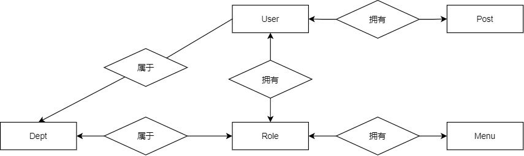

# 实体管理-后端



## 菜单管理

### 实体类

#### RouterVo

```java
@JsonInclude(JsonInclude.Include.NON_EMPTY)
public class RouterVo {

    /**
     * 路由名字
     */
    private String name;

    /**
     * 路由地址
     */
    private String path;

    /**
     * 是否隐藏路由，当设置 true 的时候该路由不会再侧边栏出现
     */
    private String hidden;

    /**
     * 重定向地址，当设置 noRedirect 的时候该路由在面包屑导航中不可被点击
     */
    private String redirect;

    /**
     * 组件地址
     */
    private String component;

    /**
     * 当你一个路由下面的 children 声明的路由大于1个时，自动会变成嵌套的模式--如组件页面
     */
    private Boolean alwaysShow;

    /**
     * 其他元素
     */
    private MetaVo meta;

    /**
     * 子路由
     */
    private List<RouterVo> children;
    ... 省略 getter 和 setter
```

注意需要加`@JsonInclude(JsonInclude.Include.NON_EMPTY)`这样当属性为空时就不会被序列化了

#### MetaVo

```java
public class MetaVo {

    /**
     * 设置该路由在侧边栏和面包屑中展示的名字
     */
    private String title;

    /**
     * 设置该路由的图标，对应路径src/icons/svg
     */
    private String icon;

    public MetaVo() {
    }

    public MetaVo(String title, String icon) {
        this.title = title;
        this.icon = icon;
    }
    ... 省略 getter 和 setter
```

#### SysMenu

因为上面的内容都是 vo 对象，现在我们要想办法将其转化为数据库中存放的形式

1. 首先存放实体一定要有个主键
2. 因需要实现父子级菜单的关系，所以需要个父菜单的id
3. 因为前端通过动态生成的路由，所以路由会按照后端传递的数据来生成，如果顺序乱了可能不美观，所以可以设置一个值来进行排序
4. 根据前端路由，所以需要 菜单名、路径、组件所在地址、是否可见、是否为 noRedirect、是否总是展示自菜单和图标，但是由于某些信息可以由某个属性推导出来，所以可以减去很多属性
5. 因为是权限系统，所以每个菜单都需要相应的权限才能访问
6. 还有个菜单描述信息

总的来说需要一下信息

+ menuId
+ menuName
+ parentId
+ path
+ component
+ orderNum
+ perms
+ visbile
+ menuType

```java
public class SysMenu extends BaseEntity {

    private static final long serialVersionUID = -8640539910050036106L;

    /** 菜单ID */
    @TableId
    private Long menuId;

    /** 菜单名称 */
    private String menuName;

    /** 父菜单名称 */
    private String parentName;

    /** 父菜单ID */
    private Long parentId;

    /** 显示顺序 */
    private String orderNum;

    /** 路由地址 */
    private String path;

    /** 组件路径 */
    private String component;

    /** 是否为外链（0是 1否） */
    private String isFrame;

    /** 类型（M目录 C菜单 F按钮） */
    private String menuType;

    /** 菜单状态:0显示,1隐藏 */
    private String visible;

    /** 权限字符串 */
    private String perms;

    /** 菜单图标 */
    private String icon;

    /** 子菜单 */
    private List<SysMenu> children = new ArrayList<SysMenu>();
    ... 省略 getter 和 setter
```

### 查询操作分析

```java
public List<SysMenu> selectMenuList(Long userId);
```

上述方法是根据用户所拥有的角色来查询他所能看到的菜单，不管菜单是否启用，因为这块是来对菜单的各参数进行配置的

```java
public List<SysMenu> selectMenuList(SysMenu menu, Long userId);
```

上述方法和第一个类似，只不过多了个根据菜单条件来进行查询，可以用在前端按条件查询

```java
public Set<String> selectMenuPermsByUserId(Long userId);
```

上述方法是根据用户所拥有的角色来查询他所拥有的权限标识，在用户登录时可以用此方法来获取当前用户所拥有权限信息，然后可以存在 vuex 中

```java
public List<SysMenu> selectMenuTreeByUserId(Long userId);
```

上述方法是用来获取系统侧边栏菜单信息的，和上面的不同，因为上面的菜单信息含有 btn

```java
public List<RouterVo> buildMenus(List<SysMenu> menus);
```

上述方法是用来==转换前端路由格式==的，因为前面的`selectMenuTreeByUserId()`查询的只是多项菜单数据，其格式即不与前端所需要的匹配，也没有相应的父子关系，所以需要进行格式转化

```java
public List<SysMenu> buildMenuTree(List<SysMenu> menus);
```

上述方法是用来构建菜单父子关系的，目前只用在了后端

```java
public List<TreeSelect> buildMenuTreeSelect(List<SysMenu> menus)
```

上述方法是用来产生下拉数结构，这里就用到了之前的`buildMenuTree()`方法

## 参考

1、[springboot使用Validation API和全局异常优雅的校验方法参数](https://www.cnblogs.com/sueyyyy/p/12865578.html)

2、[InvalidDefinitionException: No serializer found for class and no properties discovered to create BeanSerializer](https://blog.csdn.net/J080624/article/details/82529082) 这个也可以看看，不过最后发现是因为没有写 getter 和 setter 方法