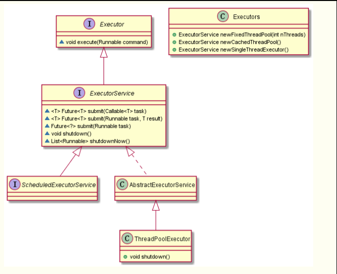

# Java中的线程池

## 一、简介

### 1.1 什么是线程池？

1、线程池（英语：thread pool）：一种线程使用模式。线程池维护着多个线程，等待着监督管理者分配可并发执行的任务。这避免了在处理短时间任务时创建与销毁线程的代价。线程池通过多个任务重用线程，线程创建的开销就被分摊到了多个任务上，而且请求到达时线程已经存在，消除了等待线程创建带来的延迟，使得程序响应更快。

2、线程池应该至少包括

+ 线程池管理器：创建、销毁管理线程池，将工作线程放入线程池中。
+ 工作线程：循环执行任务的线程，在没有任务时进行等待。
+ 任务队列：缓冲机制，将没有处理的任务放入任务队列中。
+ 任务接口：规定任务的入口、任务执行完的收尾工作、任务执行状态等，任务调度算法应该写在这里。

### 1.2 线程池的优点是什么？

线程池主要用来**解决线程生命周期开销问题和资源不足问题**。设想每当一个请求到达就创建一个新线程，开销是挺大的，甚至在创建和销毁线程上花的时间和消耗的资源要大于处理用户请求的时间和资源。另外如果创建线程太多，可能导致系统由于过度消耗内存和切换过度导致系统资源不足，因而可以通过线程池尽可能减少创建和销毁线程的次数，利用已有的对象进行服务。

### 1.3 线程池存在的问题是什么？

线程池的使用也是存在风险的，比如一样存在和其他多线程程序存在的并发风险，如同步错误、死锁，还有线程池特有的风险，如资源不足、线程泄露。

### 1.4 线程泄露

当线程池中除去一个线程去执行一项任务的时候，任务完成之后线程却没有返回线程池，就会发生线程泄露。比如在执行任务时抛出RuntimeException或者一个Error，如果没有catch到，线程池线程数量永久减1。当这样的情况发生次数足够多时，线程池就没有线程来处理任务了。

## 二、Java中的线程池

### 2.1 ThreadPoolExecutor类

```java
public ThreadPoolExecutor(int corePoolSize,int maximumPoolSize,long keepAliveTime,TimeUnit unit,BlockingQueue<Runnable> workQueue);

public ThreadPoolExecutor(int corePoolSize,int maximumPoolSize,long keepAliveTime,TimeUnit unit,BlockingQueue<Runnable> workQueue,ThreadFactory threadFactory);

public ThreadPoolExecutor(int corePoolSize,int maximumPoolSize,long keepAliveTime,TimeUnit unit,BlockingQueue<Runnable> workQueue,RejectedExecutionHandler handler);

public ThreadPoolExecutor(int corePoolSize,int maximumPoolSize,long keepAliveTime,TimeUnit unit,BlockingQueue<Runnable> workQueue,ThreadFactory threadFactory,RejectedExecutionHandler handler);
```

这个类提供了4个构造方法，实际上前3个构造方法都是调用第4个构造方法进行初始化。

介绍一下构造方法中的每个参数：

1. corePoolSize：**核心池的大小**。默认情况下创建线程池之后线程池没有线程，而是等待任务到来才创建线程去执行任务，除非调用了prestartAllCoreThreads()或者prestartCoreThread()方法，进行线程预创建，创建corePoolSize个线程。

2. maximumPoolSize：**线程池最大线程个数**，表示线程池中最多能创建的线程个数。

3. keepAliveTime：**线程多久没有任务执行就会终止。默认情况下，当线程数目大于corePoolSize的时候，keepAliveTime才会起作用**，直到线程池中线程数目不大于corePoolSize。但是如果调用了allowCoreThreadTimeOut(boolean)之后，线程池中的线程个数不大于corePoolSize的时候，keepAliveTime参数也会起作用，直到线程个数为0。

4. unit：参数keepAliveTime参数的时间单位，7种静态属性取值：
   + TimeUnit.DAYS;               //天
   + TimeUnit.HOURS;             //小时
   + TimeUnit.MINUTES;           //分钟
   + TimeUnit.SECONDS;           //秒
   + TimeUnit.MILLISECONDS;      //毫秒
   + TimeUnit.MICROSECONDS;      //微妙
   + TimeUnit.NANOSECONDS;       //纳秒

5. workQueue:一个阻塞队列，用来存储等待执行的任务，一般阻塞队列有以下几种选择：

   + ArrayBlockingQueue
   + LinkedBlockingQueue
   + SynchronousQueue

   线程池的排队策略和阻塞队列的有关。

6. threadFactory:线程工厂，用来创建线程的工厂类

7. handler:表示拒绝处理任务时的策略，一般有四种取值：
   + ThreadPoolExecutor.AbortPolicy:丢弃任务并抛出RejectedExecutionException异常。 
   + ThreadPoolExecutor.DiscardPolicy：也是丢弃任务，但是不抛出异常。 
   + ThreadPoolExecutor.DiscardOldestPolicy：丢弃队列最前面的任务，然后重新尝试执行任务（重复此过程）
   + ThreadPoolExecutor.CallerRunsPolicy：由调用线程处理该任务

### 2.2 重要的方法

ThreadPoolExecutor类中非常重要的方法：

1、execute():向线程池提交任务，由线程池去执行

2、submit()：也是向线程池提交任务，但是能返回任务执行结果，实际上还是调用execute()方法，利用了Future Pattern。

3、shutdown()：将线程池状态置为SHUTDOWN状态，之后不能往线程池添加任何任务，否则都会抛出RejectedExecutionException异常。但是线程池不会立刻退出，而是直到线程池中所有任务都处理完，才退出。

4、shutdownNow()：将线程池状态立刻变成STOP状态，试图停止所有正在执行的线程，不再处理还在队列中等待的任务，然后返回未执行的任务。

对于ThreadPoolExecutor类先了解到这，这个类的第四个构造函数的构造参数多达7个，但是幸运的是jdk提供了4个构造不同种类线程池的静态方法供我们选择。

### 2.3 Executors 创建线程池

Java通过Executors提供四种线程池，分别为：

1. newCachedThreadPool 创建一个可缓存线程池，如果线程池长度超过处理需要，可灵活回收空闲线程，若无可回收，则新建线程。
2. newFixedThreadPool 创建一个定长线程池，可控制线程最大并发数，超出的线程会在队列中等待，表示同一时刻只能有这么大的并发数
3. newScheduledThreadPool 创建一个定长线程池，支持定时及周期性任务执行。
4. newSingleThreadExecutor 创建一个单线程化的线程池，它只会用唯一的工作线程来执行任务，保证所有任务按照指定顺序(FIFO, LIFO, 优先级)执行。



线程池不建议使用Executors去创建，而是通过ThreadPoolExecutor的方式，这样的处理方式让写的同学更加明确线程池的运行规则，规避资源耗尽的风险。 

下面说明：Executors各个方法的弊端：

1. newFixedThreadPool和newSingleThreadExecutor：
   + 主要问题是堆积的请求处理队列可能会耗费非常大的内存，甚至OOM。
2. newCachedThreadPool和newScheduledThreadPool：
   + 主要问题是线程数最大数是Integer.MAX_VALUE，可能会创建数量非常多的线程，甚至OOM。

这里介绍几种种创建线程池的方式：

**Example1**

```java
//org.apache.commons.lang3.concurrent.BasicThreadFactory
ScheduledExecutorService executorService = new ScheduledThreadPoolExecutor(1,new BasicThreadFactory.Builder().namingPattern("example-schedule-pool-%d").daemon(true).build());
```

+ namingPattern：命名规则
+ daemon：守护进程
  + 虚拟机中可能同时有多个线程运行，只有当所有的非守护线程(通常都是用户线程)都结束的时候,虚拟机的进程才会结束,不管当前运行的线程是不是 main 线程。
  + main 线程运行结束，如果此时运行的其他线程全部是 Daemon 线程，JVM 会使这些线程停止，同时退出
  + 如果此时正在运行的其他线程有非守护线程，那么必须等所有的非守护线程结束JVM 才会退出。

**Example2**

```java
ThreadFactory namedThreadFactory = 
    new ThreadFactoryBuilder().setNameFormat("demo-pool-%d").build();
//Common Thread Pool
ExecutorService pool = new ThreadPoolExecutor(5, 200,0L, TimeUnit.MILLISECONDS,new LinkedBlockingQueue<Runnable>(1024), namedThreadFactory, new ThreadPoolExecutor.AbortPolicy());
 
pool.execute(()-> System.out.println(Thread.currentThread().getName()));
pool.shutdown();//gracefully shutdown
```
## 三、CachedThreadPool

回收型线程池，可以重复利用之前创建过的线程，运行线程最大数是Integer.MAX_VALUE。

## 四、FixedThreadPool

固定大小的线程池，跟回收型线程池类似，只是可以限制同时运行的线程数量

## 五、SingleThreadExecutor

单线程池，同时只有一个线程在跑。

## 六、ScheduledThreadPool

他的最大优点除了线程池的特性以外，可以实现循环或延迟任务

多线程并行处理定时任务时，Timer运行多个TimeTask时，只要其中之一没有捕获抛出的异常，其它任务便会自动终止运行，使用ScheduledExecutorService则没有这个问题。
注：当处理多个并行任务时，如果需要线程异常不互相影响，用ScheduledExecutorService代替Timer

## 参考

[线程池基础知识和CachedThreadPool](https://blog.csdn.net/qq_35580883/article/details/78729606)

[多线程定时任务(线程池的创建)](https://blog.csdn.net/qq_36226120/article/details/81866801)