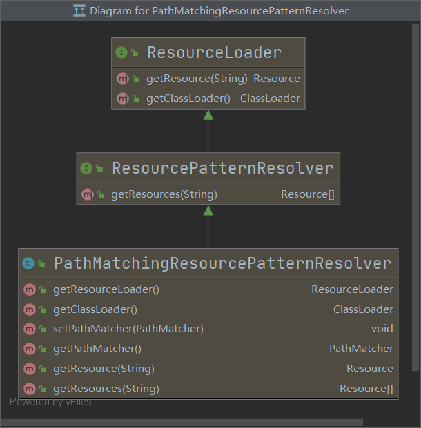

# 资源访问利器



+ ResourceLoader接口仅有一个getResource（String location）的方法，可以根据一个资源地址加载文件资源，不过，资源地址**仅支持带资源类型前缀的表达式**，**不支持Ant风格**的资源路径表达式。
+ ResourcePatternResolver扩展ResourceLoader接口，定义了一个新的接口方法：getResources（String locationPattern），该方法**支持带资源类型前缀及Ant风格**的资源路径的表达式。
+ PathMatchingResourcePatternResolver是Spring提供了标准实现类

下面是个小例子

```java
Resource[] resources = new PathMatchingResourcePatternResolver().getResources("classpath:mybatis/**/*Mapper.xml");
for (Resource resource : resources){
    System.out.println(resource.getDescription());
}
```

输出

```
file [F:\CodeMgr\Intellij IDEA\RuoYi-Study\My-RuoYi-Vue\ruoyi\target\classes\mybatis\monitor\SysLoginInfoMapper.xml]
file [F:\CodeMgr\Intellij IDEA\RuoYi-Study\My-RuoYi-Vue\ruoyi\target\classes\mybatis\system\SysMenuMapper.xml]
file [F:\CodeMgr\Intellij IDEA\RuoYi-Study\My-RuoYi-Vue\ruoyi\target\classes\mybatis\system\SysRoleMapper.xml]
file [F:\CodeMgr\Intellij IDEA\RuoYi-Study\My-RuoYi-Vue\ruoyi\target\classes\mybatis\system\SysUserMapper.xml]
```

