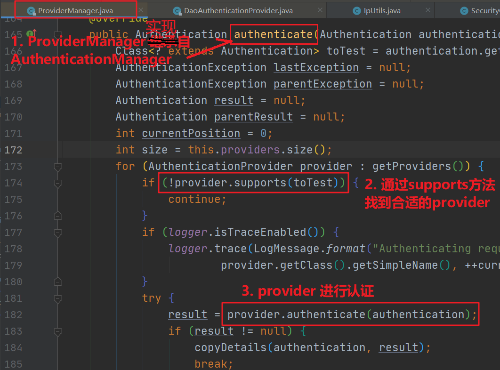
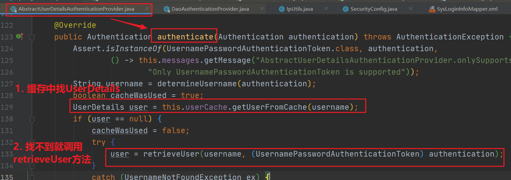
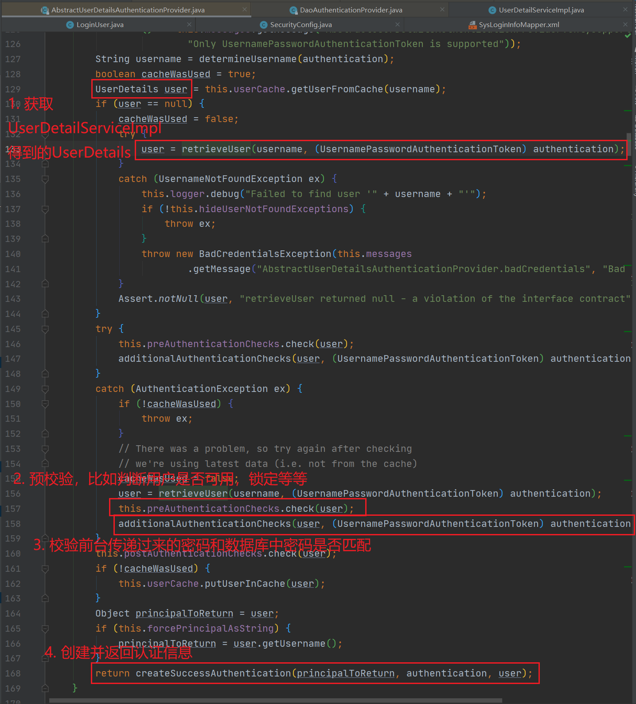
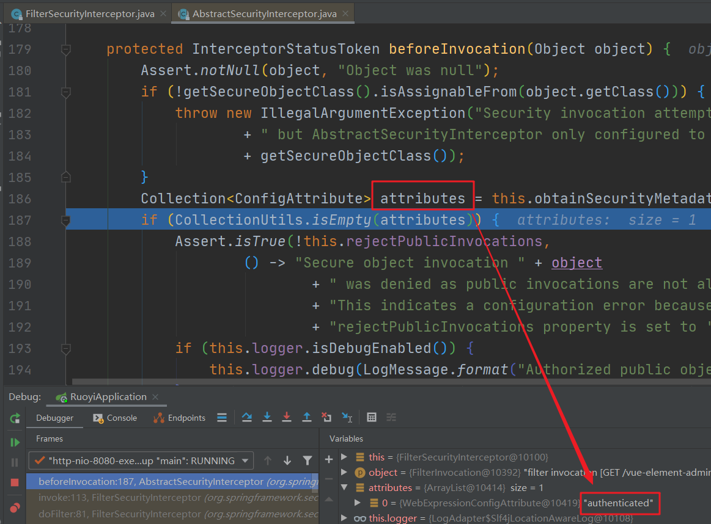
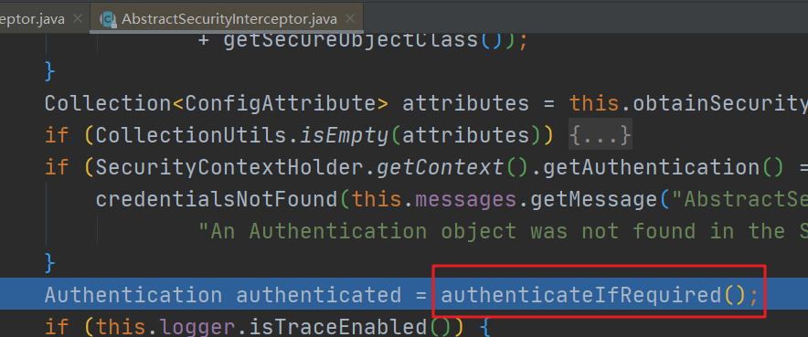
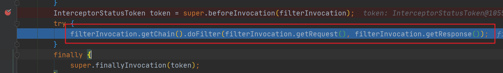

# SpringSecurity认证流程

> 最近在学习 Ruoyi 后台管理框架源码，看到了关于 SpringSecurity 安全认证方面的东西，感觉不易理解，因此花了点时间时间看了源码，深入了解一下认证流程

## SpringSecurity配置

我们需要做一定的配置才能让 SpringSecurity 的安全认证起到作用，下面我们定义一个 `SecurityConfig.java` 类，它继承了 `WebSecurityConfigurerAdapter`，如下：

```java
@EnableGlobalMethodSecurity(prePostEnabled = true, securedEnabled = true)
public class SecurityConfig extends WebSecurityConfigurerAdapter{
    ...
}
```

Step.1）同时需要重写它的 `configure(HttpSecurity http)` 方法：

```java
@Override
protected void configure(HttpSecurity http) throws Exception {
    // CRSF禁用，不使用session
    http.csrf().disable();
    // 基于token，所以不需要session
    http.sessionManagement().sessionCreationPolicy(SessionCreationPolicy.STATELESS);
    // 过滤请求
    http.authorizeRequests()
        .antMatchers("/login", "/captchaImage").anonymous()
        .anyRequest().authenticated();
    ....
    // 添加JWT filter
    http.addFilterBefore(authenticationTokenFilter, UsernamePasswordAuthenticationFilter.class);
}
```

配置的相关解释如下：

+ 项目是前后端分离的，无需用到 session，因此修改与 session 相关的配置
+ 定义哪些请求需要进行认证，哪些请求可以放行
+ 定义过滤器（**重要，如何从请求中拿到认证信息就靠它了**）
  + 在项目中过滤器 `authenticationTokenFilter` 继承了 `OncePerRequestFilter` 
  + 继承了 `OncePerRequestFilter` 的类在每次请求只执行一次

Step.2）此外我们还需要重写的它的 `configure(AuthenticationManagerBuilder auth)` 方法：

```java
@Override
protected void configure(AuthenticationManagerBuilder auth) throws Exception
{
    auth.userDetailsService(userDetailsService)
        .passwordEncoder(bCryptPasswordEncoder());
}
```

在这里我们使用了一个 `UserDetailsService` 对象（**重要，判断用户认证是否成功也就是账号密码是否正确就靠它了**）

***小总结***：目前我们提到了两个重要，下面的文章就是围绕这两个*重要*进行展开的。下面我们将先阐述用户认证流程，然后在梳理如何拿到认证信息。

## 用户认证流程

用户认证所关注是**用户所输入的账号信息是否正确**，如果账号信息正确将返回一个凭证，下面的认证流程将围绕这个关注点展开。

### 「发送认证请求」

我们发送请求 `[post] /login`，传递 username、password 等数据到服务器，服务器收到请求，来到相应的 controller 处理方法

```java
@RestController
public class SysLoginController {

    @Autowired
    private SysLoginService loginService;

    @PostMapping("login")
    public Result login(String username, String password, String code, String uuid){
        Result result = Result.success();
        String token = loginService.login(username, password, code, uuid);
        result.put(Constants.TOKEN, token);
        return result;
    }
```

在这里调用 loginService 的 login方法，其中内部是具体的验证登录逻辑，验证通过后返回一个 token，也就是一个凭证，用来表示我们已近认证成功（登录成功）。

### 「调用认证方法」

接下来进入 `loginService.login()`内

```java
@Component
public class SysLoginService {
    @Autowired private RedisCache redisCache;
    @Autowired private TokenService tokenService;
    @Autowired private AuthenticationManager authenticationManager;
    
    public String login(String username, String password, String code, String uuid) {
        ...省去验证码校验逻辑，校验失败会抛出异常
            
        Authentication authenticate = null;
        try {
        // 认证 该方法会去调用UserDetailsServiceImpl.loadUserByUsername
            authenticate = authenticationManager.authenticate(
                new UsernamePasswordAuthenticationToken(username, password));
        } catch (Exception e) {
            if (e instanceof BadCredentialsException) {
                throw new UserPasswordNotMatchException();
            } else {
                throw new CustomException(e.getMessage());
            }
        }
        return tokenService.createToken((LoginUser) authenticate.getPrincipal());
    }
}
```

其中 `authenticationManager.authenticate()` 就是我们需要调用的认证方法，如果失败则抛出异常。

这个方法以一个 `UsernamePasswordAuthenticationToken` 类作为参数，它拥有两个构造方法，如下：

+ 只有两个参数的构造方法表示「当前没有认证」

  ```java
  public UsernamePasswordAuthenticationToken(Object principal, Object credentials)
  ```

+ 有三个参数的构造方法表示「当前已经认证完毕」，后面校验成功后会用到它

  

### 「源码分析认证方法」


上面的流程图就是认证方法的一个大概过程，下面我们将通过源码来查看这个认证方法 `AuthenticationManager.authenticate()` 到底干了什么（*深入源码调用堆栈有点啰嗦，可以直接看第5步的小总结*）。

Step.1）实现了`AuthenticationMananger`的`ProviderManger`调用接口的`authenticate`方法



Step.2）然后遍历所有的 AuthenticProvider，其中的`supports`方法用来判断 `provider` 是否支持 `toTest`。

而源码中的 `toTest` 类，就是我们认证传递的 `UsernamePasswordAuthenticationToken`，通过遍历我们发现 `AbstractUserDetailsAuthenticationProvider` 支持 `UsernamePasswordAuthenticationToken`，判断`provider`是否合适的源码如下：

AbstractUserDetailsAuthenticationProvider.java

```java
@Override
public boolean supports(Class<?> authentication) {
    return (UsernamePasswordAuthenticationToken.class.isAssignableFrom(authentication));
}
```

Step.3）找到合适的Provider后，在本例中也即是AbstractUserDetailsAuthenticationProvider（抽象类），会调用provider 的authenticate 方法



Step.4）从下面可以看到  retrieveUser 方法返回一个 UserDetails


Step.5）接着深入，可以发现 DaoAuthenticationProvider 继承了 AbstractUserDetailsAuthenticationProvider，所以DaoAuthenticationProvider 才是真正的实现类，他会调用 retrieveUser  方法，接着调用 loaderUserByUsername() 方法


看到 loaderUserByUsername()，应该就很熟悉了，因为这就是我们自己实现 `UserDetailsService` 接口，自定义的认证过程。

**小总结**：源码分析了一堆，其实这个**认证方法的真正目的是调用 `UserDetailsService` 类的 `loaderUserByUsername()`**

### 「实现校验逻辑」

文章开头我们提到了两个重要，第二个重要就是 `UserDetailsService`，认证就是通过它的 `loaderUserByUsername()` 方法是否认证成功。

 `UserDetailsService` 是一个接口，同时要求我们返回一个 `UserDetail` 对象，我们需要自己实现认证校验逻辑，如下：

```java
@Service("userDetailsService")
public class UserDetailServiceImpl implements UserDetailsService {
    ...
    @Autowired private ISysUserService userService;
    @Autowired private SysPermissionService permissionService;

    @Override
    public UserDetails loadUserByUsername(String username) throws UsernameNotFoundException {
        SysUser user = userService.selectUserByUserName(username);
        if (null == user) {
            log.info("登录用户：{} 不存在.", username);
            throw new UsernameNotFoundException("登录用户：" + username + " 不存在");
        } else if (UserStatus.DELETED.getCode().equals(user.getDelFlag())) {
            log.info("登录用户：{} 已被删除.", username);
            throw new BaseException("对不起，您的账号：" + username + " 已被删除");
        } else if (UserStatus.DISABLE.getCode().equals(user.getStatus())) {
            log.info("登录用户：{} 已被停用.", username);
            throw new BaseException("对不起，您的账号：" + username + " 已停用");
        }
        return createLoginUser(user);
    }

    public UserDetails createLoginUser(SysUser user) {
        return new LoginUser(user, permissionService.getMenuPermission(user));
    }
}
```

上面就是我们自己的认证逻辑：

1. 通过一个唯一标识 username 查询用户
2. 当所有校验都通过后就会调用 createLoginUser 方法
   + 装填用户拥有的权限以及**从数据库中获取的密码**，
3. 返回一个 LoginUser 对象，而这个对象实现了 UserDetails接口。

### 「源码分析校验逻辑」

下面我们通过源码查看获取到 `UserDetails` 后 SpringSecurity 还做了什么（*如果没看之前的源码分析可以直接看第2步的小总结*）

Step.1）我们回看 AbstractUserDetailsAuthenticationProvider 的 authenticate 方法



Step.2）接着深入，可以发现`createSuccessAuthentication`方法创建了一个UsernamePasswordAuthenticationToken，并且他的构造方法**有三个参数**，这表明这个token是已近认证过后的


**小总结**：认证成功后，我们调用 `UsernamePasswordAuthenticationToken` 具有三个参数的构造方法，也就是代表认证成功的构造函数，然后将构造的对象返回去。

### 「认证结束」

至此认证已经结束，我再回到 `loginService.login()`这个我们自己写的方法内，认证方法 `authenticationManager.authenticate()` 认证成功后会返回一个 Authentication，然后就可以利用这个 Authentication 生成一个 token。

loginService.java

```java
return tokenService.createToken((LoginUser) authenticate.getPrincipal());
```

接着回到前面第二步controller调用的 `loginService.login()`，这时它已近拿到了 token ，于是将其返回到前端。前端收到相应后，就可以把这个token存在本地，以后每次访问请求时都带上这个token 信息。

```java
@PostMapping("login")
public AjaxResult login(String username, String password, String code, String uuid){
    AjaxResult result = AjaxResult.success();
    String token = loginService.login(username, password, code, uuid);
    result.put(Constants.TOKEN, token);
    return result;
}
```

## 获取认证信息

文章开头提到了两个重要，下面我们将梳理第一个重要，也就是如何从请求中拿到认证信息。

上面说到认证成功后每次发送请求都带上 token 信息，但是为啥带上这个 token 呢？在之前的 SpringSecurity 配置中有如下配置 

```java
.antMatchers("/login", "/captchaImage").anonymous()
```

因此对于 `/login`请求没遭受拦截，而其他请求都是要被拦截的。

### 「拦截器」

之前 `/login`  我们配置了不拦截，因此手动调用 `authenticationManager.authenticate()` 来进行认证，而现在被拦截的请求又是如何判断它是否认证过了呢？

对于被拦截的请求，如果它带有 token，我们会手动将这个 token 转换为认证信息 `UsernamePasswordAuthenticationToken` 并放入本次请求的上下文中，否则啥事都不做。而我们文章开头所配置的

```java
http.addFilterBefore(authenticationTokenFilter,UsernamePasswordAuthenticationFilter.class);
```

拦截器就是起这个作用，具体实现如下（后面称这个为 jwtFilter）。

JwtAuthenticationTokenFilter.java

```java
@Component
public class JwtAuthenticationTokenFilter extends OncePerRequestFilter {

    @Autowired
    private TokenService tokenService;

    @Override
    protected void doFilterInternal(HttpServletRequest request, HttpServletResponse response, FilterChain chain) throws ServletException, IOException {
        // 1)
        LoginUser loginUser = tokenService.getLoginUser(request);
        // 2)
        if (ObjectUtil.isNotNull(loginUser) && ObjectUtil.isNull(SecurityUtils.getAuthentication()))
        {
            // 3.1)
            tokenService.verifyToken(loginUser);
            // 3.2)
            UsernamePasswordAuthenticationToken authenticationToken = new UsernamePasswordAuthenticationToken(loginUser, null, loginUser.getAuthorities());
            authenticationToken.setDetails(new WebAuthenticationDetailsSource().buildDetails(request));
            SecurityContextHolder.getContext().setAuthentication(authenticationToken);
        }
        chain.doFilter(request, response);
    }
}
```

我们关注代码中 3.2）即可。在 token 正确后，我们使用用有三个参数的构造方法创建`UsernamePasswordAuthenticationToken` 对象，前面也说了，这代表已经经过认证，然后通过 `SecurityContextHolder.getContext().setAuthentication()` 为本次请求上下文设置一下认证信息。

这样后面 SpringSecurity 看到存在这个认证信息就会判断本次请求已经认证成功。

### 「源码分析拦截流程」

> 为了更深刻的了解 SpringSecurity 内部是如何被拦截请求是否认证成功，我们接下来通过源码具体分析一下流程。

再次之前先介绍一个类 `FilterSecurityInterceptor`：是一个方法级的权限过滤器，基本位于过滤链的最底部，因此请求到来时它一定会执行，下面来看看源码。


下面来打个断点，查看一下


这说明来到`beforeInvocation`方法时我们前面编写的jwtFilter已经被执行，认证信息已近被手动添加过了



进入`beforeInvocation()`里面，由调试信息可以看到当前请求需要被认证



接着我们进入`authenticateIfRequired`方法的内部


因为我们之前 jwtfilter 手动添加了认证信息，所以`authenticateIfRequired`就直接返回了authentication，表示认证通过。

如果之前在 jwtfilter 被拦截的请求不存在 token，我们就不会手动设置认证信息，因此调用 `authenticationManager.authenticate();`进行验证时，中途一定会抛出异常，导致此次请求失败被拦截

至此也没啥好讲了，filterInvocation.getChain().doFilter() 调用我们的后台服务了



## 参考

https://www.cnblogs.com/ymstars/p/10626786.html

https://www.jianshu.com/p/d5ce890c67f7

https://gitee.com/y_project/RuoYi-Vue