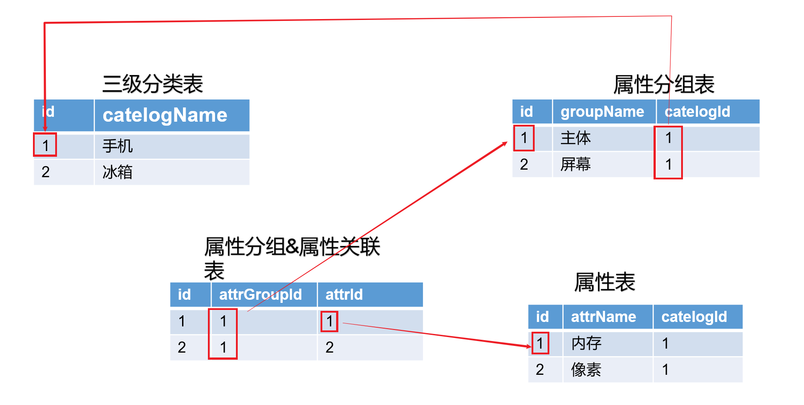
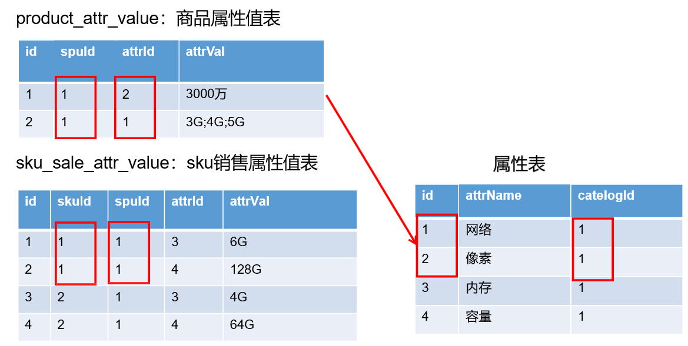
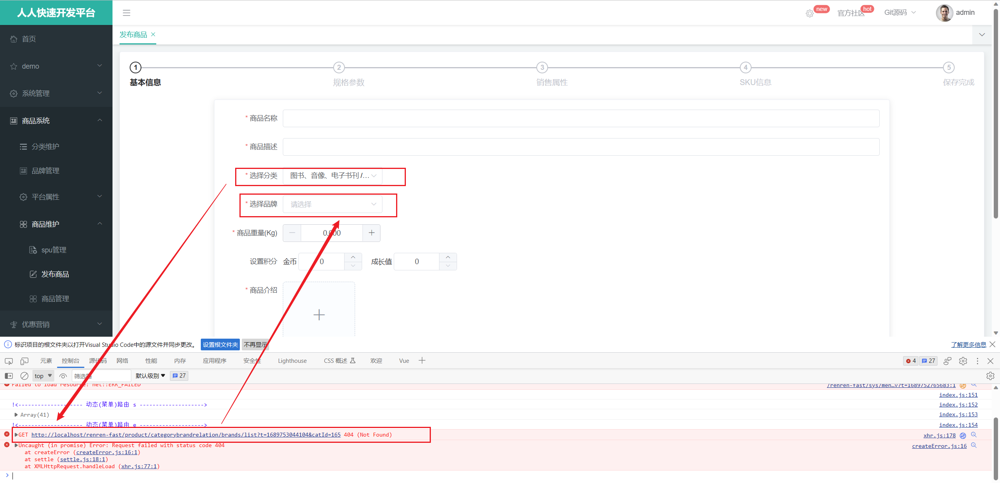

# 业务方法

## 三级分类

### 查看分类菜单

```java
@Override
    public List<CategoryEntity> listWithTree() {
        // 1、查询所有分类
        List<CategoryEntity> categoryEntityList = baseMapper.selectList(new QueryWrapper<>());
        // 2、查询所有1级分类
        return categoryEntityList.stream().filter(entity ->
            entity.getParentCid() == 0
        ).peek(menu ->
            menu.setChildren(getMenuChildren(menu, categoryEntityList))
        ).sorted(Comparator.comparingInt(menu -> (menu.getSort() == null ? 0 : menu.getSort()))
        ).collect(Collectors.toList());
    }

    private List<CategoryEntity> getMenuChildren(CategoryEntity root, List<CategoryEntity> all) {
        return all.stream().filter(categoryEntity ->
            categoryEntity.getParentCid().equals(root.getCatId())
        ).peek(entity -> entity.setChildren(getMenuChildren(entity, all))
        ).sorted(Comparator.comparingInt(entity -> (entity.getSort() == null ? 0 : entity.getSort()))
        ).collect(Collectors.toList());
    }
```

算法逻辑：

1. 查询所有的分类菜单数据
2. 根据菜单数据检索出所有的**一级菜单**
3. **一级菜单**设置好所有的子级菜单
   + 子级菜单是一个递归函数
4. 利用 sorted 方法对数据进行排序

### 删除分类菜单

1、逻辑删除

+ 删除校验，存在关联不删除，前端不允许删除的disable或unshow

由于使用的是 mybatis-plus，因此我们仅添加几个注解即可完成逻辑删除，删除找到标注的逻辑删除字段

步骤 1） 配置`com.baomidou.mybatisplus.core.config.GlobalConfig$DbConfig`

例: application.yml

```yaml
mybatis-plus:
  global-config:
    db-config:
      logic-delete-field: flag # 全局逻辑删除的实体字段名(since 3.3.0,配置后可以忽略不配置步骤2)
      logic-delete-value: 1 # 逻辑已删除值(默认为 1)
      logic-not-delete-value: 0 # 逻辑未删除值(默认为 0)
```

步骤 2）实体类字段上加上`@TableLogic`注解

```java
@TableLogic
private Integer deleted;
```

2、页面细节

+ 删除前提示
+ 删除后展开
+ 删除后提示

3、批量删除

```js
handleDelete(node, data) {
      console.log(this.ids)
      const ids = data ? [data.catId] : this.ids
      const name = data ? data.name : this.selection.map(item => item.name).join(',')
      if (data) this.expandedKeys = [data.parentCid]
      this.$confirm(`确定删除分类【${name}】吗?`, '提示', {
        confirmButtonText: '确定',
        cancelButtonText: '取消',
        type: 'warning'
      }).then(() => {
        deleteCate(ids).then(() => {
          this.$modal.msgSuccess('删除成功')
          this.getList()
        })
      }).catch(() => {})
    },
```

个人称赞的是设计了一个 `expandedKeys`，让它与 el-tree 的`default-expanded-keys` 属性进行绑定，在重新获取分类数据时能展开所需的数据

```vue
<el-tree node-key="catId" :default-expanded-keys="expandedKeys" 
```

需要注意的是，项目所采用的 renren-fast 脚手架使用 `adornData` 函数

```js
http.adornData = (data = {}, openDefaultData = true, contentType = 'json') => {
  var defaults = {
    't': new Date().getTime()
  }
  data = openDefaultData ? merge(defaults, data) : data
  return contentType === 'json' ? JSON.stringify(data) : qs.stringify(data)
}
```

为数据添加了一个 `t=xxx` 的时间数据，本意是放置请求缓存数据，但是部分请求接口指定了传递的参数，这样会影响请求的结果，需要设置 `openDefaultData=false`来避免。

### 添加分类菜单

无注意项

### 修改分类菜单

1、修改数据

暂无注意项

2、拖拽修改 —— 批量修改

```js
    allowDrop(draggingNode, dropNode, type) {
      const draggingNodeLevel = this.countNodeChildLevel(draggingNode)
      const deep = draggingNodeLevel - draggingNode.level + 1

      if (type === 'inner') {
        return deep + dropNode.level <= 3
      } else {
        return deep + dropNode.parent.level <= 3
      }
    },
    countNodeChildLevel(node) {
      // 寻找node以及子节点中level最大的数值
      let maxLevel = node.level
      const loop = (node) => {
        if (node.childNodes && node.childNodes.length) {
          node.childNodes.forEach(item => {
            if (item.level > maxLevel) {
              maxLevel = item.level
            }
            loop(item)
          })
        }
      }
      loop(node)
      return maxLevel
    },
    handleNodeDrop(draggingNode, dropNode, type) {
      let pCid = 0
      let silbing = null
      if (type === 'inner') {
        pCid = dropNode.data.catId
        silbing = dropNode.childNodes
      } else {
        pCid = dropNode.parent.level !== 0 ? dropNode.parent.data.catId : 0
        silbing = dropNode.parent.childNodes
      }
      this.expandedKeys.push(pCid)

      // 当前拖拽节点的顺序
      for (let i = 0; i < silbing.length; i++) {
        if (silbing[i].data.catId === draggingNode.data.catId) {
          let catLevel = silbing[i].level
          if (silbing[i].level !== draggingNode.level) {
            this.updateChildNodeLevel(draggingNode)
          }
          this.updateNode.push({catId: silbing[i].data.catId, sort: i, parentCid: pCid, catLevel: catLevel})
        } else {
          this.updateNode.push({catId: silbing[i].data.catId, sort: i})
        }
      }
    },
        
    updateChildNodeLevel(node) {
      if (node.childNodes && node.childNodes.length) {
        node.childNodes.forEach(item => {
          this.updateNode.push({catId: item.data.catId, catLevel: item.level})
          this.updateChildNodeLevel(item)
        })
      }
    },
```

+ 对于寻找数节点数据下数值最大的，还是在**方法体外部定义一个变量**来记录最大值比较方便
+ 

## 品牌管理

### table中switch修改数据

### 使用oss上传文件

阿里云相关文档：https://help.aliyun.com/document_detail/91868.html?spm=a2c4g.267439.0.0.7d312c798uwOQd

### 全局异常处理

### JSR303

1）给Bean添加校验注解：javax.validation.constraints,并定义自己的message提示

2）开启校验功能 `@Valid`

效果：校验错误以后会有默认的响应；

3）给校验的bean后紧跟一个BindingResult,就可以获取到校验的结果

4）分组校验（多场景的复杂校验）`Validated`

1. 给校验注解标注什么情况需要进行校验

```java
@NotBlank(message="品牌名必须提交"，groups={AddGroup.cLass,UpdateGroup.cLass})
```

其中 `AddGroup` 以及 `UpdateGroup` 为一个接口

2. 如果 Controller 方法中标注了 `@Validated(AddGroup.class)`，但是实体类属性上的校验规则没有标注任何分组，则该校验规则不会生效。

5)、自定义校验

1. 编写一个自定义的校验注解

```java
@Documented
@Constraint(
        validatedBy = {InNumberValidator.class}
)
@Target({ElementType.METHOD, ElementType.FIELD, ElementType.ANNOTATION_TYPE, ElementType.CONSTRUCTOR, ElementType.PARAMETER, ElementType.TYPE_USE})
@Retention(RetentionPolicy.RUNTIME)
public @interface InNumber {

    String message() default "{com.hemou.gulimall.common.validator.constraints.InNumber.message}";

    Class<?>[] groups() default {};

    Class<? extends Payload>[] payload() default {};

    int[] values() default {};
}
```

需要注意，下面三个属性必须存在

+ `message`
+ `groups`
+ `payload`

## 平台属性

### 属性分组

#### SPU与SKU

SPU：Standard Product Unit （标准产品单位） ，一组具有共同属性的商品集

SKU：Stock Keeping Unit（库存量单位），SPU商品集因具体特性不同而细分的每个商品

- SPU是一个抽象的商品集概念，为了方便后台的管理。
- SKU才是具体要销售的商品，每一个SKU的价格、库存可能会不一样，用户购买的是SKU而不是SPU

#### 数据库设计 ★★





#### 属性分组分类树组件

需求：通过点击侧边栏树形组件，右侧自动显示对应数据，属性组件过滤关键词 


由于自动生成的代码，分页数据不包含 categoryId，而上述功能需要指定的 categoryId 进行数据查询，因此需要补充分页的实现。【需要修改 AttrGroup】

#### 增删改属性分组

难点：

+ 添加分组信息时，下拉框的级联选择【`@JsonInclude(JsonInclude.Include.NON_EMPTY)`】
+ 修改属性分组时，下拉框不能正常回显，需要后端额外传递下拉框级联路径数据

```java
@Override
    public Long[] findCatelogPath(Long catelogId) {
        List<Long> catelogPath = new ArrayList<>();
        for (CategoryEntity ce = this.getById(catelogId); ce != null; ce = this.getById(ce.getParentCid())) {
            catelogPath.add(0, ce.getCatId());
        }
        return catelogPath.toArray(new Long[0]);
    }
```

先为 AttrGroup 添加一个字段 `Long[] catelogPath`，通过以上方法获取它的分类路径，然后通过setter 方法设置好 catelogPath

+ 需要记住**级联修改**属性与分类的关联表（修改分类表时也需要注意）

### 规格参数（属性管理）

+ 分页查询添加额外的关键字字段，Vo 额外添加分组信息

+ 添加数据时，注意添加属性与属性分组的关系

+ 规格修改，注意回显

### 销售属性

同上

### 属性分组关联属性

+ 查询：根据 `attrGroupId` 查询出所有关联的 `Attr`
+ 删除：根据 `AttrGroupId` 以及 `attrId` 删除关联数据
+ 添加关联：获取属性分组里面还没有关联的本分类里面的其他基本属性，方便添加新的关联
  + 查询：
    + 查询 `AttrGroup` 还没有关联的本分类里面的其他基本属性
    + 只能查询当前 `AttrGroup` 对应分类的属性
    + 如果一个属性已关联一个分组，那他就不能继续关联新分组
  + 添加
    + 批量添加关联关系

## 品牌管理

直接使用老师提供的代码，需要注意：

+ 添加 Mybatis-Plus 的分页插件
+ 因为额外添加了搜索关键字，因此需要重写分页查询的函数
+ 关联分类：级联修改品牌名，【避免过多的级联查询，添加了冗余字段】

## 新增商品

需求：

1、点击分类后查询该分类关联的所有品牌（基本信息）




2、获取分类下所有分组（分组下要包含一个它所有关联的属性的列表）

3、保存商品信息

```java
@Transactional
public void saveSpuInfo(SpuSaveVo spuSaveVo) {
    // 1、保存spu基本信息 —— pms_spu_info
    SpuInfoEntity spuInfoEntity = saveBaseSpuInfo(spuSaveVo);
    // 2、保存spu的描述图片 —— pms_spu_info_desc
    saveSpuInfoDesc(spuSaveVo, spuInfoEntity);
    // 3、保存spu的图片集 —— pms_spu_images
    saveSpuImages(spuSaveVo, spuInfoEntity);
    // 4、保存spu的规格参数 —— pms_spu_attr_value
    saveSpuAttrValue(spuSaveVo, spuInfoEntity);
    // 5、保存spu的积分信息 —— sms_spu_bounds
    saveSpuBounds(spuSaveVo, spuInfoEntity);

    // 5、sku
    // 5.1、保存sku的基本信息 —— pms_sku_info
    // 5.2、保存sku的图片信息 —— pms_sku_images
    // 5.3、保存sku的销售属性信息 —— pms_sku_sale_attr_value
    // 5.4、保存sku的优惠、满减等信息 —— gms_sku_ladder、gms_sku_full_reduction、gms_member_price
    saveSkuInfos(spuSaveVo, spuInfoEntity);

}
```


```sql
SET TRANSACTION ISOLATION LEVEL READ UNCOMMITTED;
```

