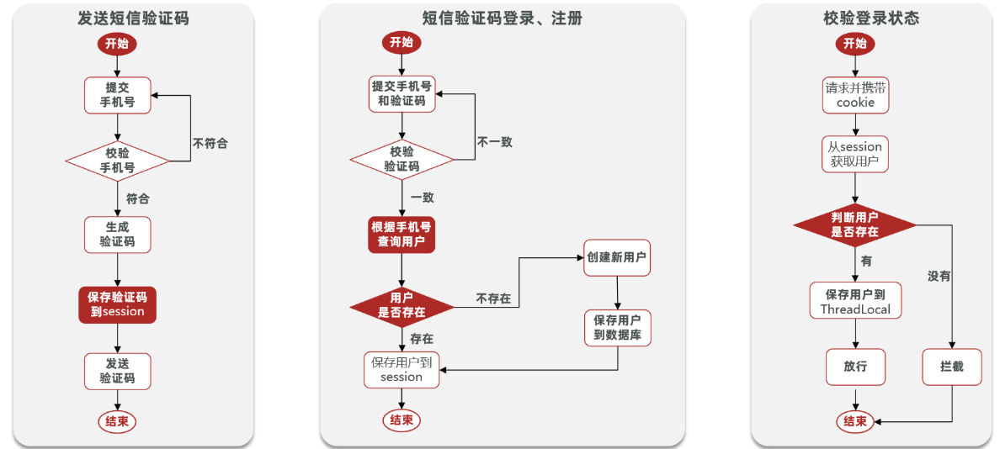
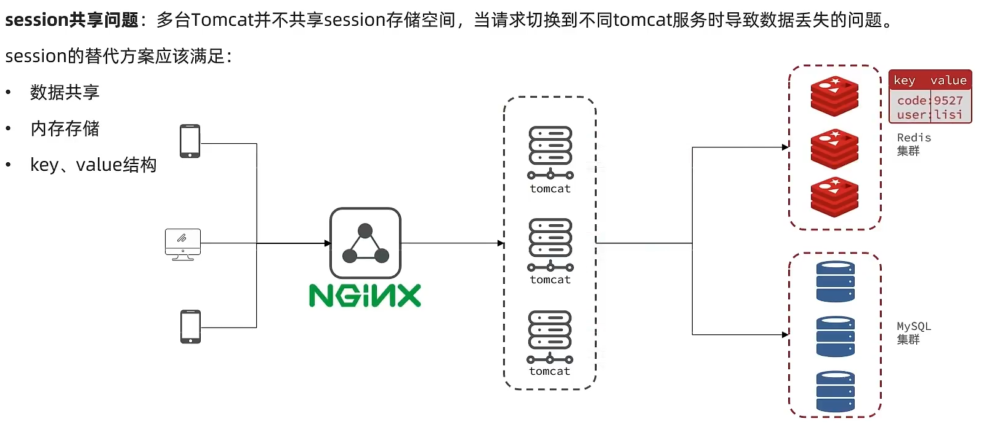
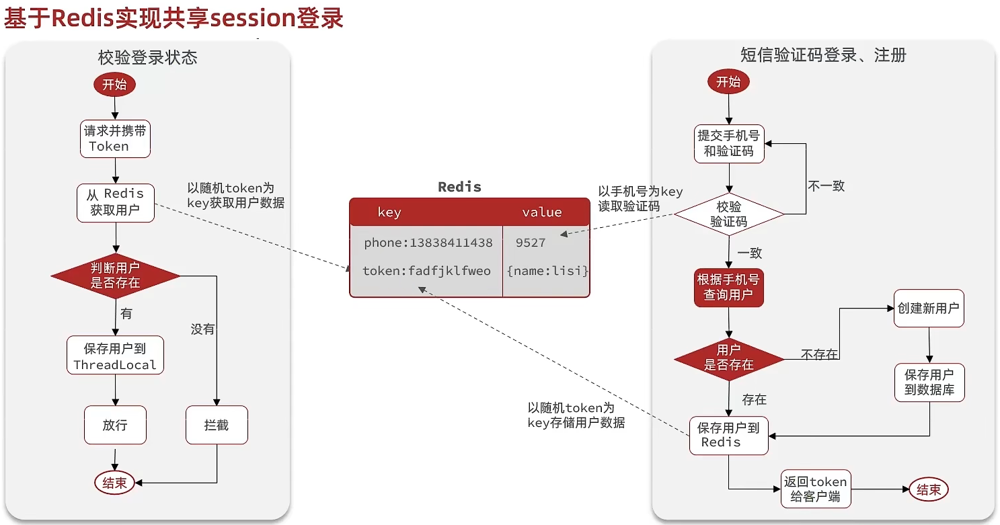
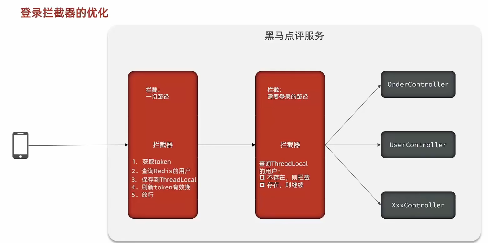

# 基于Session实现登录流程

## 登录流程

**发送验证码：**

用户在提交手机号后，会校验手机号是否合法，如果不合法，则要求用户重新输入手机号

如果手机号合法，后台此时生成对应的验证码，同时将验证码进行保存，然后再通过短信的方式将验证码发送给用户

**短信验证码登录、注册：**

用户将验证码和手机号进行输入，后台从session中拿到当前验证码，然后和用户输入的验证码进行校验，如果不一致，则无法通过校验，如果一致，则后台根据手机号查询用户，如果用户不存在，则为用户创建账号信息，保存到数据库，无论是否存在，都会将用户信息保存到session中，方便后续获得当前登录信息

**校验登录状态:**

用户在请求时候，会从cookie中携带者JsessionId到后台，后台通过JsessionId从session中拿到用户信息，如果没有session信息，则进行拦截，如果有session信息，则将用户信息保存到threadLocal中，并且放行

## session共享问题

当用户变多时，项目会使用分布式架构将项目部署到不同的tomcat服务器中，然而tomcat之间的session无法共享，用户访问第一台 tomcat 后，后面可能会轮询到其他 tomcat 服务器上，那么后面几台 tomcat 中的 session 没有存储相关信息就会产生一定的问题。

即时后面有 session 拷贝的方案来解决这个问题，但是它存在一定的延迟，并且每个 tomcat 都拥有一份完整的 session 信息，会带来较大的服务器压力。

而 redis 它本身就是数据共享的，可以避免session共享的问题

## Redis 代替 session 的业务流程

### 设计 key

因为 Redis 是全局共享的，因此 key 要保证**唯一性**，同时要方便携带。

首先想得的是使用 phone 号码，但是这属于敏感数据，如果使用它来表示登录用户不仅可能泄露用户信息而且还不安全。

因此可以考虑随机生成一个 token ，然后保存到前端，在每次请求时附带到 header 上来证明身份。

### 设计 value 结构

session 可以使用对象保存相关用户信息，Redis 可以采用 **Hash** 来存储，Hash 不仅占用空间更小并且还能更细粒度的修改用户信息。当然如果不在意内存使用 **String** 存储用户 json 字符串也是可以的。

### 整体访问流程

## 登录状态刷新问题

**存在的问题：**默认情况拦截器只能拦截需要登录验证的链接，并在此时进行身份信息刷新，但若用户登录后一直访问不需要身份验证的网页，那么当身份信息的有效期一到，用户就无法访问需要验证的网页里，这明显不合逻辑。

**解决方案：**我们可以在身份验证拦截器前再添加一个拦截器，用来进行状态刷新，只要登录用户访问界面就进行状态刷新。

