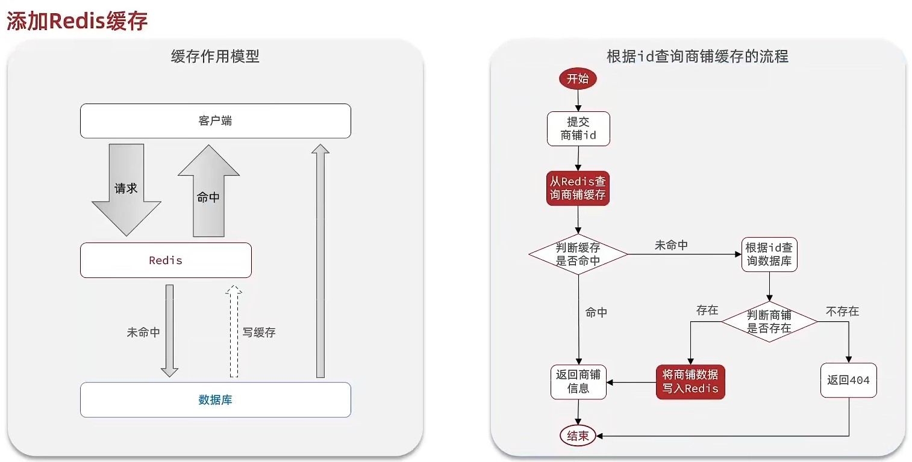
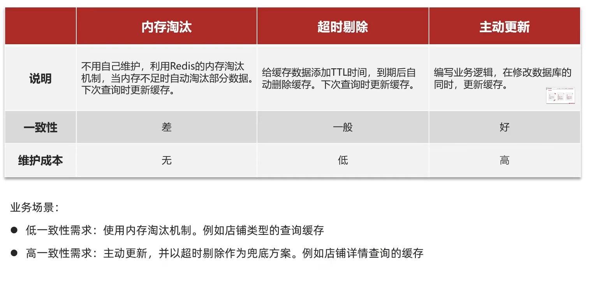
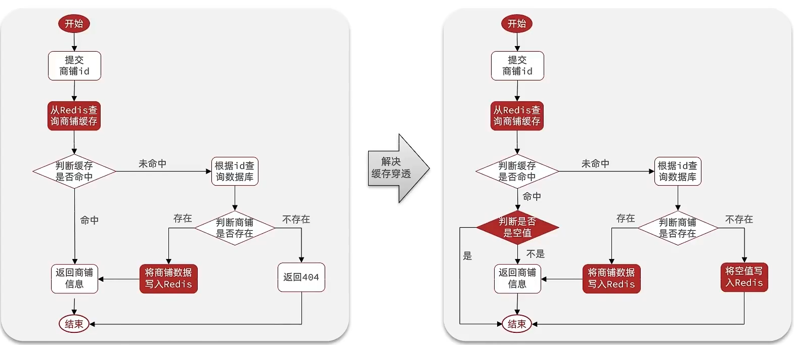
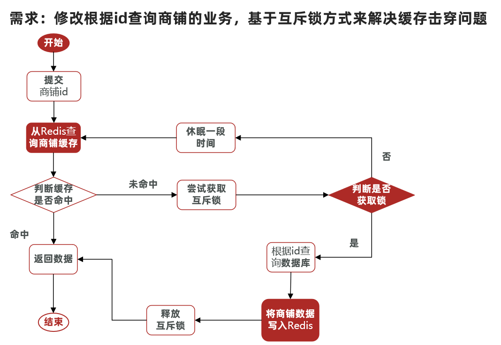
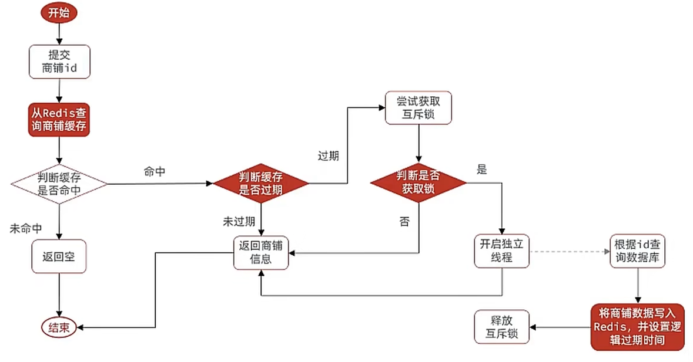

# 商户查询缓存

## 添加商户缓存

标准的操作方式就是查询数据库之前先查询缓存，

+ 如果缓存数据存在，则直接从缓存中返回
+ 如果缓存数据不存在，再查询数据库，然后将数据存入 Redis



## 缓存更新策略

**内存淘汰：**redis自动进行，当redis内存达到咱们设定的max-memery的时候，会自动触发淘汰机制，淘汰掉一些不重要的数据(可以自己设置策略方式)

**超时剔除：**当我们给redis设置了过期时间ttl之后，redis会将超时的数据进行删除，方便咱们继续使用缓存

**主动更新：**我们可以手动调用方法把缓存删掉，通常用于解决缓存和数据库不一致问题



### 数据库缓存不一致解决方案

由于我们的**缓存的数据源来自于数据库**,而数据库的**数据是会发生变化的**,因此,如果当数据库中**数据发生变化,而缓存却没有同步**,此时就会有**一致性问题存在**,其后果是:

用户使用缓存中的过时数据,就会产生类似多线程数据安全问题,从而影响业务,产品口碑等;怎么解决呢？有如下几种方案

Cache Aside Pattern 人工编码方式：缓存调用者在更新完数据库后再去更新缓存，也称之为双写方案

Read/Write Through Pattern : 由系统本身完成，数据库与缓存的问题交由系统本身去处理

Write Behind Caching Pattern ：调用者只操作缓存，其他线程去异步处理数据库，实现最终一致


### 数据库和缓存不一致采用什么方案

**综合考虑使用方案一**，但是方案一调用者如何处理呢？这里有几个问题

操作缓存和数据库时有三个问题需要考虑：

如果采用第一个方案，那么假设我们每次操作数据库后，都操作缓存，但是中间如果没有人查询，那么这个更新动作实际上只有最后一次生效，中间的更新动作意义并不大，我们可以把缓存删除，等待再次查询时，将缓存中的数据加载出来

* 1、删除缓存还是更新缓存？
  * 更新缓存：每次更新数据库都更新缓存，无效写操作较多
  * 删除缓存：更新数据库时让缓存失效，查询时再更新缓存

* 2、如何保证缓存与数据库的操作的同时成功或失败？
  * 单体系统，将缓存与数据库操作放在一个事务
  * 分布式系统，利用TCC等分布式事务方案

应该具体操作缓存还是操作数据库，我们应当是先操作数据库，再删除缓存，原因在于，如果你选择第一种方案，在两个线程并发来访问时，假设线程1先来，他先把缓存删了，此时线程2过来，他查询缓存数据并不存在，此时他写入缓存，当他写入缓存后，线程1再执行更新动作时，实际上写入的就是旧的数据，新的数据被旧数据覆盖了。

* 3、先操作缓存还是先操作数据库？
  * 先删除缓存，再操作数据库
  * 先操作数据库，再删除缓存

### 相关问题

+ 缓存穿透：缓存穿透是指客户端请求的数据在缓存中和数据库中都不存在，这样缓存永远不会生效，这些请求都会打到数据库。

  + **解决方案：**
  + 缓存空对象
    * 优点：实现简单，维护方便
    * 缺点：
      * 额外的内存消耗
      * 可能造成短期的不一致

  

  + 布隆过滤
    * 优点：内存占用较少，没有多余key
    * 缺点：
      * 实现复杂
      * 存在误判可能

+ 缓存雪崩：同一时段大量的缓存key同时失效或者Redis服务宕机，导致大量请求到达数据库，带来巨大压力。

  + **解决方案：**
  + 给不同的Key的TTL添加随机值
  + 利用Redis集群提高服务的可用性
  + 给缓存业务添加降级限流策略
  + 给业务添加多级缓存

+ 缓存击穿：也叫热点Key问题，就是一个被高并发访问并且缓存重建业务较复杂的key突然失效了，无数的请求访问会在瞬间给数据库带来巨大的冲击。

  + **解决方案：**
  + 互斥锁

  

  + 逻辑过期

  

## 封装 Redis 工具类

基于StringRedisTemplate封装一个缓存工具类，满足下列需求：

* 方法1：将任意Java对象序列化为json并存储在string类型的key中，并且可以设置TTL过期时间
* 方法2：将任意Java对象序列化为json并存储在string类型的key中，并且可以设置逻辑过期时间，用于处理缓

存击穿问题

* 方法3：根据指定的key查询缓存，并反序列化为指定类型，利用缓存空值的方式解决缓存穿透问题
* 方法4：根据指定的key查询缓存，并反序列化为指定类型，需要利用逻辑过期解决缓存击穿问题

将逻辑进行封装

```java
@Component
public class RedisUtils {

    /**
     * 线程池
     */
    private static final ExecutorService EXECUTOR_SERVICE = Executors.newFixedThreadPool(10);

    private final StringRedisTemplate redisTemplate;

    public RedisUtils(StringRedisTemplate stringRedisTemplate) {
        this.redisTemplate = stringRedisTemplate;
    }

    public boolean tryLock(String key) {
        Boolean lock = redisTemplate.opsForValue().setIfAbsent(key, "1", 10, TimeUnit.SECONDS);
        return BooleanUtil.isTrue(lock);
    }

    public void unlock(String key) {
        redisTemplate.delete(key);
    }

    public void set(String key, Object value, long expireTime, TimeUnit timeUnit) {
        redisTemplate.opsForValue().set(key, JSONUtil.toJsonStr(value), expireTime, timeUnit);
    }

    public void setWithLogicalExpire(String key, Object value, long expireTime, TimeUnit timeUnit) {
        RedisData redisData = new RedisData();
        redisData.setExpireTime(LocalDateTime.now().plus(expireTime, timeUnit.toChronoUnit()));
        redisData.setData(value);
        redisTemplate.opsForValue().set(key, JSONUtil.toJsonStr(redisData));
    }

    /**
     * 根据id查询商铺信息, <b>缓存穿透</b>解决方案
     * <p/>
     * 就是查询的数据必定不在数据库中，这样每次访问都会去数据库查询，造成数据库压力过大
     * 解决方案：在缓存中设置一个空数据，当查询到空数据时，直接返回null
     *
     * @param id id
     * @return 商铺详情数据
     */
    public <T, ID> T queryWithPassThrough(String keyPrefix, ID id, Class<T> clazz, Function<ID, T> dbFallback,
                                           long expireTime, TimeUnit timeUnit) {
        String cacheKey = keyPrefix + id;
        // 1. 从缓存中获取数据
        String cacheObj = redisTemplate.opsForValue().get(cacheKey);
        // 2. 判断缓存中是否有数据
        // 2.1 如果有数据，直接返回
        if (!StringUtils.isEmpty(cacheObj)) {
            return JSONUtil.toBean(cacheObj, clazz);
        }
        // 2.2 如果存在空数据，直接返回null
        if (StrUtil.EMPTY.equals(cacheObj)) {
            return null;
        }

        // 3.2 查询数据库
        T obj = dbFallback.apply(id);
        // 3.3 如果数据库中没有数据，写入空数据到缓存中
        if (obj == null) {
            redisTemplate.opsForValue().set(cacheKey, StrUtil.EMPTY, RedisConstants.CACHE_NULL_TTL, TimeUnit.MINUTES);
            return null;
        }
        // 3.4 如果数据库中有数据，写入数据到缓存中
        redisTemplate.opsForValue().set(cacheKey, JSONUtil.toJsonStr(obj), expireTime, timeUnit);

        return obj;
    }

    /**
     * 使用互斥锁查询商铺信息, <b>缓存击穿</b>解决方案
     * <p/>
     * 也可以成为热点key失效，就是某个热门的key突然失效了，这样每次访问都会去数据库查询，造成数据库压力过大
     * <p/>
     * 解决方案1：使用互斥锁
     * <p/>
     * 优点: 一致性高
     * 缺点：
     *
     * @param id
     * @return
     */
    public <T, ID> T queryWithMutex(String keyPrefix, String lockPrefix,ID id, Class<T> clazz,
                                     Function<ID, T> dbFallback, long expireTime, TimeUnit timeUnit) {
        String cacheKey = keyPrefix + id;
        String lockKey = lockPrefix + id;
        // 1. 从缓存中获取数据
        String cacheObj = redisTemplate.opsForValue().get(cacheKey);
        // 2. 判断缓存中是否有数据
        // 2.1 如果有数据，直接返回
        if (!StringUtils.isEmpty(cacheObj)) {
            return JSONUtil.toBean(cacheObj, clazz);
        }
        // 2.2 如果存在空数据，直接返回null
        if (StrUtil.EMPTY.equals(cacheObj)) {
            return null;
        }

        // 2.3 如果没有数据，从数据库中查询
        T obj = null;
        try {
            // 3. 从数据库中查询数据

            // 3.1 加锁
            if (!this.tryLock(lockKey)) {
                Thread.sleep(20);
                return queryWithMutex(keyPrefix, lockPrefix, id, clazz, dbFallback, expireTime, timeUnit);
            }

            // 再次从缓存中获取数据
            cacheObj = redisTemplate.opsForValue().get(cacheKey);
            if (!StringUtils.isEmpty(cacheObj)) {
                return JSONUtil.toBean(cacheObj, clazz);
            }

            // 3.2 查询数据库
            obj = dbFallback.apply(id);
            // 3.3 如果数据库中没有数据，写入空数据到缓存中
            if (obj == null) {
                redisTemplate.opsForValue().set(cacheKey, StrUtil.EMPTY, RedisConstants.CACHE_NULL_TTL, TimeUnit.MINUTES);
                return null;
            }
            // 3.4 如果数据库中有数据，写入数据到缓存中
            redisTemplate.opsForValue().set(cacheKey, JSONUtil.toJsonStr(obj), expireTime, timeUnit);

        } catch (InterruptedException e) {
            throw new RuntimeException(e);
        } finally {
            // 3.5. 释放锁
            this.unlock(lockKey);
        }

        return obj;
    }

    /**
     * 使用逻辑锁查询商铺信息, <b>缓存击穿</b>解决方案
     * <p/>
     * 解决方案2：使用逻辑锁
     * <p/>
     * 优点：性能高
     * 缺点：一致性差
     *
     * @param id
     * @return
     */
    public <T, ID> T queryWithLogicLock(String keyPrefix, String lockPrefix, ID id, Class<T> clazz,
                                        Function<ID, T> dbFallback, long expireTime, TimeUnit timeUnit) {
        String cacheKey = keyPrefix + id;
        String lockKey = lockPrefix + id;
        // 1. 从缓存中获取数据
        String cacheShop = redisTemplate.opsForValue().get(cacheKey);
        // 2. 判断缓存中是否有数据
        // 2.1 如果没有数据，直接返回null
        if (StringUtils.isEmpty(cacheShop)) {
            return null;
        }
        // 2.2 如果存在数据
        RedisData redisData = JSONUtil.toBean(cacheShop, RedisData.class);
        T obj = JSONUtil.toBean((JSONObject) redisData.getData(), clazz);

        // 3. 判断数据是否过期
        // 3.1 如果数据没有过期，直接返回
        if (redisData.getExpireTime() != null && redisData.getExpireTime().isAfter(LocalDateTime.now())) {
            return obj;
        }

        // 4. 如果数据已经过期，重建缓存
        // 4.1 加锁
        if (this.tryLock(lockKey)) {
            // 重新从缓存中获取数据
            cacheShop = redisTemplate.opsForValue().get(cacheKey);
            redisData = JSONUtil.toBean(cacheShop, RedisData.class);
            if (!StringUtils.isEmpty(cacheShop) && redisData.getExpireTime().isAfter(LocalDateTime.now())) {
                return JSONUtil.toBean((JSONObject) redisData.getData(), clazz);
            }

            // 4.2 重建缓存
            EXECUTOR_SERVICE.submit(() -> {
                try {
                    T t = dbFallback.apply(id);
                    this.setWithLogicalExpire(cacheKey, t, expireTime, timeUnit);
                } catch (Exception e) {
                    throw new RuntimeException(e);
                } finally {
                    // 4.3 释放锁
                    this.unlock(lockKey);
                }
            });
        }

        return obj;
    }
}
```

