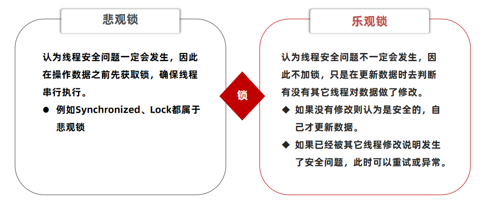

# 优惠券秒杀

## 全局唯一ID

当用户抢购时，就会生成订单并保存到tb_voucher_order这张表中，而订单表如果使用数据库自增ID就存在一些问题：

* id的规律性太明显
* 受单表数据量的限制

场景分析：如果我们的id具有太明显的规则，用户或者说商业对手很容易猜测出来我们的一些敏感信息，比如商城在一天时间内，卖出了多少单，这明显不合适。

场景分析二：随着我们商城规模越来越大，mysql的单表的容量不宜超过500W，数据量过大之后，我们要进行拆库拆表，但拆分表了之后，他们从逻辑上讲他们是同一张表，所以他们的id是不能一样的， 于是乎我们需要保证id的唯一性。

**全局ID生成器**，是一种在分布式系统下用来生成全局唯一ID的工具，一般要满足下列特性：


为了增加ID的安全性，我们可以不直接使用Redis自增的数值，而是拼接一些其它信息：

ID的组成部分：符号位：1bit，永远为0

时间戳：31bit，以秒为单位，可以使用69年

序列号：32bit，秒内的计数器，支持每秒产生2^32个不同ID

## Redis 实现全局唯一id

```java
@Component
public class RedisIdWorker {
    /**
     * 开始时间戳
     */
    private static final long BEGIN_TIMESTAMP = 1640995200L;
    /**
     * 序列号的位数
     */
    private static final int COUNT_BITS = 32;

    private StringRedisTemplate stringRedisTemplate;

    public RedisIdWorker(StringRedisTemplate stringRedisTemplate) {
        this.stringRedisTemplate = stringRedisTemplate;
    }

    public long nextId(String keyPrefix) {
        // 1.生成时间戳
        LocalDateTime now = LocalDateTime.now();
        long nowSecond = now.toEpochSecond(ZoneOffset.UTC);
        long timestamp = nowSecond - BEGIN_TIMESTAMP;

        // 2.生成序列号
        // 2.1.获取当前日期，精确到天
        String date = now.format(DateTimeFormatter.ofPattern("yyyy:MM:dd"));
        // 2.2.自增长
        long count = stringRedisTemplate.opsForValue().increment("icr:" + keyPrefix + ":" + date);

        // 3.拼接并返回
        return timestamp << COUNT_BITS | count;
    }
}
```

测试类

知识小贴士：关于 `CountDownLatch `

`CountDownLatch`名为信号枪：主要的作用是同步协调在多线程的等待于唤醒问题

我们如果没有 `CountDownLatch`，那么由于程序是异步的，当异步程序没有执行完时，主线程就已经执行完了，然后我们期望的是分线程全部走完之后，主线程再走，所以我们此时需要使用到`CountDownLatch`

`CountDownLatch` 中有两个最重要的方法

1. `countDown()`
2. `await()`

await 方法 是阻塞方法，我们担心分线程没有执行完时，main线程就先执行，所以使用await可以让main线程阻塞，那么什么时候main线程不再阻塞呢？当CountDownLatch  内部维护的 变量变为0时，就不再阻塞，直接放行，那么什么时候CountDownLatch   维护的变量变为0 呢，我们只需要调用一次countDown ，内部变量就减少1，我们让分线程和变量绑定， 执行完一个分线程就减少一个变量，当分线程全部走完，CountDownLatch 维护的变量就是0，此时await就不再阻塞，统计出来的时间也就是所有分线程执行完后的时间。

```java
@Test
void testIdWorker() throws InterruptedException {
    CountDownLatch latch = new CountDownLatch(300);

    Runnable task = () -> {
        for (int i = 0; i < 100; i++) {
            long id = redisIdWorker.nextId("order");
            System.out.println("id = " + id);
        }
        latch.countDown();
    };
    long begin = System.currentTimeMillis();
    for (int i = 0; i < 300; i++) {
        es.submit(task);
    }
    latch.await();
    long end = System.currentTimeMillis();
    System.out.println("time = " + (end - begin));
}
```

## 库存超卖问题 

超卖问题是典型的多线程安全问题，针对这一问题的常见解决方案就是加锁：而对于加锁，我们通常有两种解决方案：见下图：



**悲观锁：**

 悲观锁可以实现对于数据的串行化执行，比如syn，和lock都是悲观锁的代表，同时，悲观锁中又可以再细分为公平锁，非公平锁，可重入锁，等等

**乐观锁：**

  乐观锁：会有一个版本号，每次操作数据会对版本号+1，再提交回数据时，会去校验是否比之前的版本大1 ，如果大1 ，则进行操作成功，这套机制的核心逻辑在于，如果在操作过程中，版本号只比原来大1 ，那么就意味着操作过程中没有人对他进行过修改，他的操作就是安全的，如果不大1，则数据被修改过，当然乐观锁还有一些变种的处理方式比如cas

  乐观锁的典型代表：就是cas，利用cas进行无锁化机制加锁，var5 是操作前读取的内存值，while中的var1+var2 是预估值，如果预估值 == 内存值，则代表中间没有被人修改过，此时就将新值去替换 内存值

  其中do while 是为了在操作失败时，再次进行自旋操作，即把之前的逻辑再操作一次。

```java
int var5;
do {
    var5 = this.getIntVolatile(var1, var2);
} while(!this.compareAndSwapInt(var1, var2, var5, var5 + var4));

return var5;
```


> 事务嵌套可能会影响悲观锁


