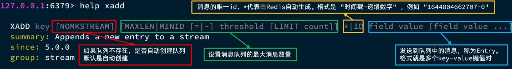
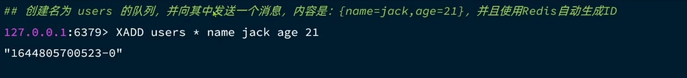
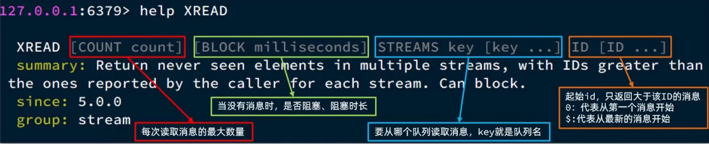
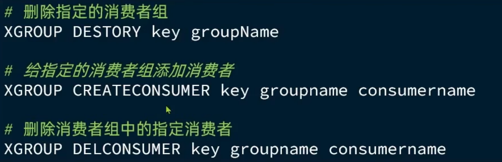

# Redis 消息队列

消息队列(Message Queue)，字面意思就是存放消息的队列。最简单的消息队列模型包括3个角色：

+ 消息队列：存储和管理消息，也被称为消息代理 (Message Broker)
+ 生产者：发送消息到消息队列
+ 消费者：从消息队列获取消息并处理消息

## 基于List结构模拟消息队列

消息队列(Message Queue)，字面意思就是存放消息的队列。而 Redis 的 list 数据结构是一个双向链表，很容易模拟出队列效果。

队列是入口和出口不在一边，因此我们可以利用：`LPUSH` 结合 `RPOP` 、或者 `RPUSH` 结合 `LPOP` 来实现。

基于Lst的消息队列有哪些优缺点？

+ 优点：
  + 利用Redis存储，不受限于VM内存上限
  + 基于Redis的持久化机制，数据安全性有保证
  + 可以满足消息有序性
+ 缺点：
  + 无法避免消息丢失
  + 只支持单消费者

## 基于PubSub的消息队列

PubSub（发布订阅）是 `Redis2.0` 版本引入的消息传递模型。顾名思义，消费者可以订阅一个或多个channel，生产者向对应 channel 发送消息后，所有订阅者都能收到相关消息。

+ PUBLISH channel msg：（发布消息）向一个频道发送消息
+ SUBSCRIBE channel[channel]：（订阅消息）订阅一个或多个频道
+ PSUBSCRIBE pattern[pattern]：（订阅消息）订阅与pattern格式匹配的所有频道
  + h?llo  match  hello
  + h*llo  match  heeeelo
  + h[ae]llo  match  hallo  and hello

基于PubSub的消息队列有哪些优缺点？

+ 优点：
  + 采用发布订阅模型，支持多生产、多消费
+ 缺点：
  + 不支持数据持久化
  + 无法避免消息丢失
  + 消息堆积有上限，超出时数据丢失

## 基于Stream的消息队列

Stream是 `Redis5.0` 引入的一种新数据类型，可以实现一个功能非常完善的消息队列。

### 发送消息

发送消息的命令：



例如：



### 读取消息

#### `XREAD`



+ `0` 和 `$` 的区别：
  + 0 表示第一条消息
  + $ 表示最新未读的消息，如果一消息你读过了，那么 \$ 下一次无法读取刚发的消息了
    + 如果一次性发了好几条消息，那么 $ 只能读取最后 一条消息

### 查看消息的数量

```
XADD s1 * k1 v1

XLEN s1
```

## 基于Stream的消息队列-消费者组

消费者组(Consumer Group):将多个消费者划分到一个组中，监听同一个队列。具备下列特点：

1. 消息分流：队列中的消息会分流给组内的不同消费者，而不是重复消费，从而加快消息处理的速度
2. 消息标示：消费者组会维护一个标示记录最后一个被处理的消息，哪怕消费者宕机重启，还会从标示之后读取消息。确保每一个消息都会被消费
3. 消息确认：消费者获取消息后，消息处于 `pending` 状态，并存入一个 `pending-list`。当处理完成后需要通过 `XACK` 来确认消息，标记消息为已处理，才会从 pending-List 移除。

### 创建消费者组

```shell
XGROUP CREATE key groupName ID [MKSTREAM]
```

+ key：队列名称
+ groupName：消费者组名
+ ID：起始 ID 标示，$代表队列中最后一个消息，O则代表队列中第一个消息
+ MKSTREAM：队列不存在时自动创建队列



### 读取消费者组消息

```shell
XREADGROUP GROUP group consumer [COUNT count] [BLOCK milliseconds] [NOACK]
STREAMS key [key ...] ID [ID ...]
```

+ group：消费组名称
+ consumer：消费者名称，如果消费者不存在，会自动创建一个消费者
+ count：本次查询的最大数量
+ BLOCK milliseconds：当没有消息时最长等待时间
+ NOACK：无需手动ACK，获取到消息后自动确认
+ STREAMS key：指定队列名称
+ ID:获取消息的起始ID：
  + `>`：从下一个未消费的消息开始
  + 其它：根据指定 id 从 pending-List 中获取已消费但未确认的消息，例如 0，是从 pending-List 中的第一个消息开始

## 总结


