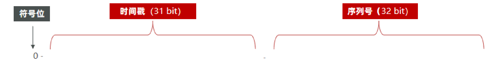
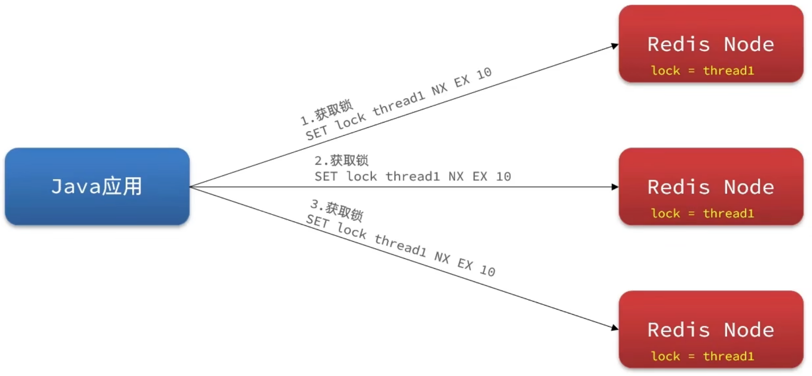
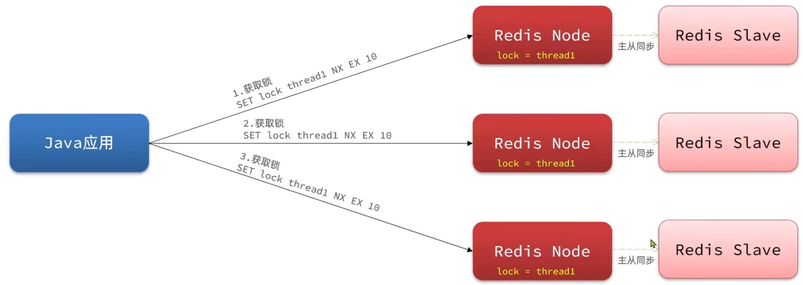
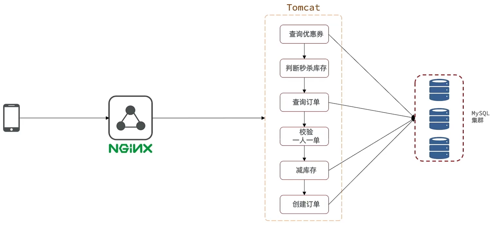
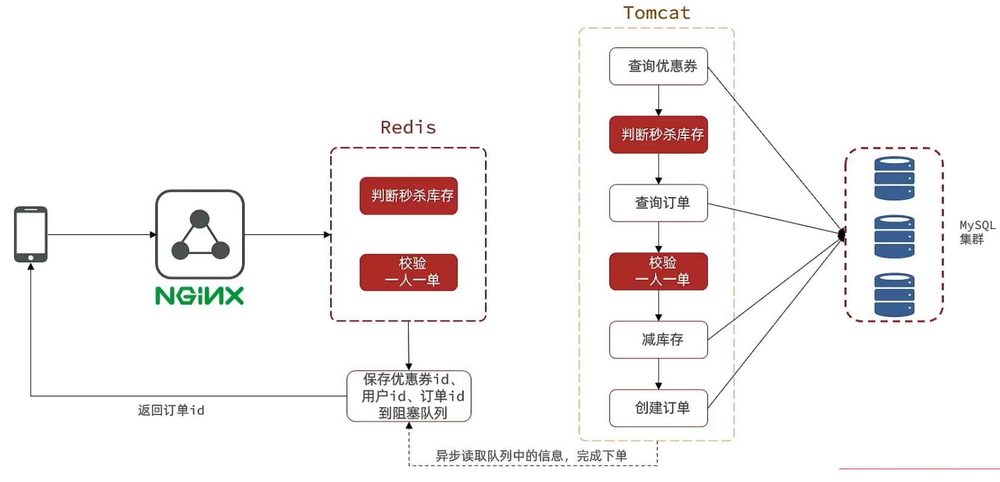

## Tomcat工作流程

1. tomcat 首先会安排一个线程来监听我们注册的端口，比如说8080
2. 当用户发起请求时，监听线程监听到后会创建一个套接字（socket）连接
3. 套接字连接时成对出现的，用户端socket传递数据，tomcat端socket收到数据后会从tomcat的线程池中获取一个线程来处理本次请求
4. 该线程会找的用户要请求的项目工程，并执行项目工程中的方法，比如controller、service、dao，执行完毕后再统一返回，找到 tomcat 端 的 socket，并将返回的数据写入到用户端的 socket，完成请求与响应

因此每次请求都是去找tomcat线程池中的一个线程单独完成，这样每个请求都是独立，因此我们可以使用 ThreadLocal 来完成线程间的数据隔离

## 为什么要将 session 换成 redis

如果项目是一个分布式项目，用户第一次请求访问时，处理请求的可能第一个 tomcat 机器，然后这个 tomcat 就会该用户维护一个 session 数据，当用户第二次请求时，可能处理请求的就是第二个 tomcat，那么这个 tomcat 就不存在有第一个 tomcat 中的 session 信息，认为用户是第一次访问网页，这会造成很大的影响。

虽然 tomcat 提供了一个 session 同步的解决方案，但是存在延迟，并且在每台 tomcat 上维护完全一样的 session 数据会造成一定的开销。

而 redis 本身就是数据共享的，因此使用 redis 来替换 session 最合适不过。

**如何转换？**

1、原 session 中需要的数据：

+ 验证码
+ 当前登录的用户

2、转换为 redis 后

+ 因为 session 是为每个用户单独维护的，所以自然而然做到了数据隔离，而 redis 是任何目标都能进行访问，因此想要获取正确的数据，需要保证 key 的唯一性
+ 为了防止数据混乱，我们对每一类数据都加上一个前缀，比如`phone:`、`token:`

**3、之前使用 session 时，我们可以在本次请求的任何地方获取到存入 session 中的数据，比如存入 session 中的 loginUser，而使用 redis 又该如何去做呢？ ★**

我们需要定义一个类，他存放一个 `ThreadLocal<User>` 对象，它可以做到线程间数据隔离，而进过上面对 tomcat 工作流程的分析，可以知道每次请求都属于一个单独的线程，因此使用 ThreadLocal 保存本次请求的局部变量十分合适。

确定了存储方法后就要确定存储时机，我们可以定义一个 Filter，每次请求时（preHandle）都将 loginUser 存入到 ThreadLocal 中，然后请求结束后（afterCompletion）销毁 ThreadLocal 存储的这个变量，避免内存泄露。

## 缓存更新策略

缓存的数据均来自于数据库，当数据库中的数据发生变化时，而缓存却没有更新，这时就会产生一致性的问题。

通常情况下使用**人工编码方式**来解决一致性问题，**缓存调用者在更新完数据库后，也要同时去更新缓存数据**，这也成为双写方案。

**那我们修改完数据库数据后，是该修改缓存、还是删除缓存？★★**

如果每次修改完数据库数据后我们都去修改缓存，但是我们并没去查询这个记录，这样就会产生较多的无效修改操作，造成不必要的损耗，因此，我们可以直接删除缓存，等待下次查询时重新加载缓存。

**如何保证数据库以及缓存操作同时成功？**

对于单体应用我们可以将操作放在同一个事务中，对于分布式应用可以使用 TCC 等事务方案。

**先删除缓存还是先操作数据库？★★★**

假设我们先删除缓存，线程1 删完缓存后，线程2 来了，查询数据发现缓存不存在，于是查询数据库写入旧数据到缓存，这时线程1 恢复进行数据库修改操作，那么缓存使用的就是旧数据。**因此我们采用先操作数据库，后删除缓存。**

## 查询缓存时所遇到的问题★★★★

### 缓存穿透

请求的数据，数据库以及缓存中都不存在，因此每次查询时都会去访问数据库

解决方案：

+ 缓存空对象
+ 布隆过滤

以往查询缓存只会碰到两种情况：（1）能在缓存中查到（2）缓存中查不到。如果我们使用【缓存空对象】的方法来解决缓存穿透的问题，我们就会遇到第三种情况那就是（3）缓存能查到，但数据为空。

因此我们在编写代码时注意这三种情况即可

### 缓存雪崩

某一时段缓存同时失效或者redis服务宕机，导致大量请求来到数据库，带来巨大压力。

1、对于缓存同时失效产生的缓存雪崩：

可能发生系统启用时**数据预热**，批量给一批数据设置缓存，由于缓存时间一致，到而导致它们同一时段缓存失效。

解决方法： 设置缓存时，给 TTL 添加随机值，让他们不在同一时刻缓存失效

2、对于 redis 宕机产生的缓存雪崩：

解决方法：提高 redis 的可用性，比如说搭建 redis 集群（主从同步、哨兵机制）

3、对于 redis 集群宕机的缓存雪崩：

解决方法：服务降级（快速失败、拒绝服务），而不是将请求压力给到数据库

4、其他解决方案：添加多级缓存，就是除了 redis ，给其他业务也填上缓存，比如 浏览器缓存、反向代理 nginx 缓存、jvm 等级缓存、数据库缓存 。。。

### 缓存击穿

一个高并发并且缓存重建业务可能比较复杂的 key 突然失效了，这时无数请求访问过来会给数据库带来巨大冲击。

逻辑分析：当线程1查询数据发现数据库不存在，准备查询数据库并重建缓存时，其他线程突然也来访问，由于缓存并未重建完成，这会对数据库带来巨大冲击

解决方法：

**（1）互斥锁**：锁能保证互斥性，一次只能一个请求来执行数据库查询以及缓存重建操作。具体过程如下：

1. 线程1查询缓存
2. 如果缓存不存在，线程1获取锁
3. 这时如果线程2过来，发现缓存不存在，于是也尝试获取锁但无法获取成功，于是休眠，等待休眠结束后重复之前的缓存查询逻辑（递归调用）
4. 线程1查询数据库数据库，重建缓存，然后释放锁
5. 线程2不断递归调用，在缓存重建完毕后就可以查询到数据返回结果了

**优缺点**：

性能底、但一致性高

**（2）逻辑过期**：之所以或出现缓存击穿是因为给缓存设置了有效时间，因此第二个解决方法就是不去 redis 这时有效期，而是设置一个逻辑有效期来实现缓存数据的同步。

上面互斥锁的解决方案查询缓存时都要考虑 3 个方面：1）缓存存在、值不为空，2）缓存存在、值为空，3）缓存不存在。由于逻辑过期的解决方案不会设置 key 的有效期，因此一定能查到缓存（经过缓存预热了），因此只要考虑两个方面：1）缓存过期，2）缓存没过期

逻辑过期实现步骤如下：

1. 线程1查询缓存
2. 判断是否逻辑过期，如果过期了，尝试获取锁并返回旧数据
3. 如果获取锁成功，则*开启一个新进程来重建缓存*
4. 如果没过期，直接返回数据
5. 线程2尝试获取锁，失败了，直接返回旧的数据

**优缺点**：

性能高、存在短期的一致性问题


**注意**：★★

+ 加锁和释放锁必须成对出现避免死锁
+ 为了避免重建缓存时出现故障无法释放锁，从而导致死锁，建议给锁加一个有效期
+ 获取锁后应该再次尝试去缓存中查询一次数据，做 DoubleCheck，如果缓存存在就不需要重建缓存了

## 全局唯一ID

id 一般为 long 类型，8个字节

+ 对于订单数据为了防止 id 太规律，被商业对手猜到敏感信心、比如销量，因此避免使用自增 id
+ 随着业务规模越变越大，数据库越来越多，以后可能要进行分表，如果使用自增 id，可能会存在主键重复的可能性

全局iD生成器，是一种在分布式系统上来生成全局唯一ID的工具，它需要满足以下5个条件：

+ 唯一性：避免业务纠纷
+ 高可用：必须任何时间都能正常使用，不能存在有调用失败的情况
+ 高性能：要保证生成 ID 足够快，避免拖累其他业务
+ 递增性：是用来替代数据库自增 id 的，不要求依次递增，便于数据库建立索引
+ 安全性：不能暴露 id 的规律

redis 是独立于数据库之外的，不管分库分表了多少，不会对 redis 有任何影响，因此满足唯一性

redis 本身又是满足高可用以及高性能的

通过 redis 的 icr 我们能保证 redis 值的自增

那么只剩下安全性要解决，为了不暴露 id 的规律性，我们为生成的 ID 指定一个规则



刚好 8 个字节

时间戳：我们可以自定义一个时间点，然后以当前的时间减去这个时间点的值得到

序列号：为秒内的计数器，每秒都能生成 2^32 个不同的 ID，比如`icr:keyPrefix:yyyy:MM:dd`

keyPrefix 可以表示业务、yyyy:MM:dd 就能具体到一秒了

## 超卖少卖

+ 超卖：记录了商品购买详情，库存却没有减少
+ 少卖：库存减少了，却没有购买记录

简单来说，就是实际卖出去的货物与数据库显示的卖出数（库存）对比，对于

超卖来说：明明出了货，但是数据库没扣库存上，因此实际买比显示的多

少卖来说：数据库库存减少了，但是货物仍然堆积在库存并没有出货，因此实际买的比显示的少


业务实现逻辑：

1. 查询库存是否充足
2. 如果充足减库存，否则直接返回

### 超卖

**逻辑分析**：线程 1 查库存，发现库存充足（为1），准备减库存，这时线程 2 突然过来了，也发现库存充足，立马完成减库存操作，这时返回到线程 1，然后减库存，这时库存就变成负数了。

#### 悲观锁和乐观锁

对于超卖问题这种典型的多行程安全问题，常见的方式就是加锁，我们通常有两种加锁方案：悲观锁和乐观锁

##### 悲观锁

认为线程安全问题一定会发生，因此在操作数据之前先获取锁，**确保线程串行执行**。例如 Synchronized、Lock 都属于悲观锁。（**适合插入数据**）

悲观锁又可以分为：

+ 公平锁
+ 非公平锁
+ 可重入锁

##### 乐观锁

认为线程安全问题不一定会发生，因此不加锁，只是在**更新数据时去判断有没有其它线程对数据做了修改**。(**适合修改数据**)

+ 如果没有修改则认为是安全的，自己才更新数据
+ 如果已经被其它线程修改说明发生了安全问题，此时可以重试或异常。

> CAS（Compare and Swap，比较并交换）是一种乐观锁技术，用于在多线程或多进程环境中实现并发控制，以保证数据的一致性。CAS 操作通常由硬件提供支持，但也可以在软件中模拟实现。
>
> CAS 操作包括以下几个步骤：
>
> 1. **比较：** 首先，读取当前内存中的值和一个期望值进行比较。
>
> 2. **交换：** 如果比较结果符合预期，那么将新的值写入内存中，完成交换操作。
>
> 3. **返回结果：** CAS 操作会返回执行结果，通常是成功（值已被更新）或失败（值未被更新）。
>
> 在乐观锁中，CAS 被用于控制共享资源的访问，特别是在数据更新时。乐观锁的基本思想是，假设多数情况下并发冲突不会发生，因此不加锁，而是在更新数据时检查是否有其他线程已经修改过数据。
>
> **CAS 的优点：**
>
> 1. **无锁：** CAS 是一种无锁机制，避免了传统锁带来的线程阻塞和上下文切换开销。
>
> 2. **原子性：** 单个 CAS 操作是原子的，确保了数据的一致性。
>
> 3. **高并发：** CAS 操作不需要持有锁，因此可以支持更高的并发性。
>
> **CAS 的局限性：**
>
> 1. **ABA 问题：** CAS 不能解决 ABA 问题，即在一段时间内，数据经历了从 A 到 B 再到 A 的变化，但 CAS 并不能察觉这种变化。
>
> 2. **自旋开销：** 如果 CAS 操作失败，需要不断重试，这可能会引起自旋开销。
>
> 3. **冲突激增：** 在高并发情况下，CAS 可能会导致冲突激增，从而增加重试次数，影响性能。
>
> CAS 在现代多线程和分布式系统中被广泛应用，用于实现乐观锁以减少锁的使用，从而提高并发性和性能。不同编程语言和平台提供了不同程度的 CAS 支持。

## 一人一单

业务需求：同一个优惠券，一人只能拿一张

业务实现逻辑：

1. 查询优惠券信息
2. 判断该优惠券的秒杀时间是否开始
   + 没有开始则直接返回函数
3. 判断优惠券库存是否充足
   + 如若不足直接返回
4. 获取本次请求的用户信息
5. 获取该用户得到该秒杀券的数量
   + 如果数量已经大于0，则直接返回
6. 优惠券库存减1
7. 创建优惠券订单信息并保存到数据库

并发问题：

当多个线程来到第 5 步，也就是查询该用户已有的优惠券数量，它们均发现数量等于0，因此都去创建优惠券的订单了，这就产生了并发问题，违反了一人一单


注意点：

1. 添加数据（创建订单）用悲观锁，修改数据（修改库存）用乐观锁
2. 如果直接给这个业务方法整个加上悲观锁（synchronized）会使得加锁的粒度太大，使得任何请求都要串行处理，我们可以将第 5 ~ 7 步为用户创建订单的逻辑封装起来，然后使用 synchronized(useId) 加锁，这样只有对应用户的并发请求会被加锁。
   + 5 ~7 步创建订单的逻辑同时包括了修改数据以及添加数据，因此还要为这个封装的逻辑方法加上 @Transactional 的注解
   + 封装 5 ~7 步的方法，不能在方法内部使用 synchronized，这个方法经过代理，try 内部执行完毕后会释放锁，而这时还没运行 finally 中的事务提交方法，因此，需要对整个这个方法加上 synchronized
   + 业务代码中使用 `synchronized(useId) {}` 来扩住这个封装的方法
   + 并且使用 `synchronized(useId)` 时，useId 要调用 intern 方法，保证它是常量池里面的数据库，以此来确保锁住的时同一个对象
3. spring 只会对当前方法进行事务控制，而 5 ~ 7 步是经过一轮封装的，如果 service 中方法调用这个标注了 @Transactional 的方法，那么代理就不会生效，除非非次 service 的方法直接调用它才能起作用，因此 service 中其他方法想要调用它使用借助 `AopContext.currentProxy()`来获取代理对象从而间接调用


**存在的问题**：

在单体应用下 `synchronized(useId)` 能锁住这个 useId，但是在分布式项目中接无法做到了，因为分布式项目会部署多个 tomcat ，每个 tomcat 会有一个自己的 jvm，它们是否锁住 userId 对其他机器并么有影响。这时我们就需要用到分布式锁了。

## 分布式锁

> 分布式锁是一种在分布式系统中用于协调多个节点访问共享资源的机制，以保证数据的一致性和并发控制。它确保在多节点环境下，同一时刻只有一个节点能够获取锁并执行关键操作。

基本方法：

+ 获取锁：
  + 互斥性：同一时刻只用一个线程能获取到锁
  + 非阻塞：尝试一次，成功则放回 true，失败则返回 false
+ 释放锁：
  + 手动释放
  + 超时释放，获取锁时添加一个超时时间

示例代码

```java
public class SampleRedisLock{
	private final String PREFIX = "lock:";
    private final String name;
    private final StringRedisTemplate rtpl;

	public SampleRedisLock(String name, StringRedisTemplate rtpl) {
		this.name = name;
        this.rtpl = rtpl;
	}
    
    public void tryLock(long second) {
        String tId = Thread.currentThread().getId();
	    Boolean success = rtpl.opsForValue().setIfAbsent(PREFIX + name, tId, second, second, TimeUnit.SECOND);
        return Boolean.TRUE.equals(success);
    }
    
    public void unlock() {
        //通过del删除锁
		rtpl.delete(KEY_PREFIX + name);
    }
}
```

### 分布式锁误删问题

逻辑分析：假设线程 1 获取锁后，执行任务但由于任务阻塞住了，然后锁超时释放了，这时线程 2 获取了锁。此时线程 1 阻塞的任务完成后，去释放锁，导致将线程 2 的锁给释放掉了。

解决方法：删除锁时，首先要判断这把锁是不是自己的，是自己的才能删

```java
public class SampleRedisLock{
	private final String PREFIX = "lock:";
    private final String name;
    private final StringRedisTemplate rtpl;
    private static final ID_PREFIX = UUID.randomUUID().toString(true) + '-';

	public SampleRedisLock(String name, StringRedisTemplate rtpl) {
		this.name = name;
        this.rtpl = rtpl;
	}
    
    public void tryLock(long second) {
        String tId = ID_PREFIX + Thread.currentThread().getId();
	    Boolean success = rtpl.opsForValue().setIfAbsent(PREFIX + name, tId, second, second, TimeUnit.SECOND);
        return Boolean.TRUE.equals(success);
    }
    
    public void unlock() {
        String tId = ID_PREFIX + Thread.currentThread().getId();
		String id = rtpl.opsForValue().get(PREFIX + name);
        if (tId.equals(id)) {
            //通过del删除锁
            rtpl.delete(KEY_PREFIX + name);   
        }
    }
}
```

### 分布式锁原子性问题

逻辑分析：误删情况有个更极端的情况，线程 1 执行 `tId.equals(id)` 已经符合条件准备删除 key 时，这时 CPU 去执行线程 2，同时线程 1 的锁已经超时自动释放了，线程 2 就可以获取到这把锁，突然 CPU 又去执行线程 1，去删除 key。

解决思路：造成这种问题的原因是，释放锁时，获取锁、对比锁值、删除锁，这三个步骤不是原子性的，因此可以使用 lua 脚本让这三个动作变为原子性操作。

Lua 代码：

```lua
if (redis.call('get', KEYS[1]) == ARGS[1]) then
    return redis.call('del', KEYS[1])
end
return 0
```

Java 代码：

```java
private static final DefaultRedisScript<Long> UNLOCK_SCRIPT;

static {
    UNLOCK_SCRIPT = new DefaultRedisScript<>();
    UNLOCK_SCRIPT.setLocation(new
    ClassPathResource("unlock.lua"));
    UNLOCK_SCRIPT.setResultType(Long.class);
}

public void unlock() {
    // 调用lua脚本
    stringRedisTemplate.execute(
        UNLOCK_SCRIPT,
        Collections.singletonList(KEY_PREFIX + name),
        ID_PREFIX + Thread.currentThread().getId()
    );
}
```

## Redisson

上面通过 setnx 实现的分布式锁存在以下问题：

+ 不可重入：同一个线程无法多次获取同一把锁
+ 不可重试：获取锁只尝试一次就返回 false，没有重试机制
+ 超时释放：锁超时释放虽然可以避免死锁，但如果是业务执行耗时较长，也会导致锁释放，存在安全隐患
+ 主从一致性：如果Redis提供了主从集群主从同步存在延迟，当主宕机时，如果从并同步主中的锁数据，则会出现锁实现

### 可重入锁

利用hash结构记录线程id和重入次数

> 可重入锁是一种允许同一线程多次获取同一个锁的锁机制，避免线程因为已经持有锁而被自己阻塞的情况。

数据结构：可重入锁的 value 不能是一个简单的 string，它的 value 必须是一个 hash 结构。

+ 大key  ：表示当前的 lock 是否存在
+ value：是一个 hash 结构
  + 小key：存储线程信息
  + value：存储锁被获取的次数

代码逻辑：

1）加锁：

1. `exists` 判断大 key 是否存在
   + 不存在，则调用 `hset` 设置 key，其中 hashKey 为线程标识，haskVal 为 1，`pexpire` 设置有效时间，最后返回 `nil`
2. （key 存在）`hexists` 判断 hashKey 是否为指定线程标识
   + 如果是，对于 hashKey 的 value 要自增 1，同时使用 `pexpire` 刷新有效期，最后返回 `nil`
3. （key 存在，但线程表示不同，说明锁被抢了）否则返回大 key 的剩余有效时间

2）释放锁：

1. `hexists` 判断 hashKey 是否为指定线程标识
   + （是自己的锁）如果是则对 hashKey 的 value 自减 1，同时使用 `pexpire` 刷新有效期
   + （不是）直接返回 `nil`
2. （是自己的锁）然后判断 hashValue 是否大于 0
   1. 如是大于 0，则调用 `pexpire` 刷新有效期
   2. 如是小于 0，则调用 `del` 删除锁

### 可重试锁及WatchDog机制 

利用信号量和PubSub功能实现等待、唤醒，获取锁失败的重试机制

redisson 实现的 tryLock 方法如下：

+ `tryLock(long waitTime, TimeUnit unit)`
+ `tryLock(long waitTime, long leaseTime, TimeUnit unit)`

`leaseTime` 表示超时时间，如果不填它默认就是 -1，如果 leaseTime 为 -1，则使用【看门狗超时时间】也就是 30 秒。

首先我们尝试获取锁，观察可重入锁的逻辑，它申请锁的时候，如果申请成功则返回 `nli`，否则返回当前锁的剩余有效时间 ttl。

通过判断 ttl 是否小于 waitTime ，来决定是否进行重试，如果 ttl < waitTime，那么我们订阅一个通知（这个通知由释放锁的方法发布），

### 超时释放

与上面的看门狗机制有关，在我们申请锁成功并返回 `nli` 时，它会在 30/3 = 10 秒后执行一个 Timeout 任务，这个任务可以将该锁的有效时间刷新为看门狗超时时间，也就是 30 秒，同时这个方法内部还会递归调用这个刷新有效时间的方法，使得锁的有效时间不断刷新。

假设我们的线程出现了宕机他还会续约吗？当然不会，因为阻塞后没有人再去内部递归调用刷新有效时间的方法，所以等到时间之后自然就释放了。

### 主从一致性

问题案例：为了提高 redis 可用性，通常会使用 redis 集群或者主从节点，以主从节点为例。一般写入数据到 Redis 时，都会先写入到主节点，然后通过主从同步来同步所有集群的数据。假如将要开始同步时，主节点宕机了，那么这时刚从主节点获取的锁信息就无法同步到从节点，从而造成问题。

解决方法：产生这个问题的主要原因是节点区分主从，如果我们写入锁信息到所有的节点就可以避免这个问题，这时只有所有节点都获取锁成功才能算加锁成功。

集群方案：

1）方案一：所有节点全部平级，不区分主从



+ 只要加锁成功，即使有一个节点突然宕机，其他线程也无法抢到锁

2）方案二：对每个节点单独建立一个主从关系



假设刚写入第一组的主节点数据还没来得及同步到从节点就宕机了，这时从节点没有锁信息，其他节点准备获取锁时，由于无法从所有节点获取锁，因此抢锁失败。

加锁流程：

1. 所有节点获取锁
2. 将所有放到 MulitLock 中，它会有一个 LockList 来填装
3. 遍历所有的锁，进行抢锁
4. 统计是否在规定时间内抢到所有锁
   + 只要有一个抢锁失败，就要释放其他所有已经抢到的锁，然后重新开始抢锁流程

### 总结

1）不可重入Redis分布式锁：

+ 原理：利用 setnx 的互斥性；利用 ex 避免死锁；释放锁时判断线程标示
+ 缺陷：不可重入、无法重试、锁超时失效

2）可重入的 Redis 分布式锁：

+ 原理：利用 hash 结构，记录线程标示和重入次数；利用 watchDog 延续锁时间；利用信号量控制锁重试等待
+ 缺陷：redis 宕机引起锁失效问题

3）RedissonMultiLock：

+ 原理：多个独立的 Redis 节点，必须在所有节点都获取重入锁，才算获取锁成功
+ 缺陷：运维成本高、实现复杂

## 秒杀优化

观察之前的业务逻辑，能发现许多操作都需要查询数据库



如图所示，有四项操作与数据库有关

+ 前两个是查询操作，用来判定是否有秒杀资格
+ 后两个是修改与添加操作，用来创建订单

由于操作数据库比较慢，并且创建订单这个操作并不一定需要立即完成，因此我们可以将判定条件与创建订单分离开来

### 解决方法

我们将需要判定的数据放到 redis 中，然后将需要创建的订单放到阻塞队列里面，这样业务就可以简化成如下形式



在判定允许下单后立即返回订单号，这样能大大提高效率，从而提高响应速度。与此同时阻塞队列中就可以“慢慢”的完成创建订单的操作。

其中难点在于如何使用 redis 的数据来判定以后可以下单

+ 使用 string 来存储优惠券的库存信息，如果库存小于 0，则失败直接返回 1
+ 使用 set 来存储已经抢券的用户，如果请求的用户 id 已经在 set 中，则失败直接返回 2
+ 其他情况就是可以抢券，我们在这里为库存减 1，同时给 set 添加用户 id，并返回 0

### 阻塞队列下单

定义阻塞队列以及线程池

```java
   private final BlockingQueue<VoucherOrder> voucherOrderTasks = new ArrayBlockingQueue<>(1024 * 1024);

    private static final ExecutorService SECKILL_ORDER_EXECUTOR = Executors.newSingleThreadExecutor();
```

我们要确保项目一启动阻塞队列就开始处理下单任务

```java
@PostConstruct
private void init() {
    SECKILL_ORDER_EXECUTOR.submit(new VoucherOrderHandler());
}

private class VoucherOrderHandler implements Runnable {

    @Override
    public void run() {
        while (true) {
            try {
                VoucherOrder voucherOrder = voucherOrderTasks.take();
                handleVoucherOrder(voucherOrder);
            } catch (InterruptedException e) {
                log.error("处理订单异常", e);
            }
        }
    }
}

private void handleVoucherOrder(VoucherOrder voucherOrder) {
    Long userId = voucherOrder.getUserId();
    RLock lock = redissonClient.getLock("lock:order:user:" + userId);
    if (!lock.tryLock()) {
        log.error("不允许重复下单");
        return;
    }

    try {
        proxy.createVoucherOrderQuick(voucherOrder);
    } finally {
        lock.unlock();
    }

}
```

`voucherOrderTasks.take()` 会等待队列里面订单的到来，因此使用 while 循环不会太占用 CPU


**存在的问题**：

+ 内存限制问题：可以看到我们定义了一个 `new ArrayBlockingQueue<>(1024 * 1024)` ，如果当队列数据库太多可能会造成内存泄露
+ 数据安全问题：如果服务突然宕机，那么存储在内存中的队列数据就会丢失

